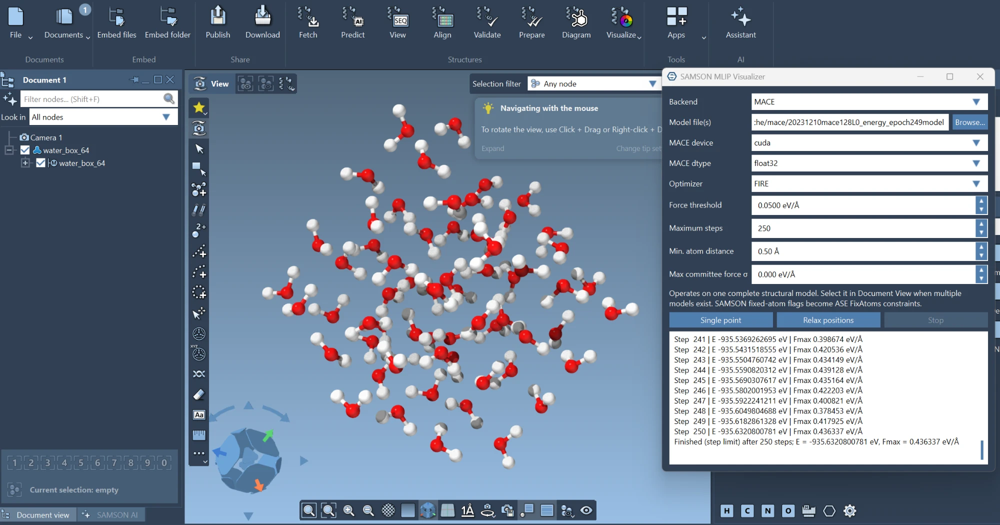
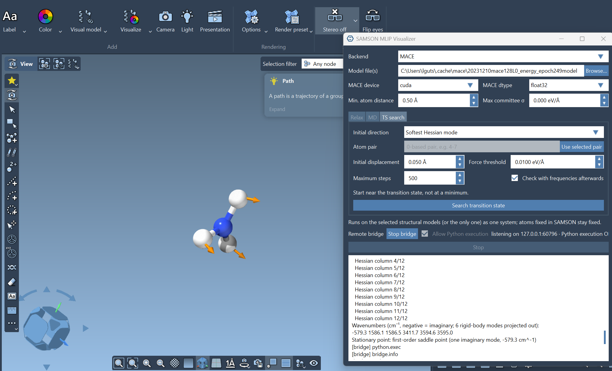

# SAMSON MLIP Visualizer

Run local [MACE](https://github.com/ACEsuit/mace) and
[DeepMD-kit](https://github.com/deepmodeling/deepmd-kit) models on structures in
**[SAMSON Connect](https://www.samson-connect.net/)** — the molecular modeling and
nanoscience platform by OneAngstrom — using ASE as the common calculator and
optimization layer.

Every reference to "SAMSON" in this repository means SAMSON Connect. It is
unrelated to any other product, company, or library that shares the name.



*Relaxing [`examples/water_box_64.xyz`](examples/water_box_64.xyz) with the
MACE-MP-0 small foundation model (CUDA, float32) inside SAMSON.*

The panel provides:

- single-point energy and force evaluation;
- position-only relaxation (FIRE / LBFGS / BFGS / PreconLBFGS) with live
  geometry synchronization to SAMSON;
- molecular dynamics (Langevin, Bussi, Nosé–Hoover chain, NVE) with live
  updates, trajectory output, and distance-constrained MD that reports the mean
  constraint force;
- transition-state search with the dimer method, and finite-difference
  frequencies to classify minima and saddle points;
- normal-mode display in SAMSON: an animated path and displacement arrows;
- an opt-in local bridge so scripts, notebooks, and coding assistants can read
  and edit the open SAMSON document;
- optional model-committee uncertainty and geometry-sanity guards;
- periodic cell and per-axis PBC transfer from SAMSON to ASE;
- `FixAtoms` constraints derived from SAMSON fixed-atom flags;
- local MACE and DeepMD model files, with CPU or CUDA selection for MACE;
- no native SAMSON SDK build: the panel is an installable Python package.

> [!IMPORTANT]
> This is an alpha research tool. An ML potential is reliable only for elements,
> charge/spin states, structures, and thermodynamic conditions represented by its
> training data. The application does not make an incompatible model safe.

## Install in SAMSON

SAMSON includes a Python environment and PySide6. In **Python Console → Edit →
Manage packages**, install this repository as a local editable package, or run in
SAMSON's terminal:

```bash
python -m pip install -e C:\path\to\Samson_MLIP_Visualizer
```

Install the backend you intend to use in that same SAMSON Python environment:

```bash
# MACE
python -m pip install mace-torch

# DeepMD (choose the build/extras appropriate to your platform)
python -m pip install deepmd-kit
```

Do not install both GPU stacks merely because both backends are supported. Start
with a CPU build, verify a known structure, then follow the backend's current
CUDA installation guidance if acceleration is needed.

## Launch

Open `scripts/launch_in_samson.py` in SAMSON's Python code editor and run it, or
enter:

```python
from samson_mlip_visualizer.samson_app import show
show()
```

Then:

1. Open or construct a structure in SAMSON.
2. If the document contains multiple structural models, select every model
   that belongs to the system in Document View (Ctrl/Shift-click). Selected
   models are evaluated together as one system — e.g. several separate water
   molecules — and must agree on any unit cell they define.
3. Mark immobile atoms with SAMSON's fixed-atom flag.
4. Choose MACE or DeepMD and select the trained model file. Selecting several
   MACE checkpoints builds an uncertainty committee (see below).
5. Run **Single point** first. Check that the energy and forces are plausible.
6. Pick an optimizer, set the force threshold and maximum steps, then choose
   **Relax positions**.

The panel keeps the SAMSON interface responsive between steps. Its **Stop**
button takes effect after the current energy/force call returns. Every task
(relaxation, MD, TS search) is one SAMSON undo transaction.

The panel remembers its settings between sessions in
`%LOCALAPPDATA%\samson-mlip-visualizer\panel.ini` (model, device, dtype, and
every task parameter), except atom pairs, the trajectory path, and the remote
bridge's Python-execution opt-in. With no saved model, it picks up MACE-MP-0
small if MACE has already downloaded it to `~/.cache/mace`.

### Molecular dynamics (MD tab)

- **Ensembles.** `Langevin` (default; robust NVT), `Bussi` (stochastic velocity
  rescaling; NVT with realistic dynamics), `NoseHooverChain` (deterministic NVT),
  and `NVE` (velocity Verlet; the log reports energy drift in meV/atom/ps).
- **Timestep.** 0.5 fs whenever hydrogen is present; the panel warns above 1 fs.
- **Start from a relaxed structure.** An unrelaxed start releases its strain as
  heat: the 64-water example box heats to ~500 K in 50 fs before the thermostat
  pulls it back. Initial velocities are drawn at the target temperature and
  rescaled to hit it exactly.
- **Update every N steps** controls how often SAMSON and the log refresh, and
  how often trajectory frames are written (`.extxyz` / `.xyz` / `.traj`).
- **Max temperature** (0 = off) aborts a run that blows up, the usual symptom
  of too large a timestep or a model leaving its training data.

**Constrained MD.** *Fixed distances* holds atom pairs at a fixed separation
with RATTLE. Select two atoms in SAMSON and press **Add selected pair**, or type
0-based pairs: `0-3, 5-9:1.20` (the `:1.20` first moves the pair to 1.20 Å).
The log reports the mean model force along each constrained pair (positive
pushes the atoms apart). Repeating runs over a range of distances and
integrating −⟨f⟩ over r gives the potential of mean force w(r), i.e.
dw/dr = −⟨f⟩ (thermodynamic integration). The free energy of the distance
coordinate itself, A(r) = −kT ln P(r), differs from it by −2kT ln r. The
reported σ is the spread of the instantaneous force, not the error of the mean:
consecutive MD steps are correlated, so run long enough for the mean to settle.
Constraints work with Langevin, Bussi and NVE.

### Transition states and frequencies (TS search tab)

Both methods climb from a guess geometry to the nearest first-order saddle point,
so start **near** the transition state (neither finds one from a minimum; use
**Reaction path** below when you have the two minima instead).

- **P-RFO (Sella)** (default): partitioned rational-function optimization in
  redundant internal coordinates ([Sella](https://github.com/zadorlab/sella)),
  the open counterpart of Gaussian's `Opt=TS` (Berny eigenvector following). It
  maximizes along the lowest Hessian mode and minimizes along all others; on the
  ammonia example it converges in about 10 steps. Needs `sella` (`pip install
  sella`, or the package's `ts` extra) in SAMSON's Python.
- **Dimer**: force-only climbing along an initial direction:
  - **Softest Hessian mode**: a Hessian at the guess (6 force calls per atom),
    starting along its softest vibration; most robust for molecules.
  - **Stretch atom pair**: a bond that forms or breaks; cheap for large systems.
    Select the two atoms and press **Use selected pair**.
  - **Random**: a random displacement of the free atoms.

After a converged search the panel computes frequencies and reports whether the
result has exactly one imaginary mode. The **Frequencies** button on the Relax
tab does the same for any geometry. Rigid-body translation and rotation are
projected out when no atom is fixed. Small imaginary modes (< 100 cm⁻¹) usually
mean a floppy, loosely converged geometry; re-optimize to Fmax ≤ 0.001 eV/Å in
float64.

Try it on [`examples/nh3_ts_guess.xyz`](examples/nh3_ts_guess.xyz): ammonia
with its pyramid flattened to 0.3 Å. With MACE-MP-0 small, P-RFO converges in
about 10 steps (the Hessian-guided dimer in 10–15) to the planar umbrella-inversion
transition state with one imaginary mode (−580 cm⁻¹). Its 0.13 eV barrier is
below experiment (~0.25 eV): a model-accuracy limit, not a search failure.

### Reaction paths: QST2/QST3 and IRC (Reaction path tab)

- **QST2 / QST3**, the counterparts of Gaussian's `Opt=QST2` / `QST3`: select
  the reactant and product models (QST2), or reactant, TS guess, and product
  (QST3), in Document View, in document order. They must hold the same atoms in
  the same order and should be relaxed minima. The panel interpolates a path
  (IDPP), relaxes it as a climbing-image nudged elastic band, and refines the
  highest image with P-RFO. It adds the band as a **path on the reactant model**
  (frame 0 = reactant) and the refined transition state as a **new structural
  model**, checked with frequencies. On ammonia inversion QST2 takes ~4 s and
  finds the same TS and 0.132 eV barrier as P-RFO.
- **IRC** (Gaussian's `IRC`), from a transition state: frequencies give the
  imaginary mode, then the path is followed downhill both ways by mass-weighted
  steepest descent (step in Å·amu½), optionally relaxing both end points to
  report the minima. **Every step is kept**: the panel adds an **IRC path** with
  all frames in order (reverse end → TS → forward end), which SAMSON's path
  controls can scrub, and **Animate last path** loops (stopping returns to the
  TS). On ammonia it reaches both pyramids in 49 steps per side.

`samson-mlip --irc --trajectory irc.extxyz` and `--qst PRODUCT [--qst-guess
GUESS]` do the same headlessly and write every frame (IRC) or image (band),
with per-frame energies, to the trajectory file.

### Viewing normal modes

After **Frequencies** (or a converged TS search with the frequency check), the
**Normal mode** row under the tabs lists every mode; imaginary ones are marked
*i*. For the chosen mode:

- **Animate** adds a SAMSON path that oscillates the structure along the mode
  (24 frames, largest atom displacement 0.3 Å) and loops it until **Stop
  animation**, which returns the atoms to the computed geometry. The path stays
  in Document View, where SAMSON's own path controls can scrub it.
- **Arrows** adds a mesh of displacement arrows, one per atom, the longest as
  long as the length box beside it; delete it in Document View when done.

SAMSON has no built-in normal-mode or vector display, so these are built from
its path (`SBConformation` / `SBPath`) and mesh (`SBSurface` / `SBMesh`) APIs.
Each is one undo step.



*The TS search on [`examples/nh3_ts_guess.xyz`](examples/nh3_ts_guess.xyz)
converged to planar (D3h) ammonia; the frequency check finds one imaginary
mode (−579 cm⁻¹), drawn as arrows. The same mode can also be animated in the
viewport (see **Animate** above). MACE-MP-0 small on CUDA.*

### Guards

- **Elements.** The panel reads the element list the model reports (MACE
  `z_table`, DeepMD `type_map`) and refuses structures containing an element the
  model was not trained on. When the list cannot be read it says so and proceeds.
- **Geometry.** Relaxation, MD, and TS search abort if two atoms come closer
  than *Min. atom distance* — MLIPs have out-of-distribution "holes" where forces
  go unphysical and an optimizer will collapse atoms into them.
- **Uncertainty.** With a committee, the panel logs the per-atom force spread and,
  if *Max committee force σ* is set, aborts relaxation or MD when it is exceeded —
  the standard signal that the model is extrapolating. A committee multiplies
  inference time and memory by the number of models, so on a laptop keep it to
  two or three small checkpoints.
- **Precision.** MACE recommends `float64` for geometry optimization; the panel
  warns if you relax with `float32`.

### Optimizers

`FIRE` is the robust default. `LBFGS` / `BFGS` converge in far fewer force calls
(each call is one MLIP inference), and `PreconLBFGS` adds a preconditioner that
helps most on large slabs. On a rattled Al(111) slab here: FIRE 43 steps, LBFGS
29, PreconLBFGS 8.

## Check a model without SAMSON

The calculator and optimization layers do not need SAMSON. After installing the
package and a backend, a console script runs the same single-point and
relaxation on any ASE-readable structure file, which is the fastest way to
sanity-check a new model:

```bash
samson-mlip structure.cif model.model --backend mace
samson-mlip structure.xyz model.pb --backend deepmd --relax --fmax 0.03 -o relaxed.xyz
samson-mlip slab.xyz m1.model m2.model m3.model --relax --optimizer LBFGS --max-force-std 0.15
samson-mlip water.xyz model.model --md --temperature 300 --timestep 0.5 --md-steps 2000 --trajectory md.extxyz
samson-mlip dimer.xyz model.model --md --fix-distance 0-3:2.9 --seed 1
samson-mlip examples/nh3_ts_guess.xyz model.model --ts --fmax 0.005 --freq
samson-mlip complex.xyz model.model --ts --ts-pair 4-9 --max-steps 500
samson-mlip ts.xyz model.model --irc --trajectory irc.extxyz
samson-mlip reactant.xyz model.model --qst product.xyz --trajectory band.extxyz -o ts.xyz
samson-mlip molecule.xyz model.model --relax --fmax 0.001 --freq
```

Several MACE files form a committee; `--max-force-std` aborts when the committee
force spread exceeds the threshold. `--ts` uses P-RFO unless `--ts-method
dimer` (or a dimer option such as `--ts-pair` or `--ts-start`) is given. `--min-distance` / `--max-drift` guard the
geometry. With `-o`, the run provenance is written into the output file's
metadata.

## Remote control (local bridge)

Other programs on this computer — notebooks, scripts, coding assistants — can
drive a running SAMSON through a small bridge. Start it from the panel's
**Start bridge** button, or in SAMSON's Python console:

```python
from samson_mlip_visualizer.remote import serve
serve()                  # fixed operations (structures, selection, edits, screenshots, MLIP jobs)
serve(allow_exec=True)   # also run Python sent by a client; only when you need it
```

Then, from any Python on the same machine:

```python
from samson_mlip_visualizer.remote import SamsonClient

client = SamsonClient.from_connection_file()
atoms = client.get_structure()          # what the panel would evaluate, as ASE Atoms
client.set_positions(atoms)             # write back as one undo step
client.capture("view.png")              # viewport screenshot
job = client.start_job("relax", fmax=0.01)   # model settings default to the panel's
print(client.wait_job(job["id"])["result"])
```

or `samson-remote summary` / `python -m samson_mlip_visualizer.remote summary`
on the command line. `samson-mcp` exposes the same operations to coding
assistants over the Model Context Protocol, including viewport images. The
bridge listens on `127.0.0.1` only, needs a fresh random token (kept in a file
only you can read) on every request, logs each request, and never starts by
itself. See [`docs/samson_api.md`](docs/samson_api.md) for the methods, MCP
setup, and security model.

## Surface and passivant models

This workflow is compatible with passivated surface models when the potential is
compatible with the *entire* model:

- keep surface, adsorbate, passivants, and any counterions in one structural
  model;
- define the correct periodic cell and vacuum in SAMSON;
- set PBC only along genuinely periodic directions;
- fix bottom layers or passivants in SAMSON when they should not move;
- confirm that the model was trained for every chemical element and relevant
  environment in the structure;
- do not treat artificial H-like passivation, fractional nuclear charges, point
  charges, or implicit embedding as ordinary atoms unless the MLIP was explicitly
  trained with that representation.

The app deliberately refuses to evaluate a selected atom subset. A local MLIP
needs the whole atomic environment; evaluating only an adsorbate would produce a
number that is easy to misinterpret.

## Supported model interfaces

| Backend | ASE calculator | Typical local files | Device control |
|---|---|---|---|
| MACE | `mace.calculators.MACECalculator` | trained MACE checkpoint/model | `cpu` or `cuda` in the panel |
| DeepMD | `deepmd.calculator.DP` | `.pb`, `.pth`, `.json`, depending on backend | controlled by the installed DeepMD runtime |

The chemical species and cutoff compatibility are determined by the model, not
the file extension. Validate a new file against the code and structure used to
train or publish it.

## Developer setup

```bash
python -m pip install -e '.[test]'
pytest
ruff check .
```

The calculator and optimization layers are independent of SAMSON. Only
`samson_bridge.py`, `samson_app.py`, and the bridge server
(`remote/dispatcher.py`, `remote/qt_server.py`) touch its runtime API, which
keeps most of the project testable in a standard Python environment. The Qt
transport test needs PySide6 and is skipped without it; SAMSON's own Python has
it.

## Current scope

- One or more complete SAMSON structural models per run, evaluated as one system.
- Pseudo-atoms in the selected model are rejected, not silently evaluated.
- Model element coverage is checked when the backend exposes it.
- Atomic energies and forces; no stress, cell optimization, or NPT MD.
- FIRE / LBFGS / BFGS / PreconLBFGS geometry optimization.
- NVT / NVE molecular dynamics; fixed-distance constraints (no harmonic
  restraints / umbrella sampling yet).
- Transition states by P-RFO (Sella) or the dimer method, QST2/QST3-style NEB
  path searches, and IRC.
- Finite-difference frequencies (6 force calls per free atom): meant for
  molecules and small clusters.
- MACE committee uncertainty (multiple checkpoints); DeepMD committee not yet.
- Close-contact, drift, and temperature guards abort a runaway run.
- No automatic model download or model-specific preprocessing.
- Geometry updates from a relaxation, MD run, or TS search are grouped into one
  SAMSON undo transaction. Saving the source document before long runs is still
  recommended.
- Every run logs its provenance (model SHA-256, device, dtype, package
  versions); the CLI also writes it into the output structure's metadata.

## Interpreting the numbers

- Foundation-model total energies are referenced to isolated atoms; only
  **relative** energies along a relaxation are meaningful here.
- A stable relaxation is not an accurate one. Universal MLIPs frequently need
  fine-tuning for quantitative properties; the provenance log records which
  model (by hash) produced a result.
- Net charge and non-ground spin states are outside the training distribution of
  essentially all of these models, the same as an untrained element.

## Roadmap

This tool owns the simulation loop and uses SAMSON only as a structure source
and sink. It does **not** interoperate with SAMSON's own interactive simulation
(`Edit → Add simulator`, `Edit → Minimize`): that is SAMSON driving its own force
field frame by frame, and the two loops should not be run on one model at once.

Planned, roughly in priority order:

- Expose the MACE/DeepMD calculator as a native SAMSON interaction model so
  SAMSON's interactive simulator, minimizer, and atom dragging run on the MLIP.
  This is the real path to interactive use and needs a SAMSON SDK module rather
  than a Python package.
- Run energy/force calls off the UI thread. The calculator can move to a worker
  thread cleanly; the difficulty is that `sync_positions` and `SAMSON.holding`
  must stay on the main thread, so per-step live updates need a marshalling
  layer. Needs to be developed and tested inside SAMSON.
- Write results back as SAMSON data: total energy on the model, per-atom force
  vectors for arrow display. Blocked on confirming the property/visual API.
- Publish relaxations and MD runs as a SAMSON path (`node.type path`) so the
  trajectory can be scrubbed in the animation bar. Blocked on the path-creation
  API; until then, open the written `.extxyz` trajectory.
- Harmonic distance restraints (umbrella sampling) and NPT MD.
- Remote bridge: unit-cell editing, change notifications, and a command
  listing ([`docs/samson_api.md`](docs/samson_api.md)).
  [`scripts/probe_samson_api.py`](scripts/probe_samson_api.py) is a read-only
  survey of SAMSON's Python API for this and the items above; run it in SAMSON's
  code editor.
- Embed the run provenance in the SAMSON document itself, not just the log.
- Cell / stress relaxation, if added, should use ASE's `FrechetCellFilter` (the
  current robust choice for variable-cell relaxation with universal MLIPs).
- D3 dispersion toggle: foundation models are PBE-level and miss van der Waals,
  which matters for physisorbed adsorbates, passivants, and layered materials
  (`mace_mp(dispersion=True)`, or a D3 term added via `SumCalculator`).
- DeepMD committee support via `deepmd.infer.calc_model_devi`.

## License

MIT
