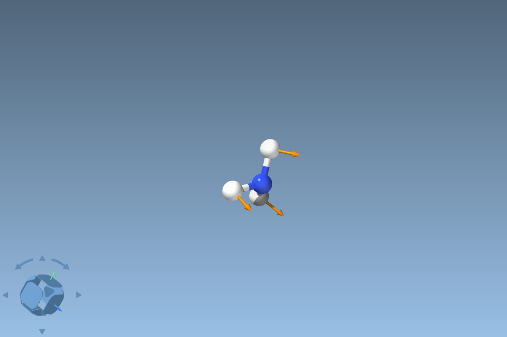

# Development log

How the tool grew from a one-model relaxation panel into an MLIP workbench
inside SAMSON, and what each step taught us. Newest last.

## 2026-09-25

### Getting MACE running inside SAMSON

- The package reaches SAMSON by being installed (editable) into SAMSON's own
  embedded Python 3.11 (`SAMSON-Application/<version>/Binaries/python.exe`);
  nothing talks to the SAMSON executable from outside.
- SAMSON sets up its Python environment on first use and pins `numpy==1.24.2`
  (plus older scipy/matplotlib). Our dependencies must fit that pin:
  `pandas<2.2` and `matscipy<1.2`. Upgrading numpy instead risks SAMSON's own
  compiled modules.
- The Python console keeps modules imported, so after installing packages the
  whole SAMSON process (including its console kernel) must be restarted, or
  half-imported packages linger.
- A backend import failure used to be reported as "not installed"; the panel
  now shows the underlying `ImportError`.
- First run: MACE-MP-0 small relaxes water to O–H 0.974 Å, H–O–H 105.6°
  (PBE-like). CUDA PyTorch (`cu130`, RTX 5070 Laptop) makes a 64-water box
  ~25× faster than CPU in float64; float32 is another ~2.7×.

### Several structural models, one system

Separate water molecules are separate structural models in SAMSON. Selected
models are now combined into one ASE system (their cells must agree); with
several models and no selection the panel still asks, so unrelated structures
are never merged by accident. Example: `examples/water_box_64.xyz`.

### MD, constrained MD, transition states, frequencies

- `md.py`: Langevin, Bussi, Nosé–Hoover chain, NVE, with the relaxation guards
  plus a temperature ceiling. Fixed atom-pair distances use RATTLE; the mean
  force along each pair is reported (dw/dr = −⟨f⟩ gives the PMF).
- `ts.py`: dimer method. A random start failed on ammonia — rotations of a
  free molecule have zero curvature and attract the dimer — so the default
  start is now the softest mode of a rigid-body-projected Hessian.
- `vibrations.py`: finite-difference frequencies. Projecting out rotations with
  QR lost modes for linear molecules (a ~1e-18 axial rotation became an
  arbitrary direction); SVD fixed it.
- Validation with MACE-MP-0 small: NVE drift 0.24 meV/atom/ps for water; a
  constrained O···O distance held to 1e-6 Å; ammonia inversion TS found in
  10–15 steps with one imaginary mode (−579 cm⁻¹). The 0.13 eV barrier is
  below experiment (~0.25 eV), a model limit.
- Testing caught: small systems starting MD far below the target temperature
  (now rescaled), a converged TS reported as "step limit", and the CLI still
  defaulting to the random TS start.

### A local API: the remote bridge

SAMSON exposes no external API: it listens on no ports and its console kernel
is in-process. The bridge (`remote/`) is a loopback-only Qt server started
explicitly from the panel or console, token-authenticated, with a fixed set of
operations and opt-in Python execution. See [samson_api.md](samson_api.md).
It let the assistant probe SAMSON's API directly instead of relaying output by
hand, which is how the normal-mode display below was designed.

### Panel layout and remembered settings

The tab area was as tall as the MD tab on every tab and squeezed the output
log. It now fits the open tab, paired settings sit in two columns, and the log
gets the rest of the height. Settings persist in `panel.ini` (never the
Python-execution opt-in, atom pairs, or trajectory path).

### Normal-mode display

After a TS search the natural next question is "what does the imaginary mode
look like?" SAMSON has no normal-mode or vector visual model, but its API has
everything needed:

- **Animation:** `SBConformation` snapshots of the structure displaced along the
  mode, joined into an `SBPath`. Setting `animationFlag` alone does not play a
  path, so the panel steps it with a Qt timer; stepping back to frame 0
  restores the computed geometry.
- **Arrows:** cylinder-plus-cone triangles built in NumPy (`modes.py`) and
  handed to `SBSurface` / `SBMesh`. SAMSON's internal length unit is the
  picometre, so mesh coordinates are scaled ×100.

### Hard cases: exact Hessians, bond scans, QM export

A toolkit for cases where a plain TS search is not enough, modeled on the
Gaussian escalation path:

- **Exact Hessians for P-RFO** (`CalcFC`, `RecalcFC=N`): the finite-difference
  Hessian from `vibrations.py` is shared with Sella's `hessian_function` /
  `diag_every_n`. With an MLIP, the most expensive fix in Gaussian takes
  seconds here.
- **Scan-to-TS** (`reaction_path.scan_to_ts`): a RATTLE-constrained distance
  scan, then P-RFO from the highest point, with a warning when the maximum is at
  an end of the range. On HCN, LBFGS under the constraint overshot and drove H
  into C (caught by the close-contact guard), so constrained points relax with
  FIRE by default. A linear start also has to be bent slightly, or the H–N axis
  passes through C.
- **QM export** (`qm_export.py`): Gaussian and ORCA inputs for TS, QST2/QST3
  (ORCA: NEB-TS with side `.xyz` files), IRC, and Opt.
- **xTB backend: deferred.** `tblite` publishes no Windows wheels on PyPI, so
  it cannot be pip-installed into SAMSON's Python.

Validation, HCN → HNC with MACE-MP-0 small (CUDA, float64): the scan peaks at
r(H–N) = 1.43 Å, and exact-Hessian P-RFO converges in 5 steps to a TS with one
imaginary mode (−989 cm⁻¹), about 20 s end to end. The barrier is 2.63 eV
against ~2.1 eV from high-level ab initio work, a model limit. This is the case
for the exported `Opt=(TS,CalcFC)` input.

## Working notes

- Tests run in CI (Python 3.10/3.12) without SAMSON or Qt; the Qt transport and
  panel tests run in SAMSON's Python, which has PySide6
  (`python.exe -m pytest tests` from `Binaries/`).
- `scripts/probe_samson_api.py` surveys SAMSON's Python API read-only; with the
  bridge running and Python execution allowed, the same probing can be done
  remotely.
