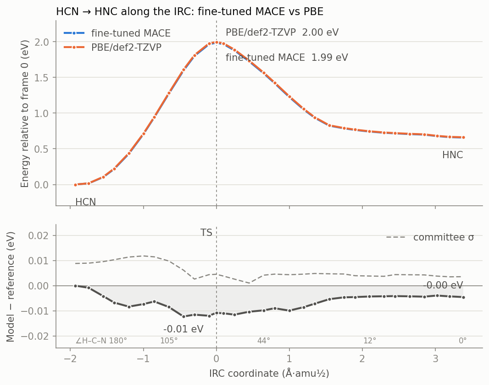

# Fine-tuning MACE-MP-0 on a reaction: HCN ⇌ HNC

This is how MACE-MP-0 small was fine-tuned to PBE for the HCN ⇌ HNC
isomerization, what it cost, and what the tuned model does and does not get
right. The scripts are in [`examples/fine_tuning_hcn/`](../examples/fine_tuning_hcn/);
the numbers below come from running them on 2026-09-26.

## Why

MACE-MP-0 small finds the right transition state for this reaction (one
imaginary mode, and an IRC that connects HCN and HNC), but puts it 2.63 eV
above HCN. PBE/def2-TZVP, the level the model was trained on, gives 2.00 eV,
and CCSD(T)/cc-pVTZ at the PBE geometries 2.07 eV. A benchmark along the IRC
([README](../README.md#benchmarking-a-model-along-a-reaction-path)) showed
the error is near zero at both minima and 0.5–0.65 eV across the whole bent
region. The foundation model's training data (Materials Project crystals)
simply does not contain a hydrogen shifting between two atoms.

## Summary

| | MACE-MP-0 small | Fine-tuned (3-model committee) | PBE/def2-TZVP |
|---|---|---|---|
| Barrier from HCN | 2.630 eV | **1.986 eV** | 1.997 eV |
| HNC − HCN | 0.634 eV | 0.658 eV | 0.662 eV |
| TS r(C–H) / r(N–H) / r(C–N) | 1.208 / 1.353 / 1.204 Å | 1.204 / 1.375 / 1.193 Å | 1.202 / 1.375 / 1.193 Å |
| TS ∠H–C–N | 68.3° | 70.0° | 70.1° |
| TS imaginary mode | −987 cm⁻¹ | −1090 cm⁻¹ | −1072 cm⁻¹ |
| HCN r(C–H) / r(C–N) | 1.088 / 1.163 Å | 1.077 / 1.158 Å | 1.076 / 1.158 Å |
| HCN modes (bend ×2, CN, CH) | 988, 2153, 3152 cm⁻¹ | 715, 2116, 3388 cm⁻¹ | 734, 2123, 3364 cm⁻¹ |
| HNC modes (bend ×2, CN, NH) | 694, 2246, 3324 cm⁻¹ | 457, 2033, 3619 cm⁻¹ | 447, 2035, 3698 cm⁻¹ |
| IRC ends | HCN, HNC | HCN, HNC | (not run) |
| Largest energy error, own IRC (30 frames) | 0.646 eV | 0.012 eV | — |
| Largest energy error, own scan (13 frames) | 0.663 eV | 0.079 eV | — |

Total cost: **about 8½ minutes** of wall-clock time from the MACE-MP-0 IRC to
a validated committee, on a laptop (Intel i9-14900HX, 32 threads; NVIDIA RTX
5070 Laptop GPU, 8 GB).

## Method

### 1. Seed data (`seed_data.py`)

1. **The foundation model's own path.** P-RFO (exact initial Hessian) from the
   MACE-MP-0 transition state, then an IRC (step 0.05 Å·amu½, both ends relaxed
   to Fmax 0.005 eV/Å): 128 frames from HCN to HNC.
2. **29 frames** spread evenly along the IRC arc length (not by index: IRC steps
   shorten near the minima), always including the TS and both relaxed minima.
3. **PBE labels** for each: energy and forces from Psi4 1.11, PBE/def2-TZVP with
   density fitting, through the tool's Psi4 backend.
4. **58 rattled copies**: two per frame, every Cartesian coordinate displaced by
   a Gaussian with σ = 0.04 Å (seed 0), also labeled with PBE. They teach the
   forces around the path, not only along it.

That gives **87 configurations**. PBE on all of them took 134 s (≈1.5 s per
three-atom gradient, including the worker start).

**Energy reference.** Psi4's all-electron PBE energies (about −2538 eV for CNH)
and the foundation model's VASP-referenced energies (about −19 eV) differ by a
constant. Every label is shifted by one constant, E_PBE − E_MACE at the MACE
HCN minimum, which puts the targets on the foundation model's scale. With a
single composition this leaves every relative energy unchanged, and training
starts from errors of a few hundred meV rather than from 2500 eV.

### 2. Training (`common.train`)

Plain fine-tuning of the foundation model with mace-torch 0.3.16 (single head,
**no replay** of foundation data):

```bash
mace_run_train --name=hcn_r1_s1 --foundation_model=<MACE-MP-0 small> \
  --multiheads_finetuning=False --train_file=train_r0.extxyz --valid_fraction=0.1 \
  --energy_key=REF_energy --forces_key=REF_forces --E0s=foundation \
  --loss=weighted --energy_weight=10 --forces_weight=100 --lr=0.005 \
  --batch_size=4 --valid_batch_size=8 --max_num_epochs=120 --ema --ema_decay=0.99 \
  --default_dtype=float64 --device=cuda --seed=1 --save_cpu
```

- **Three models** (seeds 1, 2, 3), trained **in parallel** on the one GPU: 257 s
  wall for all three. A single model alone took 331 s for 150 epochs, so
  running them side by side cost almost nothing extra.
- In the trial run (seed 1), the validation error was 254 meV/atom and 263 meV/Å
  in the first epoch and below 5 meV/atom and 90 meV/Å by epoch 10. The best
  epochs were 110–117 of 120.
- mace-torch's own validation (a random 10 % of the 87 configurations, so
  frames next to training frames): 1.3–3.9 meV/atom and 25–39 meV/Å. **This is
  not a held-out test**; see below for that.

### 3. Active learning (`active_learning.py`)

Each round:

1. Train the 3-model committee on the current data.
2. With the committee (mean energy and forces), find the TS by P-RFO with an
   exact Hessian, check its frequencies, and follow the IRC both ways.
3. **Ground truth:** PBE on 15 frames of the committee's own IRC, which are not
   in the training data.
4. **Stop** if the barrier is within 0.05 eV of PBE's 1.997 eV and the largest
   energy error on those frames is below 0.05 eV.
5. Otherwise, **select** the 8 IRC frames with the largest committee force
   spread (not held out, at least 3 frames apart), label them and one rattled
   copy each with PBE, and start the next round.

Round 1 met the stopping criterion: barrier 1.986 eV (−0.011 eV), largest held-
out energy error 0.012 eV. So **the selection step never ran**. The seed data,
taken from the foundation model's own IRC, already covered this reaction. The
loop has not yet been tested on a case where the committee has to find
missing data (see the committee caveat below).

### Timing

| Stage | Wall time |
|---|---|
| MACE-MP-0 TS + IRC (seed path) | a few seconds |
| PBE labels: 29 IRC frames | 49 s |
| PBE labels: 58 rattled copies | 85 s |
| Fine-tuning, 3 models × 120 epochs, in parallel | 257 s |
| Committee TS search, frequencies, IRC | 88 s |
| PBE on 15 held-out IRC frames | 35 s |
| **Total** | **≈ 515 s (8½ min)** |

The final tests (`tests.py`: minima, TS, IRC, scan, both benchmarks, other
molecules) took 391 s for the committee and 243 s for PBE itself.

## Checks

### Held-out frames

"Held out" is measured here, not asserted: every test frame's aligned RMSD
(rigid motion removed) to the nearest of the 87 training structures is
reported.

| Test set | Frames | RMSD to nearest training structure | Largest energy error | Worst-atom force error |
|---|---|---|---|---|
| The tuned model's own IRC | 30 | median 0.015 Å, max 0.030 Å | 0.012 eV | 0.08 eV/Å |
| The tuned model's r(N–H) scan | 13 | median 0.030 Å, max 0.085 Å | 0.079 eV | 1.11 eV/Å |

The IRC frames are new structures, but close to the training data, because the
tuned IRC runs within a few hundredths of an ångström of the old one. They show
the model reproduces its training region, not that it generalizes. The scan
frames lie further off the path, and the error grows accordingly: 0.08 eV at
r(N–H) = 1.21 Å, next to a point where the scan's geometry jumps. That is the
honest measure of accuracy away from the reaction path: good to about
0.01 eV on the path, to about 0.1 eV next to it.



### The committee is overconfident

The committee's energy spread peaks at 0.012–0.013 eV on both test sets. That
matches the true error on the IRC, but not on the scan, where the true error
reaches 0.079 eV. Frame by frame, spread and error are not positively
correlated at all (r = −0.23 on the IRC frames, −0.34 on the scan frames). The
three members start from the same foundation model and see the same data, so
they make the same mistakes. For active learning this matters: here, a spread
threshold would have stopped the loop even where the model is wrong. Better
signals are a committee with real diversity (different foundation models or
sizes, bootstrapped training sets), or a few reference calculations per round
as spot checks, which is what the stopping criterion above uses.

### IRC ends and the scan

- The tuned model's IRC ends are **HCN and HNC**, and both relaxed minima match
  PBE within 0.001 Å.
- The r(N–H) scan **still jumps**, at point 10: the constrained minimum
  switches from the bent branch to linear HNC just after the TS, as it did with
  MACE-MP-0 (points 5 and 9). That jump comes from the coordinate: r(N–H) is
  not monotonic along the reaction path, whichever model is used. MACE-MP-0's
  first jump (point 5) does not appear with the tuned model. With MACE-MP-0 the
  constrained relaxation straightens the bent start and stays trapped on the
  linear branch; the tuned model's surface keeps the bend, so it never enters
  that branch.

### Forgetting

This was plain fine-tuning, with no replay of the foundation model's data.

- **Elements.** The fine-tuned model knows **only H, C, and N**: mace-torch
  rebuilt its element table from the training data. It cannot evaluate water
  at all. The panel's element guard refuses such a structure instead of giving
  a number.
- **Other molecules with the same elements**, each relaxed with each model
  (PBE/def2-TZVP as reference):

| | MACE-MP-0 small | Fine-tuned | PBE |
|---|---|---|---|
| NH₃ inversion barrier | 0.132 eV | 0.206 eV | 0.215 eV |
| NH₃ r(N–H) | 1.019 Å | 1.034 Å | 1.022 Å |
| CH₄ r(C–H) | 1.100 Å | 1.094 Å | 1.097 Å |
| C₂H₂ r(C≡C) | 1.215 Å | **1.170 Å** | 1.208 Å |
| C₂H₂ r(C–H) | 1.069 Å | 1.079 Å | 1.071 Å |

The NH₃ inversion barrier moved toward PBE, but N–H bonds got longer, and the
C≡C triple bond got 0.04 Å too short. The model learned C≡N and extrapolates it
to C≡C. **The tuned model is an HCN/HNC specialist.** It should not replace
MACE-MP-0 as a default, and every run with it should say so. Each model ships
with a model card (`<model>.json`: foundation, data, reference level, elements,
scope), which the tool now records in the run provenance. Multihead fine-tuning,
which replays foundation data, is the standard remedy for forgetting. It would
need the Materials Project replay set and was not tried here.

### The target is PBE

Fine-tuning on PBE gives PBE accuracy at best. For this reaction that is good:
PBE's 2.00 eV barrier is 0.07 eV below CCSD(T)//PBE (2.07 eV). For reactions
where GGA barriers are poor, the labels should come from a hybrid functional
or a wavefunction method. The Psi4 backend runs any of them; only the cost
changes.

### A bug found on the way

The frequency code listed one bend for HCN instead of two. A relaxed linear
molecule is never exactly linear, and a residual bend of 10⁻⁴ Å (179.9997°)
left the axial rotation just above the rigid-body cutoff, so it was projected
out along with one bend. The cutoff is now based on the actual singular values:
10⁻⁶ for a relaxed linear molecule, 0.19 and up for nonlinear molecules. The
numbers above use the fixed code. It never affected transition states, which
are not linear here, but it gave wrong mode counts and zero-point energies for
linear minima.

## Reproduce

In SAMSON's Python (with mace-torch, and Psi4 in its own environment; see the
[README](../README.md#optional-xtb-and-psi4-reference-methods)):

```bash
cd examples/fine_tuning_hcn
python seed_data.py            # MACE-MP-0 IRC, PBE labels -> train_r0.extxyz
python active_learning.py      # committee, TS, IRC, held-out PBE check, more rounds if needed
python tests.py "fine-tuned MACE" round1/hcn_r1_s1.model round1/hcn_r1_s2.model round1/hcn_r1_s3.model
python tests.py "MACE-MP-0 small" ~/.cache/mace/20231210mace128L0_energy_epoch249model
python tests.py PBE pbe
```

`MACE_FOUNDATION`, `MACE_RUN_TRAIN`, and `FINETUNE_DIR` override the model,
the trainer, and the output folder. The models from this run are not in the
repository (5 MB each, and they are specialists); rerunning the three
steps rebuilds them in about ten minutes.
