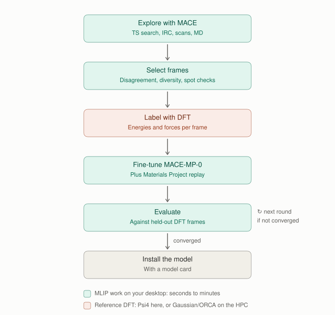
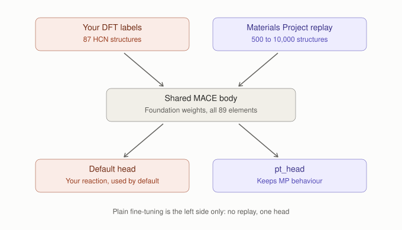
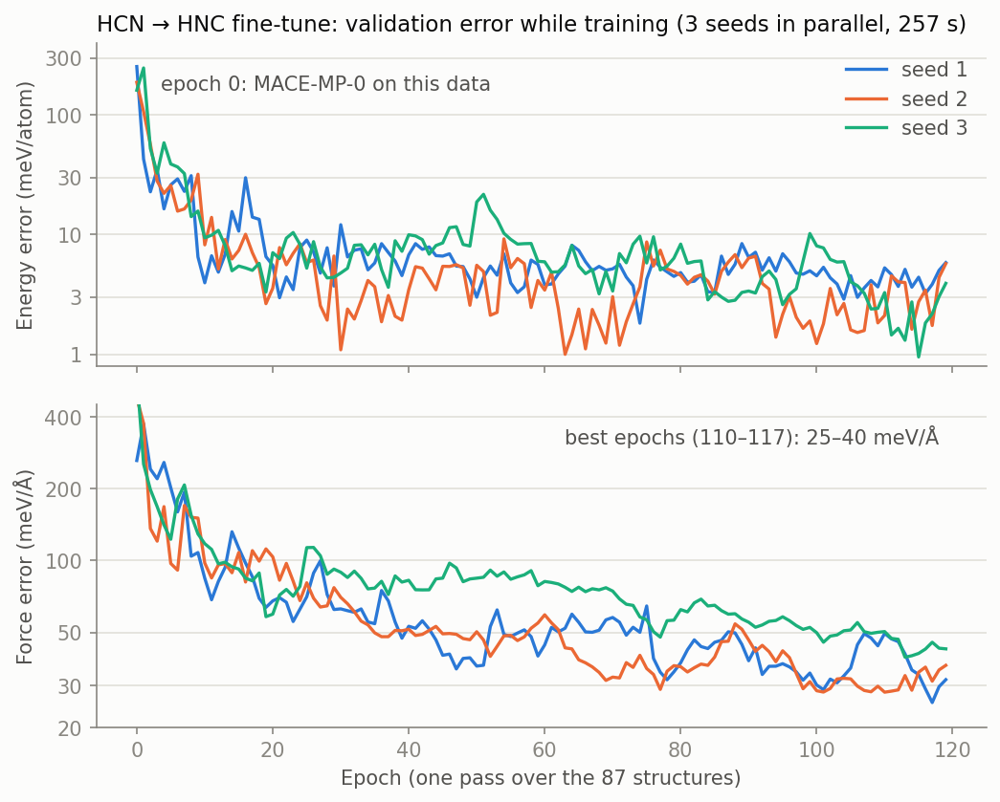

# Fine-tuning guide

How this tool fine-tunes a MACE foundation model for your own chemistry, and
how to run each step. The worked example, HCN ⇌ HNC, is written up with all
its numbers in [fine_tuning.md](fine_tuning.md).

## When to fine-tune

Fine-tune when the foundation model is wrong for your system, not by default.
The [path benchmark](../README.md#benchmarking-a-model-along-a-reaction-path)
shows where it is wrong: for HCN, MACE-MP-0 was right at both minima but
0.5–0.65 eV too high across the whole bent region, because its training data
(Materials Project crystals) never contain a hydrogen shifting between two
atoms. That region is where new training data belongs.

## The loop



Each round costs a few DFT calculations and a few minutes of GPU time. The
MLIP steps (teal) run on the desktop in seconds to minutes; the reference
calculations (coral) run locally with Psi4 for small molecules, or on the HPC
from a package this tool writes. Nothing is ever submitted to a cluster by the
tool: you copy the package, run it, and copy the results back.

1. **Explore** with the current model: TS searches, IRCs, scans, and MD
   (the panel, `samson-mlip`, or the bridge). Run the path benchmark
   (`samson-mlip-benchmark`) to see where the model disagrees with the
   reference.
2. **Select frames** to label (`finetune.select_for_labeling`), from three
   sources: where a committee disagrees, frames farthest from everything
   labeled so far (diversity), and a few random spot checks. Every frame is
   kept a minimum distance from the others. Disagreement never selects alone:
   a committee of seeds from one foundation model is overconfident.
3. **Label with DFT.** Locally with the Psi4 backend, or as a Gaussian or ORCA
   package for SLURM (`labeling.write_label_package`). Back on the desktop,
   `labeling.collect_labels` checks every output (normal termination, SCF
   converged, the geometry is the frame it was made for) before accepting it.
4. **Fine-tune** MACE-MP-0 on the labels (below).
5. **Evaluate** on DFT frames the model has not seen, reported next to their
   distance from the training data, plus the chemistry the model must not
   forget.
6. **Repeat or stop.** Stop when the properties you care about are within
   your tolerance of the reference and the off-path error has stopped
   improving, never on committee spread alone. Then install the model with its
   model card.

**Automated: `samson-mlip-finetune config.json`** runs these steps as rounds
(`samson_mlip_visualizer.active_learning`). Each round trains a committee (or
reuses it), explores from a TS guess (P-RFO with an exact Hessian,
frequencies, IRC, and an optional bond scan), evaluates against the reference
on frames of that round's own IRC and scan that it was not trained on, and
then stops or selects (the three sources above; the held-out frames are never
candidates), labels through a cached reference (`reference_cache`: each
structure computed once), and adds the labels to the training set. It stops
only when the barrier, the largest IRC error and the largest scan error are all
within your tolerances; the committee spread is logged next to the real error
every round and used for selection, never for stopping. Two model plug-ins:
MACE (a committee of seeds, `training.train_local`) and AIMNet2 (members
fine-tuned from different AIMNet2 ensemble members in the aimnet environment,
charge per structure). Every round writes its training set, models,
exploration, evaluation, selection manifest and labels under `round_NN/` plus a
`rounds.json`, and a restarted run picks up where it stopped. Worked example,
with the round table:
[examples/active_learning_sn2](../examples/active_learning_sn2/README.md)
(converged in one round of selection, about 5 minutes of DFT).

## Inside the fine-tuning step



MACE has a shared body, which turns each atom's neighborhood into features,
and small readout heads, which turn features into energies. Two modes:

- **Plain** (left side only): the whole model is trained on your labels. It is
  fast and effective on the target, but the shared body drifts: the HCN model
  got C≡C 0.04 Å too short.
- **Multihead** (both sides): your labels train a new `Default` head, while a
  replay set of Materials Project structures, the data MACE-MP-0 was trained
  on, keeps training the original head (`pt_head`). Because the shared body
  must keep serving both, it cannot drift far from what it already knew. The
  calculator uses `Default` automatically.

Both modes keep all 89 foundation elements
(`--foundation_model_elements=True`). Without that flag mace-torch rebuilds
the element table from the data: the plain HCN model knew only H, C and N,
and a multihead run kept 83 of 89.

```python
from samson_mlip_visualizer.paths import foundation_model
from samson_mlip_visualizer.training import TrainingSpec, install_models, train_local

spec = TrainingSpec(
    name="my_reaction_r1",
    foundation=str(foundation_model()),        # MACE-MP-0 small
    train_file="round1/gaussian/labeled.extxyz",
    mode="multihead", replay="mp",             # or mode="plain"
    replay_samples=10000, seeds=(1, 2, 3), epochs=120,
    card={"reference": "PBE/def2-TZVP (Gaussian 16)", "scope": "my reaction"},
)
train_local(spec, "round1/train")             # desktop GPU, seeds in parallel
install_models("round1/train")                # into the MACE folder, with model cards
```

For the HPC, `training.write_training_package(spec, folder)` writes the same
run as a SLURM GPU array (one task per seed), a login-node script that
downloads the replay set (compute nodes often have no internet), and a README.
In multihead mode mace-torch sets its own learning rate (10⁻⁴).

### What training looks like



The HCN run: three models (seeds 1–3) trained side by side on the laptop GPU,
120 epochs in 257 s. Epoch 0 is essentially MACE-MP-0 on this data (about
250 meV/atom and 260 meV/Å). The error falls by an order of magnitude within
ten epochs, then improves slowly and noisily, and mace-torch keeps the best
epoch (here 110–117). These validation frames are a random 10 % of the
training set, so they sit right next to training frames: the curve shows that
training converged, not how good the model is. That is what the evaluation on
held-out frames is for.

## Energy scales

Gaussian, ORCA, and Psi4 energies are all-electron or on other pseudopotential
scales; MACE-MP-0 was trained on VASP. They differ by roughly a constant per
atom of each element. `finetune.fit_element_offsets` fits those offsets from
a few structures labeled by both codes and reports the residual; pass the fit
to `collect_labels` to put `REF_energy` on the foundation scale (the raw
energy is kept as `REF_energy_raw`). Do this check before the first labeling
round. With one composition only (as for HCN) the offsets are not unique and
the fit says so.

## Where things are stored

- The MACE folder, `~/.cache/mace`, holds the foundation model and installed
  fine-tuned models (`finetuned/<name>/`). The panel's default model comes
  from here, so it works with no other drive attached.
- An optional mirror folder on a second drive (`paths.set_mirror_dir(...)`),
  here `D:\MLIP_Work_Folder\cache\mace`, gets a copy of every installed model
  and takes the large downloads: the Materials Project replay set is about
  595 MB. It is used only while the drive is connected.
- Labeling and training packages, run folders, and figures go wherever you
  write them; on this machine, `D:\MLIP_Work_Folder`.

## Before the first real campaign: HPC smoke tests

`examples/hpc_smoke_tests/make_smoke_tests.py` writes four small jobs:
- Gaussian and ORCA labeling of three HCN/HNC geometries, with a Psi4 PBE
  reference to compare against;
- plain and multihead fine-tuning on a GPU node.

Run them on the cluster, copy the results back, and run
`check_smoke_results.py`, which prints PASS or FAIL per test. Both training
tests pass when run locally exactly as SLURM would run them (28 s and 184 s).
The labeling collectors have so far been tested only on outputs written to the
Gaussian 16 and ORCA 5 formats, so the smoke tests are also their first check
against real output.

## Not built yet

- An evaluation report: errors binned by distance from the training data,
  and a forgetting table (the loop already logs committee spread against the
  real error every round).
- Panel buttons for exporting frames, loading labels, and running the loop.
- The HCN example rebuilt on the new modules, as an end-to-end regression
  test.
- VASP labeling packages, for periodic systems.
