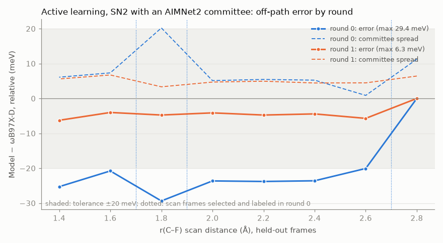

# Active learning: F⁻ + CH₃Cl with an AIMNet2 committee

A worked run of the library's reference-checked active-learning loop
(`samson_mlip_visualizer.active_learning`, the `samson-mlip-finetune` command)
on the SN2 reaction studied in [`examples/sn2_f_ch3cl/`](../sn2_f_ch3cl/). That
example has the chemistry, the ωB97X-D validation against CCSD(T), and the
fine-tunes done by hand; this one shows the same fine-tune done as rounds.

Each round (config: [`active_learning_config.json`](active_learning_config.json)):
train an
AIMNet2 committee (three members fine-tuned from AIMNet2 ensemble members 0, 1
and 2), explore (P-RFO with an exact Hessian, IRC, and the r(C–F) scan), check
against ωB97X-D on held-out frames, and stop or select, label and repeat. It
started from the complex-only labels (93 structures), with tolerances of
0.5 kcal/mol on the barrier, 10 meV on the IRC and 20 meV off the path (the
scan).

| Round | Training | Barrier model / ωB97X-D (kcal/mol) | IRC max error (meV) | Scan max error (meV) | Error / spread at the worst scan frame | Labeled | Status |
|---|---|---|---|---|---|---|---|
| 0 | 93 | 3.27 / 3.27 | 0.9 | **29.4** | 1.5× | 6 | continued |
| 1 | 99 | 3.29 / 3.28 | 0.8 | **6.3** | 1.1× | 0 | converged |



*Errors on the held-out scan frames, relative to the first one (2.8 Å, zero by
construction), so round 0's flat −20 to −29 meV is largely an error at that
far end. Dashed: committee spread. Dotted: the three frames labeled in round 0.*

## What triggered retraining, and what it added

The loop uses two different signals, and keeps them apart.

**Whether to retrain: the reference error on held-out frames.** After
training, each round computes ωB97X-D on frames of the model's own new IRC and
scan that are not in the training set, and checks the three tolerances. In
round 0:

| Check | Round 0 | Tolerance | Result |
|---|---|---|---|
| Barrier, model vs ωB97X-D on the same IRC frames | 3.27 vs 3.27 kcal/mol | 0.5 kcal/mol | pass |
| Largest IRC energy error | 0.9 meV | 10 meV | pass |
| Largest scan (off-path) energy error | **29.4 meV** | 20 meV | **fail** |

That one failure is the whole reason round 1 exists. In round 1 the scan error
was 6.3 meV, every check passed, and the loop stopped.

**What to add: the committee spread, within the selection rules.** Once the
loop has decided to continue, it ranks the 770 candidates (the round's IRC
frames and the scan frames that were not held out) by the committee's
worst-atom force spread and takes the top ones that are at least 0.05 Å from
the training data:

| Selected | r(C–F) | Committee force spread | Distance to the training data |
|---|---|---|---|
| scan frame 9 | 1.9 Å | 0.19 eV/Å | 0.093 Å |
| scan frame 11 | 1.7 Å | 0.16 eV/Å | 0.075 Å |
| scan frame 1 | 2.7 Å | 0.07 eV/Å | 0.084 Å |

The diversity and random spot-check passes had budget for six more frames but
found nothing else far enough from the data: every IRC frame lies within about
0.02 Å of the training path. With one rattled copy each, round 1 trained on
six new labels.

**Why the split.** The committee spread costs no DFT, so it decides *where* to
spend the DFT. It is not trusted to decide *when* the model is good enough. In
this run it was right in size at the worst frame (the error was 1.5× the
spread in round 0, 1.1× in round 1: much better than the HCN MACE committee,
whose spread was 6× below the real error on its scan, because these members
start from different AIMNet2 models). But frame by frame it did not track the
error (correlation 0.03 and −0.47 on the scan), and on the IRC it
*over*estimated (error 0.2× the spread). A loop that stopped on low spread, or
kept going on high spread, would have been wrong in both directions.
Retraining is triggered only by a DFT-checked error above the user's tolerance.

## Cost and caveats
- **Cost:** 58 new ωB97X-D calculations (about 5 minutes; the rest came from
  the shared cache). Training dominated: about 14 minutes per round-0 member
  (800 epochs) and 12 per round-1 member (300 warm-start epochs), the three in
  parallel on the CPU, slowed in round 1 by another job running on the laptop.
- The tolerances cover the path and the region the scan visits, not the
  separated fragments. Those were not checked for this committee; since it
  starts from the complex-only labels, they are presumably off as in the
  complex-only fine-tune above. Adding the fragment structures to the seed data
  would bring them in.

Outputs are in `D:\MLIP_Work_Folder\sn2_F_CH3Cl\active_learning\` (`rounds.json`,
and per round the training set, models, exploration, evaluation, selection
manifest and labels); `plot_active_learning.py` draws the figure.

## Reproduce

With SAMSON's Python (the package, mace-torch), the aimnet environment
(`D:\MLIP_Work_Folder\envs\mlip`), and Psi4 in its own environment:

```bash
samson-mlip-finetune examples/active_learning_sn2/active_learning_config.json
python examples/active_learning_sn2/plot_active_learning.py
```

The config points at the SN2 work folder (the complex-only labels from
`examples/sn2_f_ch3cl/finetune_sn2.py`, the shared ωB97X-D cache, and a TS start
geometry from the AIMNet2 IRC); a restarted run picks up where it stopped.
