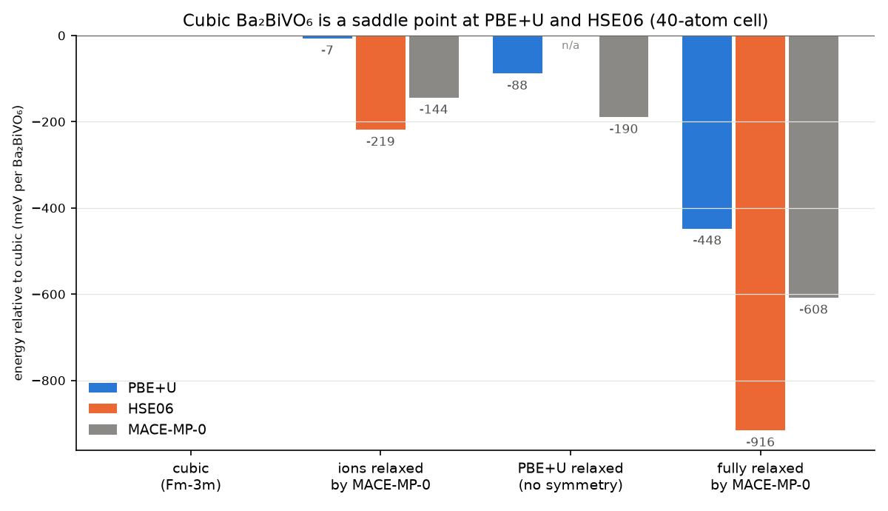

# HSE06 quality from MACE-MP-0: Δ-learning for Ba₂BiVO₆

## Project priorities — PI direction, 2026-09-30

Read [AGENTS.md](AGENTS.md) before planning or dispatching BBVO work. **Dopants primarily target improved CBM dispersion; phonon stabilization is secondary and optional.** Rank substitutions using DFT electronic properties (dispersion, mass tensors, band character and gap tradeoffs), not removal of imaginary modes. The MLIP supplies structures and paths, not electronic bands. Residual soft modes do not disqualify a useful dopant or block BBVO. Pursue stabilization only through accessible, modest-cost opportunities; defer it if those do not emerge. Keep model-accuracy gates separate from material-stability questions. This direction supersedes earlier stabilization-first wording below.

Hybrid functionals fix a lot of what PBE(+U) gets wrong in oxides, but at 10–100×
the cost, which rules out MD and large cells. The idea here is to keep an MLIP
at run time and learn only the difference:

```
E(x) = E_MACE-MP-0(x) + ΔE(x),     ΔE trained on  E_HSE06 − E_MACE-MP-0
```

MACE-MP-0 was trained on Materials Project data: PBE+U with U = 3.25 eV on V in
oxides, the same setting as the PBE+U runs of this structure. So MACE-MP-0 stands in
for the PBE+U calculation, and a step of the combined model costs two MLIP
evaluations and no DFT. Every labeled frame gets both PBE+U and HSE06, so the
residual can be split into the functional (HSE06 − PBE+U) and the baseline's
own error (PBE+U − MACE-MP-0).

The example is split between the laptop and LONI:

| Step | Where | What |
|---|---|---|
| `make_frames.py` | laptop, 4 min | 58 frames from MACE-MP-0: strained primitive cells, 40-atom MD at 300/600/900 K, Nb- and Ta-substituted cells |
| `doping.py` | laptop, 8 min | the V-site series Ba₂Bi(V₁₋ₓMₓ)O₆, M = Nb, Ta, x = 0.25–1: relaxed cells, lattice, bonds, mixing energies, and 73 frames to label |
| `snb_screen.py` | laptop, 12 min (GPU) | ShakeNBreak bond distortions around one Nb or Ta (doped supercell, 60 atoms), a pristine control, MACE-MP-0 relaxations, and 9 PBE+U single points (`snb/`); needs a separate `defects` environment |
| `make_packages.py` | laptop | four VASP packages: `smoke/` (3 frames), `campaign/` (58), `doped_smoke/` (3), `doped_campaign/` (73) |
| run the packages | **LONI** | PBE+U then HSE06 on every frame, same k-mesh, cutoff, and precision |
| `collect_vasp_labels` | laptop | checks every run and writes `labeled.extxyz` |
| `vasp_results.py` | laptop, 1 min | the first real labels (smoke tests 05, 08) against MACE-MP-0, and the stability ladder |
| `stability_followup.py` | laptop | the next LONI job: PBE+U relaxation from the MACE-MP-0 distortion, then HSE06 |
| `train.py`, `evaluate.py`, `figures.py` | laptop | the Δ-model, a direct HSE06 fine-tune for comparison, the tests, and the figure |

`fake_labels.py` and `--dry-run` run the laptop half on synthetic labels, to
check the pipeline before any LONI hours are spent.

## Structures for coauthors

[`poscars/`](poscars/README.md) has every structure of the example as a
VASP POSCAR, one folder each: the PBE+U cell (primitive and 40-atom), the Nb/Ta
series, the two MACE-MP-0 distortions of the cubic cell, and the 80-atom
dilute cells, with where each comes from. [`frames/`](frames/) has the exact
frame sets the LONI packages were written from. `export_structures.py`
regenerates both.

## The baseline, checked

At the PBE+U geometry of the primitive cell, MACE-MP-0 gives −66.084 eV per
10-atom cell against the earlier VASP PBE+U run's −66.071 eV (13 meV per cell). It relaxes the
cubic cell to 8.502 Å against PBE+U's 8.487 Å (+0.17 %). The residual forces at
the PBE+U minimum are up to 0.19 eV/Å. Near the cubic structure, MACE-MP-0 is a
close stand-in for PBE+U; away from it, it is not (next section).

## The first real labels (LONI, 2026-09-29)

Smoke tests 05 and 08 came back with PBE+U and HSE06 on six frames, all converged
and accepted by `collect_vasp_labels`. `vasp_results.py` compares them with
MACE-MP-0 (→ [`vasp_results.json`](vasp_results.json)):

| Frame | Atoms | MACE-MP-0 − PBE+U (meV/atom) | Force RMSE vs PBE+U (eV/Å) | Stress RMSE (GPa) | HSE06 − PBE+U forces (eV/Å) |
|---|---|---|---|---|---|
| primitive cell, PBE+U geometry | 10 | −9.0 | 0.054 | 0.48 | 0.23 |
| primitive cell, rattled | 10 | −12.0 | 0.123 | 0.58 | 0.27 |
| 300 K MD frame | 40 | −26.9 | 0.202 | 0.13 | 0.47 |
| cubic 40-atom cell | 40 | −8.1 | 0.052 | 0.50 | 0.23 |
| ions relaxed by MACE-MP-0 | 40 | −21.8 | 0.151 | 0.22 | 0.47 |
| fully relaxed by MACE-MP-0 | 40 | −24.1 | 0.096 | 0.22 | 0.52 |

- **MACE-MP-0's error is not a constant.** It ranges from −8 meV/atom (cubic) to
  −27 meV/atom (distorted or hot), so it favours distortions that PBE+U does not
  (below). A Δ-model has to learn that part too, not only the functional.
- **HSE06 − PBE+U is large where it matters**: 0.23–0.52 eV/Å in the forces, and
  its energy varies by 47 meV/atom across the six frames. (The constant part, about
  −1.8 eV/atom, is only a different energy zero.)
- **The primitive-cell energies do not match the earlier runs** to the few meV
  predicted: PBE+U −65.994 eV against −66.071 (+77 meV per cell), HSE06
  −83.907 eV against −84.208 (+0.30 eV per cell). The earlier runs used PRECFOCK =
  Fast (HSE06) and a 7×7×7 mesh with LREAL = Auto (PBE+U), but their INCARs and
  POTCARs are not on this machine, so the cause is still open. It does not affect
  anything inside this campaign (every frame has identical settings), but do not
  mix absolute energies from the two setups. One cheap test on LONI would settle it:
  the primitive cell again with PRECFOCK = Fast (3 h) and with 7×7×7 + LREAL = Auto
  (2 min).
- **Cost on one 64-core QB4 node**: PBE+U under 2 min per frame; HSE06 3.3 h on
  the 10-atom cell and 9.1–14.8 h on 40 atoms. The pristine campaign (16 primitive,
  42 40-atom frames) is therefore about 430–670 node-hours and the doped one (73
  40-atom frames) about 660–1,080; the doped 40-atom cells are slower still
  (07: 12.3, 21.8 and 28.1 h). `make_packages.py` now asks for 48 h per 40-atom
  frame (the first doped smoke test's 12 h killed all three of its HSE06 runs, and
  the rerun's 28.1 h came close to its 36 h) and the 72 h maximum for the 80-atom cells. PRECFOCK =
  Fast would roughly halve the HSE06 cost, but must be chosen before the campaign,
  not after.

## Dry run: the laptop half, on synthetic labels

Before any LONI time, `fake_labels.py` makes stand-in labels for all the frames
(58 pristine, 73 doped): "HSE06" is MACE-MP-0 plus a known pair term (Morse)
that changes energies, forces, and stress. The laptop half then runs as it will
on the real data (`train.py --dry-run --quick`, `evaluate.py --dry-run`,
`figures.py --dry-run`): 109 training frames, 22 held out. On the held-out
pristine 600 K frames:

| | E (meV/atom) | F (eV/Å) | Stress (GPa) | Relaxed a (Å) | Clamped-ion a (Å) |
|---|---|---|---|---|---|
| Target (synthetic) | — | — | — | 8.4843 | 8.5114 |
| MACE-MP-0 alone | 0.70 | 0.063 | 0.46 | 8.5021 | 8.5250 |
| **MACE-MP-0 + Δ** | 0.05 | 0.003 | 0.01 | 8.4839 | 8.5113 |
| MACE-MP-0 fine-tuned | 0.84 | 0.062 | 0.14 | 8.4890 | 8.5097 |

On the held-out doped frames (2 per composition), the Δ-model's forces are
0.002–0.004 eV/Å at every x for both dopants (direct fine-tuning: 0.03–0.08).
The mixing energies (meV per formula unit) are the sharpest test:

| x | Nb: target | Nb: + Δ | Nb: fine-tuned | Ta: target | Ta: + Δ | Ta: fine-tuned |
|---|---|---|---|---|---|---|
| 0.25 | −0.2 | +0.0 | **+21.8** | −13.0 | −12.9 | **+15.8** |
| 0.5 | −16.6 | −16.4 | **+23.4** | −34.5 | −34.3 | **+14.0** |
| 0.75 | −30.1 | −29.9 | **+12.7** | −44.7 | −44.5 | **+4.1** |

The correction keeps MACE-MP-0's energetics across compositions and adds the
difference, so it reproduces the target's mixing energies to within 0.3 meV per
formula unit. Direct fine-tuning on the same labels moves the energies of the
compositions relative to each other by more than the mixing energies themselves,
and flips their sign. With real HSE06 labels the numbers will differ, but the
risk is the same: for energies between compositions, fine-tune with care.


The correction recovers the known term in energy, forces, stress, and both
lattice constants. Fine-tuning MACE-MP-0 on the same labels gets energies and
lattice constants nearly as close, but its forces stay near MACE-MP-0's
(0.062 against 0.063 eV/Å): in this short training on 109 frames it cannot move a
128-channel model as far as a correction can go on a residual. The relaxed and
clamped-ion lattices differ by 0.03 Å, because the ions follow the volume in a
relaxation. That is why a single-point campaign can check a model's clamped-ion
lattice, but not its relaxed HSE06 lattice.

On the way, the dry run found two ways stress training fails silently, now both
fixed:

1. mace-torch's default `weighted` loss ignores stress. `TrainingSpec` now
   switches to `--loss=stress --compute_stress=True` whenever a stress weight is
   set.
2. A residual's stresses are small, so they need a large weight (10⁴ here). At
   weight 10 the stress error stayed at 0.56 GPa.

Three MACE-MP-0 fine-tunes with stress on 40-atom cells do not fit in 8 GB of
GPU memory side by side, so `train.py` trains the direct fine-tune's seeds one
at a time.

## Is cubic Ba₂BiVO₆ a minimum? Not along PBE+U's own relaxation path

**Update (2026-09-30):**
- The 0.05 Å rattle result is strong evidence *motivating* a stability test. It is not a proof of negative curvature at the cubic point, and "saddle point" needs the unstable-mode count that phonons give. The HSE06 numbers below are single points at MACE-MP-0 geometries, taken at a lattice where HSE06 has −5.3 GPa of stress. They show that lower-energy configurations exist, not a local instability at HSE06.
- Package 18 (phonons + a cubic → R3 path scan) and package 19 (consistent polymorph shortlist) test this. See [Structural candidates](#structural-candidates-beyond-the-perovskite-packages-18-and-19).
- **Answered at PBE+U (packages 18 and 19, 2026-09-30):** cubic Ba₂BiVO₆ is locally unstable (Γ T1u −3.2 THz, T1g −2.3 THz, converged in k and supercell) and falls without a barrier to R3 (−48.6 meV/f.u. at fixed cell). See [Results](#results-loni-2026-09-30). Per the project direction this is a recorded finding, not a blocker.



LONI smoke test 08 answered the question below (`vasp_results.py`), in meV per
formula unit relative to the cubic 40-atom cell, all at identical settings:

| Structure | PBE+U | HSE06 | MACE-MP-0 |
|---|---|---|---|
| ions relaxed by MACE-MP-0, cubic cell | −7 | −219 | −144 |
| PBE+U relaxation from a 0.05 Å rattle (no symmetry, no MACE-MP-0) | **−88** | — | −190 |
| fully relaxed by MACE-MP-0 | **−448** | **−916** | −608 |

- **Lower-energy distortions are established.** Both DFT levels put the MACE-MP-0 structure far
  below cubic, and PBE+U's own symmetry-free relaxation also leaves the cubic cell:
  it stops in a strained cell (9.07 × 8.34 × 8.44 Å, angles within 1.2° of 90°,
  volume +4.4 %) 88 meV/f.u. down.
- **HSE06 puts the same remote structure lower still**: −916 against −448 meV/f.u.
  (single points at the PBE+U lattice). The cubic structure's band gap and effective
  masses belong to a structure that is not the lowest found at either level.
- **PBE+U's own relaxation found a shallower minimum** than MACE-MP-0's structure,
  360 meV/f.u. higher. `stability_followup.py` writes the next LONI job: PBE+U
  relaxation from the MACE-MP-0 structure (ions, then the cell twice), then HSE06
  at the result, to get the distortion energy at a DFT geometry.
- **MACE-MP-0 is right about the direction and wrong about the size.** At fixed
  cell it overshoots PBE+U twentyfold (−144 against −7) and lands near HSE06;
  with the cell free it is between the two.
- **For the Δ-model**: the campaign frames are all cubic-derived (strained cells,
  MD from cubic, dopants in cubic cells). They should also sample the distorted
  structures, or the corrected model will be trained where the material is not.
  That changes `make_frames.py` and the campaign size, so it is a decision to take
  before the campaign runs.

What follows is the question as it stood before LONI.

### Before LONI: MACE-MP-0 says no

Found while testing dilute dopants. Every relaxation above starts from the cubic
(Fm-3m) cell, where every force is zero by symmetry, so it stays cubic. From a
0.02 Å rattle, MACE-MP-0 relaxes the pristine cell much lower:

| Cell (pristine, MACE-MP-0) | Lattice | E − cubic (meV/f.u.) | Largest atom shift |
|---|---|---|---|
| 40, 80, 270, 320 atoms | fixed at the cubic lattice | −143 to −148 | 0.42–0.46 Å |
| 40 atoms | cell free too | **−608** | O up to 1.45 Å |

With the cell free, the volume grows by 23 %, the octahedra break, and V ends
up with V–O bonds of 1.73 Å (the length of the VO₄ tetrahedra of vanadates
such as BiVO₄). Whether this is real or MACE-MP-0 extrapolating that far from its
data is for DFT to decide. A PBE+U relaxation from the symmetric cell cannot see
it either, so the cubic structure's band gap and effective masses may belong to
a saddle point.

`stability_check.py` writes the test for LONI (also in
`D:\MLIP_Work_Folder\hpc_smoke_tests\08_vasp_bbvo_stability`):

- **PBE+U and HSE06 single points** on the cubic cell, the fixed-cell distortion,
  and the fully relaxed MACE-MP-0 structure;
- **a PBE+U relaxation** from the cubic cell rattled by 0.05 Å, with ISYM = 0
  (ions, then cell and ions). It does not depend on MACE-MP-0 at all.

The answer (above) is that the distortion is real, so the doping series and dilute cells below are cubic-derived screening results,
not an established ground-state description. This does not disqualify their CBM-screening
purpose or make harmonic stabilization a prerequisite. The Δ-learning pipeline itself does not
depend on the answer, but the training frames must include the distortion.

## Structural candidates beyond the perovskite (packages 18 and 19)

**Candidate set.** Every Ba₂BiVO₆ entry in OQMD (13), Materials Project (2) and Alexandria (1) was compared with the PBE+U and MACE-MP-0 structures above (the BBVO audit repository, `13_STRUCTURAL_SHORTLIST.md`):
- The perovskite polymorphs lie 0.13–0.26 eV/atom above the database hulls.
- OQMD entry 1344250 is lower still: **Cmc2₁ Ba₂[BiO₂][VO₄], isolated VO₄ tetrahedra, not a perovskite**, 0.0155 eV/atom above the OQMD hull, OQMD gap 2.98 eV.
- The 08 fixed-cell product symmetrises to R3 and matches OQMD entry 1286152.
- The MACE-MP-0 VO₄ structure is a different arrangement.

The structures and their provenance are in [`polymorphs/`](polymorphs/README.md).

**Packages (written; nothing submitted):**

| Package | Generator | Content |
|---|---|---|
| `loni_smoke_tests/batch04_2026-09-30/18_vasp_bbvo_phonons` | `phonon_package.py` | 57 PBE+U single points: finite-displacement phonons of the cubic cell (40 atoms: Γ, X; 4×4×4 check; 80 atoms: adds L; a × 0.99/0.98/1.01) and a 9-point linear path from cubic to the 08 R3 minimum |
| `loni_smoke_tests/batch04_2026-09-30/19_vasp_bbvo_polymorphs` | `polymorph_package.py` | 14 frames: the shortlist (incl. Cmc2₁) and Nb/Ta x = 0.25/0.5/1 with an x = 0 control. Each frame runs relax (ISIF 3) → relax → static (the comparison energy) → 0.05 Å rattle + ISIF 2 relax, all at one consistent PBE+U setting (0.25 Å⁻¹) |

Both use the dispatcher's `run_vasp.slurm` layout. Chained levels come from `loni_chain.py` (plain bash plus `rattle.awk`, no Python on the cluster). They are numbered 18 and 19 because 14–17 are routed to other packages. They sit in the desk's batch 04, with routes 18 and 19 in `dispatch/routes.json`.

**Analysis.**
- `phonon_analyze.py PACKAGE` checks every run (via `parse_vasp_run`, plus a minimum-image geometry match). It reports frequencies at Γ/X/L with irreps and species weights, the dispersion, the strain series and E(λ) on the path. `--scan DIR` writes a frozen-mode scan for the soft modes.
- `polymorph_analyze.py PACKAGE` refuses unconverged relaxations. It reports energies per f.u. within each composition, the rattle drop, space group, V coordination, a spin-aware mesh gap, and the 10- vs 40-atom k-sampling cross-check.

**MACE-MP-0 preview (not DFT).** `phonon_analyze.py --mace` on package 18:
- Γ: a T1u polar mode at −5.8i THz and a T1g rotation at −2.8i THz;
- X: unstable modes to −5.5i THz;
- compression to 0.98 a weakens them;
- the path falls from λ = 0.

MACE-MP-0 overstates this distortion (−113 vs −48.6 meV/f.u. at the 08 geometry), so the preview only shows what to look for.

### Results (LONI, 2026-09-30)

Both packages ran on `vasp6/6.6.1-cpu` (each package on one version) and passed:
57/57 single points of 18 and 14 × 4 levels of 19 converged (EDIFF reached; every
relaxation stopped on EDIFFG, not NSW). Cost: 3.6 and 12.5 node-hours. Re-read here
with `phonon_analyze.py` and `polymorph_analyze.py` on the returned packages
(`D:\MLIP_Work_Folder\hpc_smoke_tests\batch04_2026-09-30`); the reports are also
in the audit repository, `outputs/batch04_18_phonons` and `outputs/batch04_19_polymorphs`.

**18: cubic Ba₂BiVO₆ is locally unstable at PBE+U.**

| Set | Γ: unstable modes, lowest (THz) | X: unstable modes, lowest (THz) | L lowest (THz) |
|---|---|---|---|
| `sc40` (3×3×3) | 6: −3.24 (T1u ×3), −2.29 (T1g ×3) | 3: −2.97 | — |
| `sc40k4` (4×4×4) | 6: −3.42 | 3: −3.23 | — |
| `sc80` | 6: −3.42 | 3: −3.19 | **+1.74 (stable)** |
| lattice × 0.99 | 6: −2.65 (T1g), −0.91 (T1u) | 3: −1.30 | — |
| lattice × 0.98 | 3: −2.98 (T1g only) | 1: −1.68 | — |
| lattice × 1.01 | 6: −4.84 (T1u), −1.88 (T1g) | 3: −4.57 | — |

- **The modes are converged**: 4×4×4 k and the 80-atom cell agree within 0.2 THz.
- **Character:** the polar T1u mode is mostly Bi and O (eigenvector weights O 0.81,
  Bi 0.17, V 0.01, Ba 0.02), so Bi off-centring drives it more than V; T1g is a pure
  O octahedral rotation. Compression weakens T1u and removes it at 0.98 a
  (≈ 9 GPa, estimated) but deepens T1g; expansion does the opposite. Strain trades
  one instability for the other rather than removing both.
- **Path cubic → 08 R3** (9 points, E(λ) in meV/f.u.): 0, −0.2, −0.9, −3.7, −14.2,
  −28.7, −42.2, **−48.6** (λ = 1), −40.6. It falls from λ = 0: no barrier, as the
  imaginary modes require. Under the reading in the audit
  (`13_STRUCTURAL_SHORTLIST.md` §5) this is the "locally unstable" case, not a
  metastable cubic phase behind a barrier.

**19: polymorph energies at one PBE+U level** (3_static e_fr, meV/f.u., same composition):

| Structure | ΔE vs Cmc2₁ | vs cubic (10-atom) | V CN | Mesh gap (eV) | Rattle drop |
|---|---|---|---|---|---|
| OQMD Cmc2₁ (non-perovskite) | **0** | −1314 | 4 | 3.00 | 0 |
| MACE-MP-0 VO₄ | +835 | −479 | 4 | 2.70 | 0 |
| PBE+U P1 cell-relaxed (VO₅) | +1199 | −115 | 5 | 2.04 | 0 |
| **R3 polar perovskite** (lowest perovskite) | +1234 | **−79** | 6 | 1.64 | 0 |
| Alexandria C2/m tilt | +1298 | −16 | 6 | 1.19 | −27 |
| cubic 40-atom (x = 0 control) | +1305 | −9 | 6 | 1.39 | −46 |
| MP Pn‑3 (relaxed back to cubic) | +1305 | −8 | 6 | 1.39 | −51 |
| cubic Fm‑3m, 10-atom | +1314 | 0 | 6 | 1.14 | −56 |

- **OQMD's non-perovskite Cmc2₁ is the lowest by far**: 1.23 eV/f.u. below R3 and
  1.31 below cubic, the order and size OQMD gave (−1.26). This is a 0 K
  energy preference at one PBE+U level, not a hull energy and not a statement
  about experimental accessibility (AGENTS.md).
- **R3 is the lowest perovskite**, 79 meV/f.u. below cubic in the same 10-atom
  cell, and survives the rattle (drop 0.1 meV/f.u.).
- **Nb/Ta do not stabilize cubic.** The rattle drop grows with x: Nb −102, −139,
  −165 and Ta −90, −117, −136 meV/f.u. at x = 0.25, 0.5, 1, against −46 for the
  x = 0 control. That fits the Bi-dominated T1u mode, which a V-site
  substitution does not remove. Stabilization was secondary; no further
  stabilization screen is proposed.
- **Error bar:** the 10- vs 40-atom cubic cross-check is −9 meV/f.u. (target 5;
  the meshes differ), which matters only for comparisons across cell sizes, not
  for the 79 meV or 1.3 eV differences.
- Mesh gaps are PBE+U on the SCF mesh, for orientation only (the cubic cell gives
  1.14 or 1.39 eV on its two meshes).

**Does this change which structures the dopant screening uses?** Within the
perovskite, yes; the host family, no.
- **The host stays the perovskite.** Cmc2₁ (like the two other non-perovskites) has
  isolated VO₄ tetrahedra and no B-site octahedron, so Nb/Ta-on-V there is a
  different substitution problem. Per AGENTS.md, the lowest 0 K structure does not
  replace the target phase's inputs automatically. Cmc2₁ goes to HSE06 as a
  phase-specific comparison (its own gap and band edges), not as a dopant host.
- **The geometry changes from cubic to relaxed.** Cubic is a saddle, and every
  doped cubic cell relaxes 90–165 meV/f.u. lower after a rattle. CBM dispersion has
  to be compared at consistently treated geometries, so the screening geometry is
  the symmetry-free relaxed cell: R3 for the pristine host and package 19's
  rattle-relaxed CONTCARs (x = 0, 0.25, 0.5, 1) for Nb/Ta, with x = 0.75 still to be
  relaxed the same way. The cubic-cell numbers (`doping.py`, the ShakeNBreak screen,
  the 07 HSE06 labels) remain valid as the labelled cubic reference and as Δ-learning
  labels; they are not the screening geometry.
- **Nothing is gated on phonons.** CBM dispersion stays the primary dopant
  criterion; the remaining soft modes are a recorded finding.

**Next: packages 29 and 30 (written 2026-10-06, approved; not submitted).** Both are in the
dispatch desk (`loni_smoke_tests/29_vasp_bbvo_cbm_screen`, `30_vasp_bbvo_hybrid_soc`) with routes,
and use 19's settings and geometries.

| Package | Generator / analyzer | What | Cost |
|---|---|---|---|
| 29 CBM screen | `cbm_package.py` / `cbm_analyze.py` | PBE+U band edges, electron and hole mass tensors and edge character at the relaxed cells (R3; 19's rattle-relaxed x = 0, 0.25, 0.5, 1; x = 0.75 relaxed with 19's chain), the cubic cells as reference. 17 frames | ~20-25 nh |
| 30 hybrid + SOC | `hybrid_soc_package.py` / `hybrid_soc_analyze.py` | HSE06 gaps of cubic, R3, Cmc2₁ and MACE VO₄; PBE+U vs PBE+U+SOC on all 14 of 19's statics (does SOC reorder them?); one R3 HSE06+SOC run to measure its cost. 19 frames | ~60-110 nh |

How the band levels work (`band_kpoints.py`): each is one SCF run whose KPOINTS lists the SCF
mesh at weight 1 plus zero-weight points: a dense grid and the Γ → TRIM lines (edges), Cartesian
stencils at the eight TRIMs (±0.04 Å⁻¹ on 3 axes and 6 diagonals, ±0.08 on the axes: the band
Hessian, hence m* = ħ²H⁻¹), or the TRIMs with LORBIT 10 (character). Time reversal makes every
TRIM a stationary point even in P1, and folding leaves the curvature at an extremum unchanged, so
no unfolding is needed for the masses; the analyzer flags an edge off the TRIMs or a degenerate
band. The masses come from a least-squares quadratic fit with the cell VASP used, so a relaxed
cell is handled too. Tested: synthetic bands with a known rotated tensor come back within 1-2 %
through vasprun's 0.1 meV rounding; both job scripts ran end to end with a stub VASP (level
chaining, per-level KPOINTS, WAVECAR hand-off to HSE06, `vasp_ncl` for SOC).

`loni_chain.py` gained opt-in options for these (per-level KPOINTS, a `"last"` start, a per-level
executable, WAVECAR hand-off, extra files copied back); 18 and 19 regenerate byte for byte.

Open before 30 runs: `vasp_ncl` in `vasp6/6.6.1-cpu` is unverified (`module load vasp6/6.6.1-cpu
&& command -v vasp_ncl`); without it the SOC levels stop with a message and the rest runs.

## V-site substitution: Nb and Ta

`doping.py` replaces V by Nb or Ta in the 40-atom cell. The four V sites there
form an fcc sublattice, so each of x = 0.25, 0.5, 0.75, 1 has a single ordering.
Every composition is relaxed with MACE-MP-0 (cell and ions). These are
**PBE+U-level numbers, before any HSE06 correction**:


| x | a, M = Nb (Å) | a, M = Ta (Å) | ΔE_mix, Nb (meV/f.u.) | ΔE_mix, Ta (meV/f.u.) |
|---|---|---|---|---|
| 0 (Ba₂BiVO₆) | 8.502 | 8.502 | 0 | 0 |
| 0.25 | 8.555 | 8.552 | +0.2 | −12.9 |
| 0.5 | 8.606 | 8.601 | −15.6 | −33.7 |
| 0.75 | 8.655 | 8.647 | −28.6 | −43.3 |
| 1 (Ba₂BiMO₆) | 8.703 | 8.691 | 0 | 0 |

- **The lattice follows Vegard's law.** It grows almost linearly, by 0.20 Å
  (Nb) and 0.19 Å (Ta) from x = 0 to 1, because the B-site octahedra swell:
  V–O is 1.93–1.97 Å, Nb–O 2.00–2.02 Å, Ta–O 1.99–2.00 Å. Bi–O barely changes
  (2.32–2.34 Å). At x = 0.5, the layered ordering makes the cell slightly
  tetragonal (8.609 × 8.609 × 8.599 Å for Nb).
- **The mixing energy is negative for both, deeper for Ta.** A mixed crystal
  with this ordering is favored over separate V and Nb/Ta phases at 0 K. This
  comes from one ordering per composition, in a 40-atom cell, at MACE-MP-0
  level. Differences of a few meV per formula unit are within what MACE-MP-0
  can resolve, so the asymmetry (Nb at x = 0.25 is essentially zero) is a
  hypothesis for the HSE06 labels to test.

For labeling, `doping.py` also writes 9 frames per composition: the relaxed
cell, 6 MD frames at 300 and 900 K, and 2 held-out frames at 600 K. It adds
the relaxed pristine cell, so the labels give the mixing energy on the same
footing. `make_packages.py` turns them into:

- `doped_smoke/` (also `D:\MLIP_Work_Folder\hpc_smoke_tests\07_vasp_bbvo_doped`):
  Ba₂BiNbO₆, Ba₂BiTaO₆, and Nb at x = 0.5, relaxed. This checks the Nb_pv and
  Ta_pv POTCARs, that PBE+U puts U on V only (the end members get none, as in the
  Materials Project), and the cost of the doped cells.
  **Passed (LONI, rerun at 36 h, back 2026-09-30):** `collect_vasp_labels` accepts
  3/3 (all six OUTCARs vasp.6.5.1; Nb_pv/Ta_pv/V_pv; U = 3.25 eV on V only, so the
  "PBE+U" level of the two end members is plain PBE). HSE06 took 28.1 h (Ba₂BiNbO₆,
  56 SCF steps), 21.8 h (Ba₂BiTaO₆) and 12.3 h (Nb x = 0.5) on 64 ranks, hence
  48 h per 40-atom frame now. The PBE+U times are WAVECAR restarts (2–4 SCF steps),
  not cost numbers. Results:
  `D:\MLIP_Work_Folder\hpc_smoke_tests\batch01_2026-09-28\07_vasp_bbvo_doped`.
- `doped_campaign/`: all 73 frames. Heavy, like the pristine campaign.

Once `doped_campaign/labeled.extxyz` exists, `train.py` trains on both
campaigns together. `evaluate.py` then reports the errors per held-out
composition and the mixing energies from the HSE06 and PBE+U labels against
each model on the same relaxed cells, which is the same table at hybrid level.

## Symmetry breaking around one dopant (doped + ShakeNBreak)

`snb_screen.py` asks the local version of the stability question. It uses
[doped](https://github.com/SMTG-Bham/doped) and
[ShakeNBreak](https://github.com/SMTG-Bham/ShakeNBreak). doped picks the
supercell (60 atoms, the smallest near-cubic cell with 10.4 Å between periodic
images of the dopant) and guesses the charge states. ShakeNBreak stretches or
compresses the bonds to the 2 or 6 nearest O by ±10–40 % and rattles the rest,
tailing off away from the site. MACE-MP-0 relaxes each start at the host
lattice, and the same starts (same seeds, same atom order) around a V of the
undoped cell give the control. Two points to know:

- **ShakeNBreak's own rule does nothing here.** It distorts as many neighbours
  as the defect has extra or missing electrons. Nb⁵⁺ and Ta⁵⁺ on V⁵⁺ have none,
  so it would only rattle. The script sets the neighbour counts explicitly. doped
  guesses q = 0, −1, −2, −3 (and −4 for Ta). Only q = 0 runs, because MACE-MP-0
  has no charge.
- **Strong compressions find holes in MACE-MP-0.** Ta with all six O pushed in
  by 30 or 40 % collapsed to Ta–O 0.01–0.8 Å, at −10⁷ eV. Any relaxation with two
  atoms closer than 1.5 Å, or that did not converge, is rejected. Two of the 54
  were rejected, both Ta.

Energies relative to the unperturbed relaxation of the same cell (meV per
60-atom cell, 6 formula units), 18 starts each:

| On the site | Lowest ΔE | Range over starts | M–O at the lowest (Å) | Lowest − lowest of the control |
|---|---|---|---|---|
| V (pristine control) | −914 | −832 to −914 | 1.79–2.12 | — |
| Nb | −697 | −640 to −697 | 1.97–2.06 | **+218** |
| Ta | −242 | −188 to −242 | 1.98–2.02 | **+672** |

- **Every start falls into the host's distortion, a rattle included.** The
  control gains about 150 meV per formula unit, as in `stability_check.py`.
  The starts differ by up to 80 meV, a rugged landscape of related minima
  rather than one new structure. No bond pattern around the dopant stands out.
- **The dopant does not distort. It suppresses the host's distortion.** The
  V–O bonds at the control site split to 1.79–2.12 Å (the V moves off-center),
  while Nb–O stays within 1.97–2.06 Å and Ta–O within 1.98–2.02 Å. The doped
  cells gain less than the pristine one, by 218 meV (Nb) and 672 meV (Ta). That
  is about 1.5 and 4.5 formula units' worth of the host's gain, so Ta holds
  more of the cell near cubic than just its own octahedron.
- **That fits a V-driven instability.** Off-centering of d⁰ cations (a
  second-order Jahn–Teller effect) is strongest for V⁵⁺ and weaker for Nb⁵⁺ and
  Ta⁵⁺. The order V > Nb > Ta here matches. It stays a MACE-MP-0 result until
  the DFT checks come back.

For the dilute cells, if the distortion is real, substituting V costs more
than `dilute.py` reports against the cubic host. In this cell the extra cost
is +218 meV (Nb) and +672 meV (Ta) per dopant, and the Ta suppression reaches
past the dopant's own octahedron, so the number depends on cell size (only
60 atoms was run). The substitution energies and the doped series should wait
for the `stability_check.py` result.

For DFT, `snb/` (in `DELTA_DIR`) holds PBE+U single points on 9 structures. For
Nb, Ta, and the control, it takes the unperturbed relaxation and the 2 lowest
distinct distorted minima. If PBE+U gives the same ordering, relax those in
VASP (the ShakeNBreak recipe); if not, the distortion is MACE-MP-0's.


doped and ShakeNBreak are not dependencies of samson-mlip-visualizer, and they
add about 55 packages (pymatgen ≥ 2025.10, phonopy, hiphive, dscribe, numba,
mp-api). Keep them in a separate environment, with a CUDA torch for the RTX
5070 (cu128):

```bash
micromamba create -n defects -c conda-forge python=3.12 pip
micromamba run -n defects python -m pip install torch --index-url https://download.pytorch.org/whl/cu128
micromamba run -n defects python -m pip install mace-torch==0.3.16 doped==3.2.1 shakenbreak==3.4.4
PYTHONPATH=../../src micromamba run -n defects python snb_screen.py      # --quick: 18 starts, 5 min
```

On this laptop, pip's download of the 3 GB torch wheel failed twice on a
Windows file lock (`WinError 32`, pip's temp file). Downloading the wheel with
`curl -C -` and installing from the file worked.

## The VASP packages

`samson_mlip_visualizer.vasp_labeling` writes the packages. It gives each frame
POSCAR, KPOINTS, one INCAR per level, and the list of POTCARs to concatenate on
the cluster (POTCARs are licensed, so none are copied):

- **POTCARs and U** follow pymatgen's `MPRelaxSet.yaml`, as used for the MACE-MP-0 training data:
  Ba_sv, V_pv, Bi, O (Nb_pv, Ta_pv), legacy PBE set. U = 3.25 eV on V only, and
  only in PBE+U, because HSE06 has no U.
- **Matched settings**: 520 eV, PREC = Accurate, LREAL = .FALSE., ISYM = 0, and
  one Γ-centered KPOINTS per frame (spacing 0.3 Å⁻¹: 5×5×5 on the primitive
  cell, 3×3×3 on 40 atoms) shared by both levels, so their difference is the
  functional's alone.
- **HSE06** (AEXX 0.25, HFSCREEN 0.2, PRECFOCK Normal, ALGO Damped) starts from
  the PBE+U WAVECAR in the same array task.
- **Single points with forces and stress** (NSW = 0, ISIF = 2). The collector
  keeps a frame only if both levels finished and reached EDIFF, and their cell
  and geometry match the frame.

### Smoke test (`D:\MLIP_Work_Folder\hpc_smoke_tests\05_vasp_bbvo`)

Three frames: the PBE+U primitive cell itself, a rattled primitive cell, and
one 40-atom MD frame. On the first, the numbers were expected near the earlier
runs of this cell on the same 5×5×5 mesh: HSE06 −84.208 eV (that run used
PRECFOCK = Fast) and PBE+U −66.071 eV (that run used a 7×7×7 mesh and
LREAL = Auto). They came out 0.30 eV and 77 meV higher, more than expected; see
[The first real labels](#the-first-real-labels-loni-2026-09-29). The 40-atom
frame took 9.1 h of HSE06 on one node.

Fill in `<ACCOUNT>`, `<PARTITION>`, `<VASP_MODULE>`, `<VASP_COMMAND>` (e.g.
`srun vasp_std`) and `<POTPAW_PBE_DIR>` in `run_vasp.slurm`, then `sbatch` it.
Copy `outputs/` back and run
`collect_vasp_labels(r"D:\MLIP_Work_Folder\delta_hse06_bbvo\smoke")`.

### Training on LONI

`train.py --package DIR` writes the two trainings (the correction and the direct
fine-tune) as GPU packages instead of training on the laptop, whose 8 GB GPU
could not fit three 40-atom fine-tunes with stress at once. The residual labels
are computed here first. The smoke test, `hpc_smoke_tests/11_train_bbvo_stress`
(`--dry-run --smoke`), trains both for 3 epochs on the synthetic labels.

It passed on `gpu2` (2026-09-30): both finish with the stress loss active
(stress weight 1000 for the direct fine-tune, 10000 for the correction; 109 of 109
configurations carry stress), about 42 s per job, 1.2–1.8 s per epoch after a 6 s
first one; `install_models` accepts both and they return stress on a periodic
frame. The model cards now keep the stress RMSE of the final error table. GPU
memory was not logged, so whether three seeds fit one GPU is still open.

### Campaign

All 58 frames. The smoke tests settled the cost (HSE06 9.1–14.8 h per pristine
40-atom frame on one node and up to 28.1 h on doped ones, so `make_packages.py`
asks for 48 h), the VASP build (new
packages run 6.6.1, bit-identical to 6.5.1 in smoke test 20; this campaign stays
on 6.5.1, like the 05/07/08 labels it joins) and the labels (05's three frames
accepted). Two decisions are still to take before it runs:

- **Which structures it samples.** 08 showed that cubic Ba₂BiVO₆ is not the
  lowest structure at either DFT level; the frames are all cubic-derived. 18 and
  19 (see [Results](#results-loni-2026-09-30)) show that the perovskite falls to R3
  without a barrier, so R3 and the rattle-relaxed doped cells belong in the frames;
  whether Cmc2₁ does too depends on what the model is for.
- **PRECFOCK.** Fast would roughly halve the HSE06 cost and is what the earlier
  reference used; Normal is what 05/08 used. Mixing them within one label set is
  not an option. After collecting,
copy `campaign/labeled.extxyz` next to this example's data (the default
`DELTA_DIR` is `D:\MLIP_Work_Folder\delta_hse06_bbvo`) and run `train.py` and
`evaluate.py`.

## What `evaluate.py` reports

- Energy, force, and stress errors against HSE06 on the held-out 600 K frames, for
  MACE-MP-0 alone, MACE-MP-0 + Δ (3-seed committee), and MACE-MP-0 fine-tuned
  directly on HSE06.
- How the force residual splits into the functional (HSE06 − PBE+U) and the
  baseline (PBE+U − MACE-MP-0).
- The clamped-ion lattice constant (the minimum of E over the rigidly scaled
  primitive cells) from the HSE06 labels and from each model on the same
  frames, plus each model's fully relaxed lattice. Single points cannot give the
  relaxed HSE06 lattice: in the dry run, letting the ions relax moved the
  minimum by 0.03 Å. For a reference, add one HSE06 relaxation (ISIF = 3) of the
  primitive cell on LONI.

If the split shows that most of the residual is MACE-MP-0's own error
(PBE+U − MACE-MP-0) rather than the functional, the correction is mostly
patching the baseline. Better baselines need no new labels, because every frame
already has PBE+U. One option is two stages: fine-tune MACE-MP-0 on the PBE+U
labels, then train the correction on HSE06 − that model. The other is a larger
foundation model as the baseline (`mace_baseline_card` records any MACE file).

## Scope

- **Energies, forces, and stress only.** The band gap, effective masses, and
  band-edge character come from the electronic structure, which an interatomic
  potential does not have. For those, the natural ML route is a model of the
  charge density, whose prediction starts or replaces the SCF (for example, a
  non-self-consistent HSE06 band run from a predicted density).
- **Neutral cells.** A small polaron (an extra electron localized on V) is a
  charged, spin-polarized state that neither MACE-MP-0 nor this correction
  describes.
- **Nb and Ta.** The doped campaign covers x = 0.25–1 in the 40-atom cell (and
  the pristine campaign has 12 more substituted frames). Treat any other dopant
  or site as out of scope until it has labels of its own.
