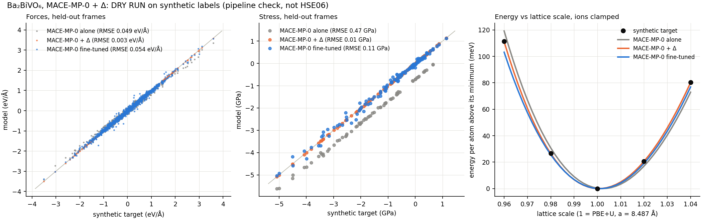
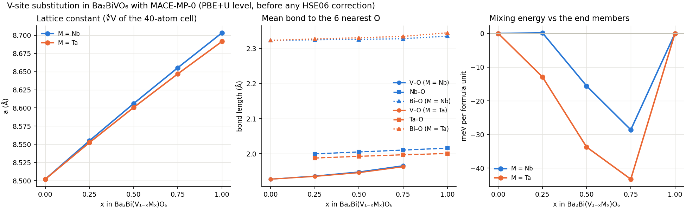
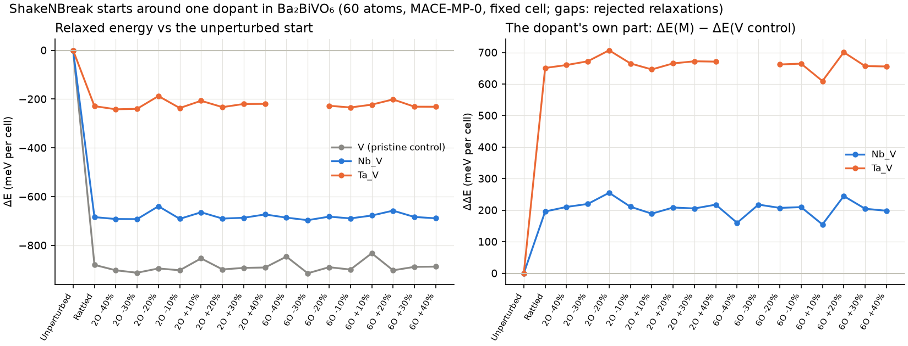

# HSE06 quality from MACE-MP-0: Δ-learning for Ba₂BiVO₆

Hybrid functionals fix a lot of what PBE(+U) gets wrong in oxides, but at 10–100×
the cost, which rules out MD and large cells. The idea here is to keep an MLIP
at run time and learn only the difference:

```
E(x) = E_MACE-MP-0(x) + ΔE(x),     ΔE trained on  E_HSE06 − E_MACE-MP-0
```

MACE-MP-0 was trained on Materials Project data: PBE+U with U = 3.25 eV on V in
oxides, the same setting as the PBE+U runs of this structure. So MACE-MP-0 stands in
for the PBE+U calculation, and a step of the combined model costs two MLIP
evaluations and no DFT. Every labeled frame gets both PBE+U and HSE06, so the
residual can be split into the functional (HSE06 − PBE+U) and the baseline's
own error (PBE+U − MACE-MP-0).

The example is split between the laptop and LONI:

| Step | Where | What |
|---|---|---|
| `make_frames.py` | laptop, 4 min | 58 frames from MACE-MP-0: strained primitive cells, 40-atom MD at 300/600/900 K, Nb- and Ta-substituted cells |
| `doping.py` | laptop, 8 min | the V-site series Ba₂Bi(V₁₋ₓMₓ)O₆, M = Nb, Ta, x = 0.25–1: relaxed cells, lattice, bonds, mixing energies, and 73 frames to label |
| `snb_screen.py` | laptop, 12 min (GPU) | ShakeNBreak bond distortions around one Nb or Ta (doped supercell, 60 atoms), a pristine control, MACE-MP-0 relaxations, and 9 PBE+U single points (`snb/`); needs a separate `defects` environment |
| `make_packages.py` | laptop | four VASP packages: `smoke/` (3 frames), `campaign/` (58), `doped_smoke/` (3), `doped_campaign/` (73) |
| run the packages | **LONI** | PBE+U then HSE06 on every frame, same k-mesh, cutoff, and precision |
| `collect_vasp_labels` | laptop | checks every run and writes `labeled.extxyz` |
| `train.py`, `evaluate.py`, `figures.py` | laptop | the Δ-model, a direct HSE06 fine-tune for comparison, the tests, and the figure |

`fake_labels.py` and `--dry-run` run the laptop half on synthetic labels, to
check the pipeline before any LONI hours are spent.

## Structures for coauthors

[`poscars/`](poscars/README.md) has every structure of the example as a
VASP POSCAR, one folder each: the PBE+U cell (primitive and 40-atom), the Nb/Ta
series, the two MACE-MP-0 distortions of the cubic cell, and the 80-atom
dilute cells, with where each comes from. [`frames/`](frames/) has the exact
frame sets the LONI packages were written from. `export_structures.py`
regenerates both.

## The baseline, checked

At the PBE+U geometry of the primitive cell, MACE-MP-0 gives −66.084 eV per
10-atom cell against VASP PBE+U's −66.071 eV (13 meV per cell). It relaxes the
cubic cell to 8.502 Å against PBE+U's 8.487 Å (+0.17 %). The residual forces at
the PBE+U minimum are up to 0.19 eV/Å. For this material, MACE-MP-0 is a close
stand-in for PBE+U.

## Dry run: the laptop half, on synthetic labels

Before any LONI time, `fake_labels.py` makes stand-in labels for all the frames
(58 pristine, 73 doped): "HSE06" is MACE-MP-0 plus a known pair term (Morse)
that changes energies, forces, and stress. The laptop half then runs as it will
on the real data (`train.py --dry-run --quick`, `evaluate.py --dry-run`,
`figures.py --dry-run`): 109 training frames, 22 held out. On the held-out
pristine 600 K frames:

| | E (meV/atom) | F (eV/Å) | Stress (GPa) | Relaxed a (Å) | Clamped-ion a (Å) |
|---|---|---|---|---|---|
| Target (synthetic) | — | — | — | 8.4843 | 8.5114 |
| MACE-MP-0 alone | 0.70 | 0.063 | 0.46 | 8.5021 | 8.5250 |
| **MACE-MP-0 + Δ** | 0.05 | 0.003 | 0.01 | 8.4839 | 8.5113 |
| MACE-MP-0 fine-tuned | 0.84 | 0.062 | 0.14 | 8.4890 | 8.5097 |

On the held-out doped frames (2 per composition), the Δ-model's forces are
0.002–0.004 eV/Å at every x for both dopants (direct fine-tuning: 0.03–0.08).
The mixing energies (meV per formula unit) are the sharpest test:

| x | Nb: target | Nb: + Δ | Nb: fine-tuned | Ta: target | Ta: + Δ | Ta: fine-tuned |
|---|---|---|---|---|---|---|
| 0.25 | −0.2 | +0.0 | **+21.8** | −13.0 | −12.9 | **+15.8** |
| 0.5 | −16.6 | −16.4 | **+23.4** | −34.5 | −34.3 | **+14.0** |
| 0.75 | −30.1 | −29.9 | **+12.7** | −44.7 | −44.5 | **+4.1** |

The correction keeps MACE-MP-0's energetics across compositions and adds the
difference, so it reproduces the target's mixing energies to within 0.3 meV per
formula unit. Direct fine-tuning on the same labels moves the energies of the
compositions relative to each other by more than the mixing energies themselves,
and flips their sign. With real HSE06 labels the numbers will differ, but the
risk is the same: for energies between compositions, fine-tune with care.



The correction recovers the known term in energy, forces, stress, and both
lattice constants. Fine-tuning MACE-MP-0 on the same labels gets energies and
lattice constants nearly as close, but its forces stay near MACE-MP-0's
(0.062 against 0.063 eV/Å): in this short training on 109 frames it cannot move a
128-channel model as far as a correction can go on a residual. The relaxed and
clamped-ion lattices differ by 0.03 Å, because the ions follow the volume in a
relaxation. That is why a single-point campaign can check a model's clamped-ion
lattice, but not its relaxed HSE06 lattice.

On the way, the dry run found two ways stress training fails silently, now both
fixed:

1. mace-torch's default `weighted` loss ignores stress. `TrainingSpec` now
   switches to `--loss=stress --compute_stress=True` whenever a stress weight is
   set.
2. A residual's stresses are small, so they need a large weight (10⁴ here). At
   weight 10 the stress error stayed at 0.56 GPa.

Three MACE-MP-0 fine-tunes with stress on 40-atom cells do not fit in 8 GB of
GPU memory side by side, so `train.py` trains the direct fine-tune's seeds one
at a time.

## Is cubic Ba₂BiVO₆ a minimum? (MACE-MP-0 says no)

Found while testing dilute dopants. Every relaxation above starts from the cubic
(Fm-3m) cell, where every force is zero by symmetry, so it stays cubic. From a
0.02 Å rattle, MACE-MP-0 relaxes the pristine cell much lower:

| Cell (pristine, MACE-MP-0) | Lattice | E − cubic (meV/f.u.) | Largest atom shift |
|---|---|---|---|
| 40, 80, 270, 320 atoms | fixed at the cubic lattice | −143 to −148 | 0.42–0.46 Å |
| 40 atoms | cell free too | **−608** | O up to 1.45 Å |

With the cell free, the volume grows by 23 %, the octahedra break, and V ends
up with V–O bonds of 1.73 Å (the length of the VO₄ tetrahedra of vanadates
such as BiVO₄). Whether this is real or MACE-MP-0 extrapolating that far from its
data is for DFT to decide. A PBE+U relaxation from the symmetric cell cannot see
it either, so the cubic structure's band gap and effective masses may belong to
a saddle point.

`stability_check.py` writes the test for LONI (also in
`D:\MLIP_Work_Folder\hpc_smoke_tests\08_vasp_bbvo_stability`):

- **PBE+U and HSE06 single points** on the cubic cell, the fixed-cell distortion,
  and the fully relaxed MACE-MP-0 structure;
- **a PBE+U relaxation** from the cubic cell rattled by 0.05 Å, with ISYM = 0
  (ions, then cell and ions). It does not depend on MACE-MP-0 at all.

Until that comes back, everything below that relaxes a structure (the doping
series and the dilute cells) describes the cubic structure, not necessarily the
ground state. The Δ-learning pipeline itself does not depend on the answer, but
if the distortion is real, the training frames must include it.

## V-site substitution: Nb and Ta

`doping.py` replaces V by Nb or Ta in the 40-atom cell. The four V sites there
form an fcc sublattice, so each of x = 0.25, 0.5, 0.75, 1 has a single ordering.
Every composition is relaxed with MACE-MP-0 (cell and ions). These are
**PBE+U-level numbers, before any HSE06 correction**:



| x | a, M = Nb (Å) | a, M = Ta (Å) | ΔE_mix, Nb (meV/f.u.) | ΔE_mix, Ta (meV/f.u.) |
|---|---|---|---|---|
| 0 (Ba₂BiVO₆) | 8.502 | 8.502 | 0 | 0 |
| 0.25 | 8.555 | 8.552 | +0.2 | −12.9 |
| 0.5 | 8.606 | 8.601 | −15.6 | −33.7 |
| 0.75 | 8.655 | 8.647 | −28.6 | −43.3 |
| 1 (Ba₂BiMO₆) | 8.703 | 8.691 | 0 | 0 |

- **The lattice follows Vegard's law.** It grows almost linearly, by 0.20 Å
  (Nb) and 0.19 Å (Ta) from x = 0 to 1, because the B-site octahedra swell:
  V–O is 1.93–1.97 Å, Nb–O 2.00–2.02 Å, Ta–O 1.99–2.00 Å. Bi–O barely changes
  (2.32–2.34 Å). At x = 0.5, the layered ordering makes the cell slightly
  tetragonal (8.609 × 8.609 × 8.599 Å for Nb).
- **The mixing energy is negative for both, deeper for Ta.** A mixed crystal
  with this ordering is favored over separate V and Nb/Ta phases at 0 K. This
  comes from one ordering per composition, in a 40-atom cell, at MACE-MP-0
  level. Differences of a few meV per formula unit are within what MACE-MP-0
  can resolve, so the asymmetry (Nb at x = 0.25 is essentially zero) is a
  hypothesis for the HSE06 labels to test.

For labeling, `doping.py` also writes 9 frames per composition: the relaxed
cell, 6 MD frames at 300 and 900 K, and 2 held-out frames at 600 K. It adds
the relaxed pristine cell, so the labels give the mixing energy on the same
footing. `make_packages.py` turns them into:

- `doped_smoke/` (also `D:\MLIP_Work_Folder\hpc_smoke_tests\07_vasp_bbvo_doped`):
  Ba₂BiNbO₆, Ba₂BiTaO₆, and Nb at x = 0.5, relaxed. This checks the Nb_pv and
  Ta_pv POTCARs, that PBE+U puts U on V only (the end members get none, as in the
  Materials Project), and the cost of the doped cells.
- `doped_campaign/`: all 73 frames. Heavy, like the pristine campaign.

Once `doped_campaign/labeled.extxyz` exists, `train.py` trains on both
campaigns together. `evaluate.py` then reports the errors per held-out
composition and the mixing energies from the HSE06 and PBE+U labels against
each model on the same relaxed cells, which is the same table at hybrid level.

## Symmetry breaking around one dopant (doped + ShakeNBreak)

`snb_screen.py` asks the local version of the stability question. It uses
[doped](https://github.com/SMTG-Bham/doped) and
[ShakeNBreak](https://github.com/SMTG-Bham/ShakeNBreak). doped picks the
supercell (60 atoms, the smallest near-cubic cell with 10.4 Å between periodic
images of the dopant) and guesses the charge states. ShakeNBreak stretches or
compresses the bonds to the 2 or 6 nearest O by ±10–40 % and rattles the rest,
tailing off away from the site. MACE-MP-0 relaxes each start at the host
lattice, and the same starts (same seeds, same atom order) around a V of the
undoped cell give the control. Two points to know:

- **ShakeNBreak's own rule does nothing here.** It distorts as many neighbours
  as the defect has extra or missing electrons. Nb⁵⁺ and Ta⁵⁺ on V⁵⁺ have none,
  so it would only rattle. The script sets the neighbour counts explicitly. doped
  guesses q = 0, −1, −2, −3 (and −4 for Ta). Only q = 0 runs, because MACE-MP-0
  has no charge.
- **Strong compressions find holes in MACE-MP-0.** Ta with all six O pushed in
  by 30 or 40 % collapsed to Ta–O 0.01–0.8 Å, at −10⁷ eV. Any relaxation with two
  atoms closer than 1.5 Å, or that did not converge, is rejected. Two of the 54
  were rejected, both Ta.

Energies relative to the unperturbed relaxation of the same cell (meV per
60-atom cell, 6 formula units), 18 starts each:

| On the site | Lowest ΔE | Range over starts | M–O at the lowest (Å) | Lowest − lowest of the control |
|---|---|---|---|---|
| V (pristine control) | −914 | −832 to −914 | 1.79–2.12 | — |
| Nb | −697 | −640 to −697 | 1.97–2.06 | **+218** |
| Ta | −242 | −188 to −242 | 1.98–2.02 | **+672** |

- **Every start falls into the host's distortion, a rattle included.** The
  control gains about 150 meV per formula unit, as in `stability_check.py`.
  The starts differ by up to 80 meV, a rugged landscape of related minima
  rather than one new structure. No bond pattern around the dopant stands out.
- **The dopant does not distort. It suppresses the host's distortion.** The
  V–O bonds at the control site split to 1.79–2.12 Å (the V moves off-center),
  while Nb–O stays within 1.97–2.06 Å and Ta–O within 1.98–2.02 Å. The doped
  cells gain less than the pristine one, by 218 meV (Nb) and 672 meV (Ta). That
  is about 1.5 and 4.5 formula units' worth of the host's gain, so Ta holds
  more of the cell near cubic than just its own octahedron.
- **That fits a V-driven instability.** Off-centering of d⁰ cations (a
  second-order Jahn–Teller effect) is strongest for V⁵⁺ and weaker for Nb⁵⁺ and
  Ta⁵⁺. The order V > Nb > Ta here matches. It stays a MACE-MP-0 result until
  the DFT checks come back.

For the dilute cells, if the distortion is real, substituting V costs more
than `dilute.py` reports against the cubic host. In this cell the extra cost
is +218 meV (Nb) and +672 meV (Ta) per dopant, and the Ta suppression reaches
past the dopant's own octahedron, so the number depends on cell size (only
60 atoms was run). The substitution energies and the doped series should wait
for the `stability_check.py` result.

For DFT, `snb/` (in `DELTA_DIR`) holds PBE+U single points on 9 structures. For
Nb, Ta, and the control, it takes the unperturbed relaxation and the 2 lowest
distinct distorted minima. If PBE+U gives the same ordering, relax those in
VASP (the ShakeNBreak recipe); if not, the distortion is MACE-MP-0's.



doped and ShakeNBreak are not dependencies of samson-mlip-visualizer, and they
add about 55 packages (pymatgen ≥ 2025.10, phonopy, hiphive, dscribe, numba,
mp-api). Keep them in a separate environment, with a CUDA torch for the RTX
5070 (cu128):

```bash
micromamba create -n defects -c conda-forge python=3.12 pip
micromamba run -n defects python -m pip install torch --index-url https://download.pytorch.org/whl/cu128
micromamba run -n defects python -m pip install mace-torch==0.3.16 doped==3.2.1 shakenbreak==3.4.4
PYTHONPATH=../../src micromamba run -n defects python snb_screen.py      # --quick: 18 starts, 5 min
```

On this laptop, pip's download of the 3 GB torch wheel failed twice on a
Windows file lock (`WinError 32`, pip's temp file). Downloading the wheel with
`curl -C -` and installing from the file worked.

## The VASP packages

`samson_mlip_visualizer.vasp_labeling` writes the packages. It gives each frame
POSCAR, KPOINTS, one INCAR per level, and the list of POTCARs to concatenate on
the cluster (POTCARs are licensed, so none are copied):

- **POTCARs and U** follow pymatgen's `MPRelaxSet.yaml`, as used for the MACE-MP-0 training data:
  Ba_sv, V_pv, Bi, O (Nb_pv, Ta_pv), legacy PBE set. U = 3.25 eV on V only, and
  only in PBE+U, because HSE06 has no U.
- **Matched settings**: 520 eV, PREC = Accurate, LREAL = .FALSE., ISYM = 0, and
  one Γ-centered KPOINTS per frame (spacing 0.3 Å⁻¹: 5×5×5 on the primitive
  cell, 3×3×3 on 40 atoms) shared by both levels, so their difference is the
  functional's alone.
- **HSE06** (AEXX 0.25, HFSCREEN 0.2, PRECFOCK Normal, ALGO Damped) starts from
  the PBE+U WAVECAR in the same array task.
- **Single points with forces and stress** (NSW = 0, ISIF = 2). The collector
  keeps a frame only if both levels finished and reached EDIFF, and their cell
  and geometry match the frame.

### Smoke test (`D:\MLIP_Work_Folder\hpc_smoke_tests\05_vasp_bbvo`)

Three frames: the PBE+U primitive cell itself, a rattled primitive cell, and
one 40-atom MD frame. On the first, the numbers should land near the earlier
runs of this cell on the same 5×5×5 mesh: HSE06 −84.208 eV (that run used
PRECFOCK = Fast) and PBE+U −66.071 eV (that run used a 7×7×7 mesh and
LREAL = Auto, so a few meV apart). The 40-atom frame measures what the campaign
will cost per frame.

Fill in `<ACCOUNT>`, `<PARTITION>`, `<VASP_MODULE>`, `<VASP_COMMAND>` (e.g.
`srun vasp_std`) and `<POTPAW_PBE_DIR>` in `run_vasp.slurm`, then `sbatch` it.
Copy `outputs/` back and run
`collect_vasp_labels(r"D:\MLIP_Work_Folder\delta_hse06_bbvo\smoke")`.

### Training on LONI

`train.py --package DIR` writes the two trainings (the correction and the direct
fine-tune) as GPU packages instead of training on the laptop, whose 8 GB GPU
could not fit three 40-atom fine-tunes with stress at once. The residual labels
are computed here first. The smoke test, `hpc_smoke_tests/11_train_bbvo_stress`
(`--dry-run --smoke`), trains both for 3 epochs on the synthetic labels.

### Campaign

All 58 frames. HSE06 on a 40-atom cell takes node-hours, so run the smoke test
first and adjust nodes, KPAR, and wall time from its timing. After collecting,
copy `campaign/labeled.extxyz` next to this example's data (the default
`DELTA_DIR` is `D:\MLIP_Work_Folder\delta_hse06_bbvo`) and run `train.py` and
`evaluate.py`.

## What `evaluate.py` reports

- Energy, force, and stress errors against HSE06 on the held-out 600 K frames, for
  MACE-MP-0 alone, MACE-MP-0 + Δ (3-seed committee), and MACE-MP-0 fine-tuned
  directly on HSE06.
- How the force residual splits into the functional (HSE06 − PBE+U) and the
  baseline (PBE+U − MACE-MP-0).
- The clamped-ion lattice constant (the minimum of E over the rigidly scaled
  primitive cells) from the HSE06 labels and from each model on the same
  frames, plus each model's fully relaxed lattice. Single points cannot give the
  relaxed HSE06 lattice: in the dry run, letting the ions relax moved the
  minimum by 0.03 Å. For a reference, add one HSE06 relaxation (ISIF = 3) of the
  primitive cell on LONI.

If the split shows that most of the residual is MACE-MP-0's own error
(PBE+U − MACE-MP-0) rather than the functional, the correction is mostly
patching the baseline. Better baselines need no new labels, because every frame
already has PBE+U. One option is two stages: fine-tune MACE-MP-0 on the PBE+U
labels, then train the correction on HSE06 − that model. The other is a larger
foundation model as the baseline (`mace_baseline_card` records any MACE file).

## Scope

- **Energies, forces, and stress only.** The band gap, effective masses, and
  band-edge character come from the electronic structure, which an interatomic
  potential does not have. For those, the natural ML route is a model of the
  charge density, whose prediction starts or replaces the SCF (for example, a
  non-self-consistent HSE06 band run from a predicted density).
- **Neutral cells.** A small polaron (an extra electron localized on V) is a
  charged, spin-polarized state that neither MACE-MP-0 nor this correction
  describes.
- **Nb and Ta.** The doped campaign covers x = 0.25–1 in the 40-atom cell (and
  the pristine campaign has 12 more substituted frames). Treat any other dopant
  or site as out of scope until it has labels of its own.
