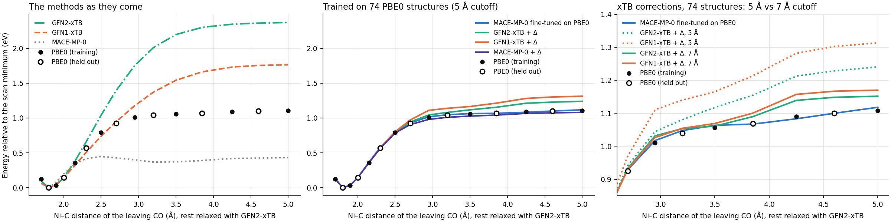
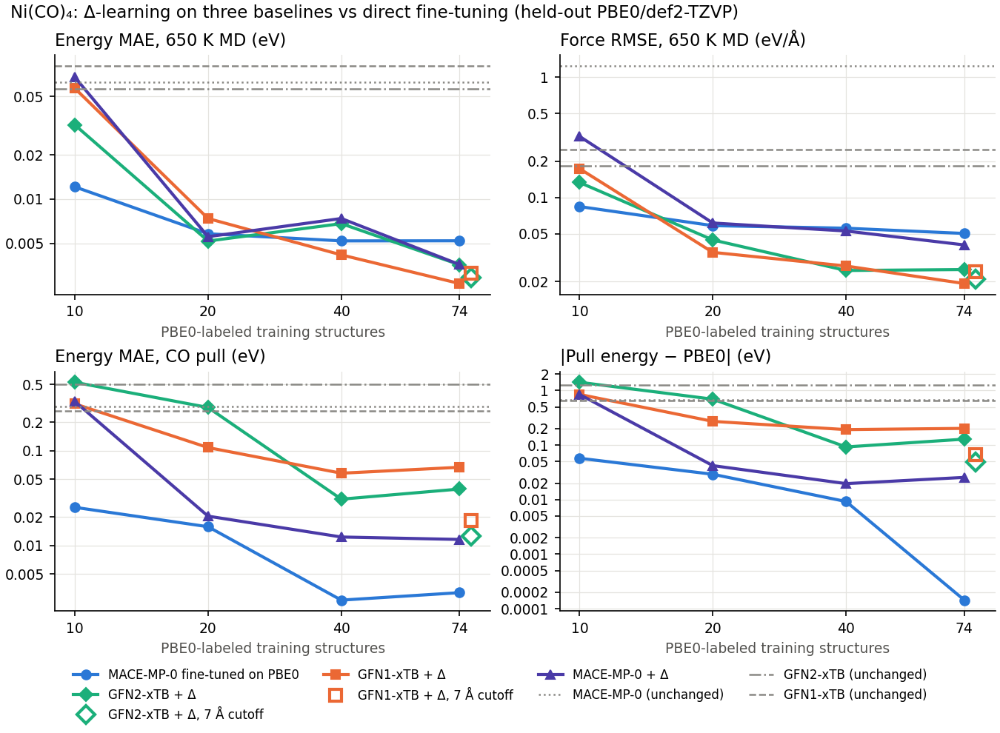

# Δ-learning for a transition-metal complex: Ni(CO)₄ → Ni(CO)₃ + CO

The first CO of nickel tetracarbonyl comes off with about 25 kcal/mol (≈ 1.1 eV).
That metal–ligand bond is where semi-empirical methods are weakest, so it is a
harder test for Δ-learning than HCN. The target is PBE0/def2-TZVP (Psi4). Three
baselines get a correction, each a small MACE trained from scratch on the
residual:

- **GFN2-xTB** and **GFN1-xTB**;
- **MACE-MP-0 small**, a machine-learned baseline. This is a laptop rehearsal of
  the design of the [HSE06 example](../delta_hse06_bbvo/README.md), where
  MACE-MP-0 stands in for PBE+U.

All three are compared with MACE-MP-0 fine-tuned directly on PBE0. The run
was done on 2026-09-27 with one seed per model.

## Data

`make_data.py` makes every geometry with GFN2-xTB and labels it with PBE0
(96 frames, none failed, ~17 s per gradient on the laptop):

- **The CO pull**: Ni–C of one CO from 1.70 to 5.0 Å, everything else relaxed at
  each distance (15 points). Every other point goes to training, with two
  rattled copies each; the 7 points in between are held out.
- **MD**: Langevin at 400 and 900 K for training (50 frames), and an independent
  650 K trajectory held out (15 frames).

Training pool: 74 structures. Every model gets the same number of optimizer
steps.

## The baselines as they come



*Left: the baselines on the scan geometries. Middle: every model trained on 74
structures, with the correction's default 5 Å cutoff. Right: the plateau
enlarged, where the xTB corrections with a 5 Å cutoff (dotted) stay 0.13–0.20 eV
above PBE0 and those with 7 Å (solid) close most of the gap.*

| | CO pull energy, 1.80 → 4.60 Å | Force residual vs PBE0 (RMS over the pool) |
|---|---|---|
| PBE0/def2-TZVP | **1.100 eV** | — (PBE0 forces: 1.65 eV/Å RMS) |
| GFN2-xTB | 2.364 eV | 0.18 eV/Å |
| GFN1-xTB | 1.756 eV | 0.25 eV/Å |
| MACE-MP-0 small | 0.424 eV, wrong shape | 1.26 eV/Å |

- **GFN-xTB overbinds the CO by 0.7–1.3 eV but has the right shape**, and its
  forces are close to PBE0's. Its error is a large, smooth energy offset along
  the pull.
- **MACE-MP-0 gets the curve wrong.** It levels off at 0.4 eV past 2.5 Å, and
  its forces are poor. Its training data are crystals, not metal carbonyls.

## Learning curves



*Held-out errors against the number of PBE0 labels. The hollow markers at 74 are the
xTB corrections retrained with a 7 Å cutoff. Gray lines are the methods used as
they come.*

| Held-out, 74 training structures | 650 K MD: E MAE | 650 K MD: F RMSE | CO pull: E MAE | Pull energy (PBE0 1.100) |
|---|---|---|---|---|
| MACE-MP-0 fine-tuned on PBE0 | 5.2 meV | 0.050 eV/Å | 0.003 eV | 1.100 eV |
| MACE-MP-0 + Δ | 3.6 meV | 0.040 eV/Å | 0.012 eV | 1.074 eV |
| GFN2-xTB + Δ (5 Å cutoff) | 3.6 meV | 0.025 eV/Å | 0.039 eV | 1.228 eV |
| GFN1-xTB + Δ (5 Å cutoff) | 2.7 meV | 0.019 eV/Å | 0.067 eV | 1.302 eV |
| GFN2-xTB + Δ (**7 Å** cutoff) | 3 meV | 0.021 eV/Å | 0.012 eV | 1.149 eV |
| GFN1-xTB + Δ (**7 Å** cutoff) | 3 meV | 0.024 eV/Å | 0.018 eV | 1.167 eV |

- **Near equilibrium, the xTB corrections are best.** From 20 labels on, their
  forces in the 650 K MD are 0.02–0.03 eV/Å, against 0.05–0.06 for direct
  fine-tuning. The same pattern as HCN.
- **For the bond breaking, direct fine-tuning is best.** With 74 labels it
  reproduces the pull energy exactly. The foundation model plus a single
  well-covered curve is a strong combination, and even 10 labels get within
  0.06 eV.
- **The xTB corrections' first weakness was their cutoff.** GFN-xTB's
  overbinding is long-ranged (its curve still climbs at Ni–C 4–5 Å). A
  correction that sees 5 Å cannot cancel all of it, so the pull energy stayed
  0.13–0.20 eV too high. With a 7 Å cutoff (`cutoff_test.py`, same data), the
  error drops to 0.05–0.07 eV and the pull-curve error to 0.012–0.018 eV, with
  forces unchanged. **A correction's cutoff has to cover the range of the
  baseline's error, not just the range of the chemistry.**
- **MACE-MP-0 is a poor baseline here, yet MACE-MP-0 + Δ does well.** Its
  errors are short-ranged, because MACE-MP-0 itself has a 6 Å cutoff.
- **With very few labels, only the fine-tuned foundation model gets the bond
  breaking.** At 10 labels every correction misses the pull energy by 0.8–1.4 eV
  (fine-tuning: 0.06 eV), and GFN2-xTB + Δ still misses by 0.7 eV at 20. The
  MACE-MP-0 correction is within 0.05 eV from 20 labels on.

What this means for a new transition-metal system: to run MD near a minimum,
GFN-xTB + Δ gives the best forces from the fewest labels. For bond breaking,
check how far the baseline's error reaches before choosing the cutoff, or use
a fine-tuned foundation model.

## The scale-up for LONI: Ni porphine

`porphine_packages.py` builds Ni(II) porphine (37 atoms, closed-shell singlet,
D4h, Ni–N 1.971 Å after GFN2-xTB) and writes two ORCA packages at PBE0/def2-TZVP
with RIJCOSX (16 cores, 32 GB per frame). A 37-atom hybrid gradient takes
minutes on a cluster node, too much for a laptop campaign:

- `porphine_smoke/`, also in
  `D:\MLIP_Work_Folder\hpc_smoke_tests\06_orca_ni_porphine`: 3 frames (the
  GFN2-xTB minimum, a rattled copy, a 600 K MD frame). This checks ORCA on the
  complex, the collector, and the cost per frame.
- `porphine_campaign/`: 150 frames (the minimum, 10 rattled copies, GFN2-xTB MD
  at 300 and 600 K), for the same learning curves as Ni(CO)₄.

Fill in `<ACCOUNT>`, `<PARTITION>`, and `<MODULE>` in `run_orca.slurm`, submit,
copy back `outputs/`, and run `collect_labels` on the folder. Given the
Ni(CO)₄ result, train the xTB corrections for porphine with a cutoff of at
least 7 Å.

## Next steps on LONI

Two things are too heavy for the laptop and are packaged for LONI (see
`examples/hpc_smoke_tests/README.md`):

- **Is PBE0 good enough?** `reference_check.py` writes ORCA DLPNO-CCSD(T)/def2-TZVP
  single points (energy only) on frames that already have PBE0 labels. The
  smoke test is 3 points of the CO pull
  (`hpc_smoke_tests/09_orca_nico4_dlpno`); the campaign is the whole pull plus the
  held-out 650 K frames (30). If PBE0 is off by more than ~0.1 eV, a second
  correction (CCSD(T) − PBE0) on those points is next.
- **Error bars and both cutoffs for every size.** `train.py --package DIR
  --seeds 1 2 3 --rmax 7` writes the 24 models of the learning curves
  (72 trainings) as GPU packages; the residual labels are computed here, so the
  cluster needs only mace-torch. Smoke test: `hpc_smoke_tests/10_train_nico4`
  (`--smoke`: 2 models, 3 epochs). Copy `runs/` back, `install_models`, and run
  `evaluate.py` here (it needs xtb).

## Reproduce

In SAMSON's Python, with xtb and Psi4 in their own environments:

```bash
cd examples/delta_nico4
python make_data.py          # 96 PBE0 labels (~30 min)
python train.py              # 16 models
python evaluate.py           # results.json and the figures
python cutoff_test.py        # the 7 Å xTB corrections
python porphine_packages.py  # the LONI packages for Ni porphine
python reference_check.py    # DLPNO-CCSD(T) packages
python train.py --package D:/MLIP_Work_Folder/delta_nico4/loni_learning_curves --seeds 1 2 3 --rmax 7
```

`DELTA_DIR` sets where data, models, and results go; the run above used
`D:\MLIP_Work_Folder\delta_nico4`.
