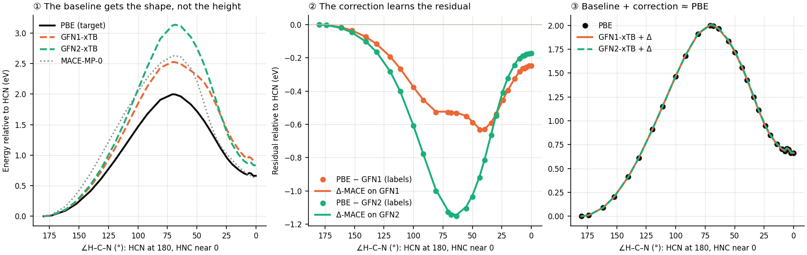
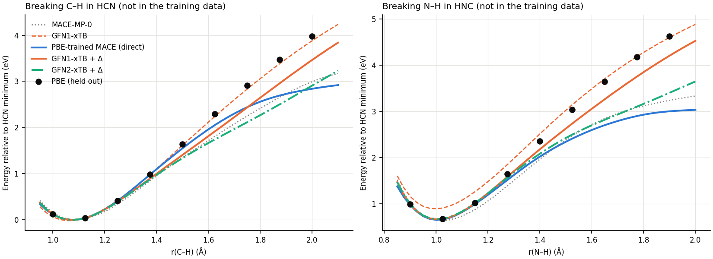
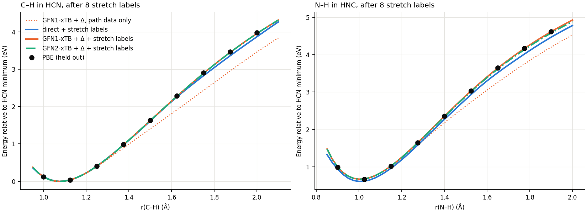
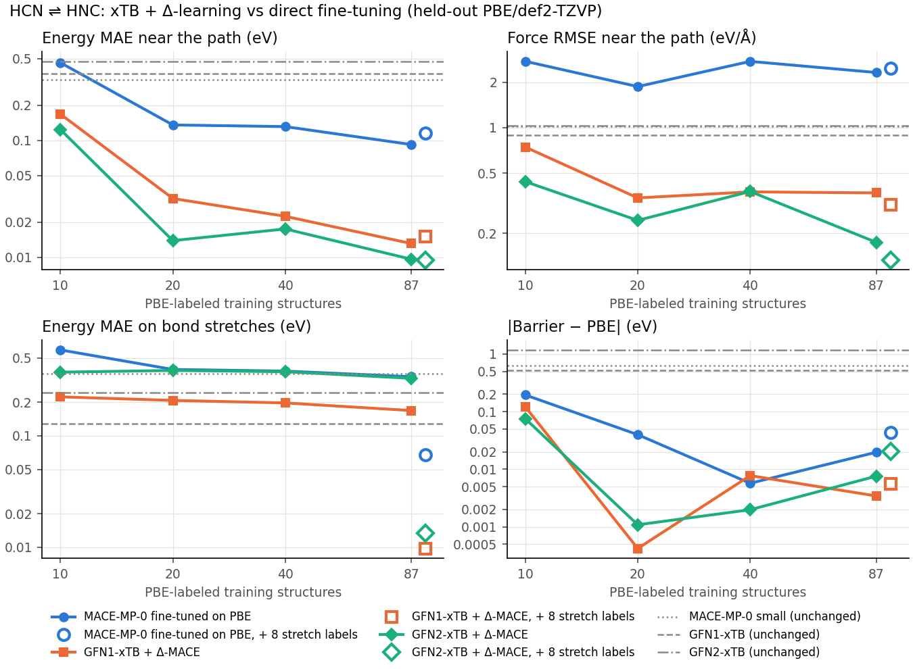
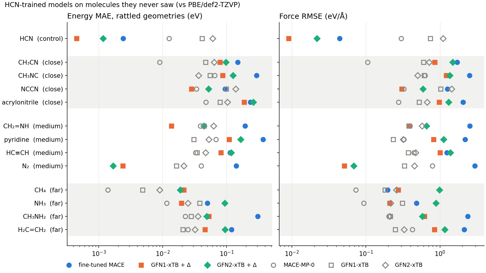

# Δ-learning for HCN ⇌ HNC: GFN-xTB plus a learned correction

A tight-binding model with an ML correction for one particular system. GFN-xTB
provides the physics; a small MACE learns only the difference between PBE
and xTB:

```
E(x) = E_xTB(x) + ΔE_MACE(x),     ΔE_MACE trained on  E_PBE − E_xTB
```

This is how published models such as AIQM2 (GFN2-xTB + ANI) and QDπ
(DFTB3 + DeepPot-SE) are built. Here it is compared with fine-tuning
MACE-MP-0 directly on PBE ([docs/fine_tuning.md](../../docs/fine_tuning.md)),
using the same 87 PBE-labeled structures, the same number of optimizer steps,
and a held-out test set. The runs were done on 2026-09-26 with one seed per
model, so treat differences below a factor of two with care.

## What happens, in three pictures

**1. The baseline gets the shape of the reaction, not the height.** Along the
isomerization path, GFN1-xTB puts the barrier at 2.52 eV and GFN2-xTB at
3.13 eV (PBE: 2.00 eV). The residual PBE − xTB is smooth and has no sharp
features, so a small network can learn it. MACE fits it to within a few meV
per atom, and the sum lands on PBE.



**2. Away from the training data, the correction can break a good baseline.**
The 87 training structures only follow the isomerization. Breaking the C–H
or N–H bond moves the hydrogen somewhere the correction has never seen. Plain
GFN1-xTB tracks PBE well there (0.05 eV mean error for C–H), but the correction
drifts by about 0.4 eV as the hydrogen leaves and drags the sum away. It still
does better than direct fine-tuning, whose curve flattens out entirely
(errors up to 1.1 and 1.6 eV).



**3. Eight more labels fix it.** One active-learning round labeled 8
stretched geometries with PBE, at bond lengths between and beyond the test
points (`stretch_round.py`). The Δ-models then follow PBE on the stretches to
0.004–0.017 eV and keep their accuracy on the path. Direct fine-tuning with the
same 8 labels gets to 0.04–0.09 eV.



## Learning curves

Errors on the held-out test set against the number of PBE labels. Every
model got about 2,640 optimizer steps whatever the set size. The hollow
markers are the 95-structure models of the stretch round.



Near the reaction path, the Δ-models trained on **20** structures are more
accurate than direct fine-tuning on all **87**. Their mean energy error is
0.014–0.032 eV, against 0.092 eV.

| Energy MAE near the path (eV) | 10 | 20 | 40 | 87 |
|---|---|---|---|---|
| MACE-MP-0 fine-tuned on PBE | 0.462 | 0.136 | 0.131 | 0.092 |
| GFN1-xTB + Δ-MACE | 0.168 | 0.032 | 0.022 | 0.013 |
| GFN2-xTB + Δ-MACE | 0.124 | 0.014 | 0.017 | 0.010 |

## All numbers

Errors against held-out PBE/def2-TZVP. Energies are relative to the HCN
minimum, which removes each method's constant offset. "Near" is 29 IRC frames
rattled by σ = 0.08 Å. The stretches are 9 frames each. The barrier and
reaction energy come from each model's own surface: P-RFO from the MACE-MP-0
TS, and relaxed linear minima.

| Model | PBE labels | Near: E MAE / max (eV) | Near: F RMSE (eV/Å) | C–H stretch E MAE | N–H stretch E MAE | Barrier (eV) | HNC − HCN (eV) |
|---|---|---|---|---|---|---|---|
| MACE-MP-0 small | 0 | 0.331 / 1.03 | 1.02 | 0.387 | 0.521 | 2.630 | 0.634 |
| GFN1-xTB | 0 | 0.371 / 1.03 | 0.89 | 0.045 | 0.135 | 2.517 | 0.920 |
| GFN2-xTB | 0 | 0.475 / 1.29 | 1.03 | 0.176 | 0.230 | 3.175 | 0.868 |
| MACE-MP-0 fine-tuned | 87 | 0.092 / 1.37 | 2.32 | 0.303 | 0.554 | 1.977 | 0.652 |
| GFN1-xTB + Δ | 87 | 0.013 / 0.20 | 0.37 | 0.246 | 0.197 | 2.000 | 0.663 |
| GFN2-xTB + Δ | 87 | 0.010 / 0.08 | 0.17 | 0.424 | 0.447 | 2.005 | 0.668 |
| MACE-MP-0 fine-tuned | 87 + 8 stretch | 0.115 / 1.47 | 2.46 | 0.040 | 0.094 | 1.953 | 0.608 |
| GFN1-xTB + Δ | 87 + 8 stretch | 0.015 / 0.17 | 0.31 | 0.009 | 0.004 | 2.003 | 0.669 |
| GFN2-xTB + Δ | 87 + 8 stretch | 0.010 / 0.04 | 0.13 | 0.010 | 0.017 | 2.017 | 0.667 |
| PBE/def2-TZVP | — | — | — | — | — | 1.997 | 0.662 |

Things to read into the table:

- **Compressed bonds.** Two of the near-path test frames have a bond
  squeezed to 0.93–0.96 Å, further from the training data than anything
  else in that group (0.12–0.14 Å RMSD). Direct fine-tuning is off by 0.7 and
  1.4 eV there, and those two frames dominate its force RMSE. The Δ-models
  stay within 0.2 eV because xTB's short-range repulsion is part of the
  baseline.
- **GFN2 is a worse baseline but a fine Δ-model.** Its residual is twice the
  size of GFN1's (1.35 against 0.78 eV range on the training set), yet the
  network learned it just as well near the path. Off the path, the bigger
  residual extrapolates worse, until the stretch labels arrive.
- **The barrier is easy for everyone.** It sits on the training path, and
  with 20 or more labels every trained model lands within 0.05 eV of PBE.
- **Cost.** One energy and force evaluation of GFN1-xTB + Δ took about
  2.5× as long as the direct MACE (178 against 71 ms on the GPU, on a loaded
  machine). Most of that is starting the xtb process (~76 ms). Both are
  about 100× cheaper than PBE.

## Transferability: molecules the models never saw

`transfer.py` runs the final HCN models (87 path structures + 8 stretches) on
12 other molecules made of H, C, and N, graded by how much they resemble HCN.
Each molecule is relaxed with GFN1-xTB and rattled (6 copies, σ 0.03 Å), and
every method is compared with PBE on the same geometries.



- **The correction only helps where every atom's surroundings look like
  HCN.** Compared with its own baseline, GFN1-xTB + Δ is better on N₂ (0.002
  against 0.016 eV), CH₂=NH (0.014 against 0.044), NCCN (0.028 against 0.099),
  and NH₃ (0.020 against 0.038). It is worse on 8 of the 12 molecules: anything
  with a methyl group, a C=C or C≡C bond, or a ring (CH₃CN, CH₃NC,
  acrylonitrile, pyridine, HC≡CH, H₂C=CH₂, CH₄, CH₃NH₂). The HCN data contain
  no carbon bonded to carbon and no sp³ carbon.
- **Direct fine-tuning forgot the most.** It is worse than MACE-MP-0, the
  model it started from, on every molecule, often by 5–30×, with force errors
  of 1.2–3 eV/Å. The Δ-models degrade less, because part of the energy still
  comes from xTB.
- **Away from HCN, the broadly trained MACE-MP-0 beats every specialist.**
  Of the trained models, only on N₂ and CH₂=NH does a specialist do better
  than it.
- **An unseen reaction, CH₃NC → CH₃CN** (PBE: −1.084 eV, each method relaxing
  both isomers). GFN2-xTB alone gets −1.025. GFN2-xTB + Δ gets −0.961, so the
  HNC → HCN correction made it worse. GFN1-xTB + Δ improved on GFN1 slightly
  (−1.485 against −1.556). MACE-MP-0 gets −1.259 and the fine-tuned MACE
  −0.621. The correction learned for HNC → HCN does not carry over to its
  methyl analogue.

So a correction trained on 95 geometries of one molecule is a specialist, and
off its domain it can make the baseline worse. It stays usable on another
molecule only if that molecule's local environments were in the training
data. Covering many systems needs broad training data (the way AIQM2 is
trained) or a correction retrained for each new system.

## Using a Δ-model in the tool

A Δ-model's card (`<model>.json`) names its baseline:

```json
"delta_baseline": {"program": "xtb", "method": "gfn1", "charge": 0,
                   "multiplicity": 1, "solvent": null, "xtb_version": "6.7.1"}
```

`create_calculator("mace", model)` reads it and returns a
`DeltaCalculator` (xTB + correction), so the panel, the CLI, and the MCP
tools use it like any other MACE model. A correction on its own is not a
potential and is never returned alone. Committees of Δ-models keep their
spread. The building blocks are in `samson_mlip_visualizer.delta`
(`delta_labels`, `delta_e0s`, `DeltaCalculator`) and the `scratch` mode of
`samson_mlip_visualizer.training.TrainingSpec`.

## Reproduce

In SAMSON's Python, with xtb and Psi4 in their own environments (see the
[README](../../README.md#optional-xtb-and-psi4-reference-methods)):

```bash
cd examples/delta_xtb_hcn
python test_set.py        # 54 held-out frames labeled with PBE -> test_set.extxyz
python train.py           # 12 models: direct, Δ-GFN1, Δ-GFN2 on 10/20/40/87 structures
python stretch_round.py   # 8 stretch labels, 3 more models on 95 structures
python evaluate.py        # test-set errors, barrier, reaction energy -> results.json
python plot.py            # learning curves
python figures.py         # the pictures above
python transfer.py        # 12 unseen molecules + CH3NC -> CH3CN (91 PBE labels)
```

`DELTA_DIR` sets where data, models, and results go (default: this folder;
the run above used `D:\MLIP_Work_Folder\delta_xtb_hcn`). The training
structures are the committed
[`hcn_training_87_structures.extxyz`](../hpc_smoke_tests/hcn_training_87_structures.extxyz).
Training the 15 models took about 30 minutes of wall time, six at a time on
the laptop GPU while other jobs shared the CPU.
