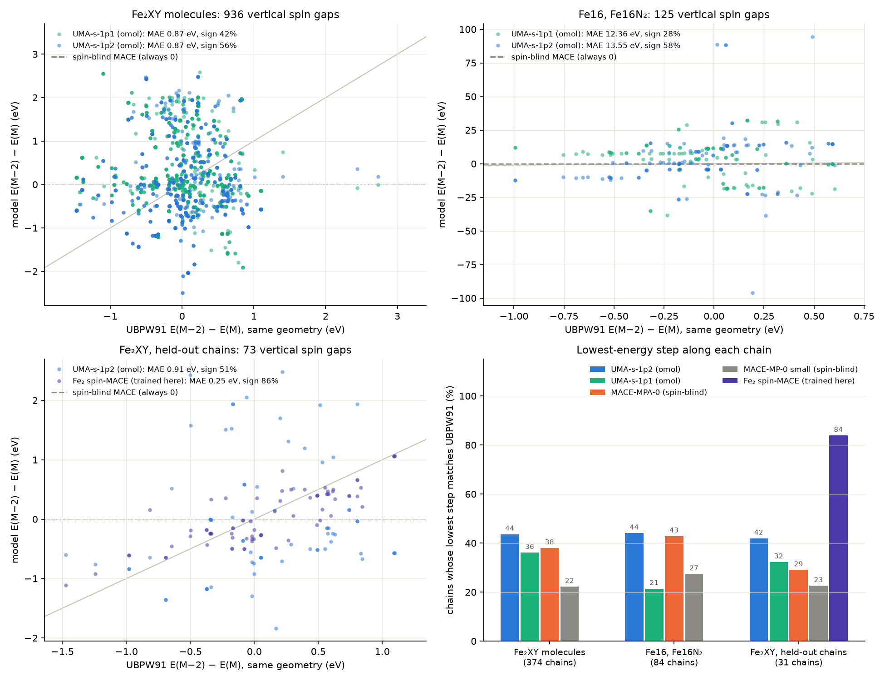
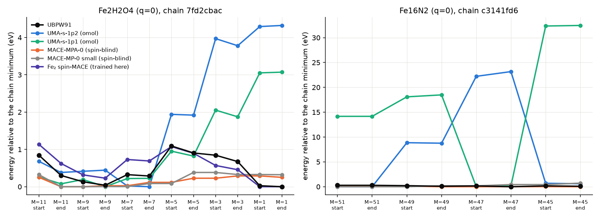

# Do foundation models know which spin state iron is in?

ClusterMLIP's Warehouse 2 (`dataset_spin_v0`, 21,390 UBPW91 frames from
Gaussian 09) is built from **spin ladders**. A chain relaxes one structure at
high multiplicity M, hands the relaxed geometry to M − 2, relaxes again, and so
on down. The last frame of one step and the first frame of the next are the
same geometry at two multiplicities (checked for all 1,061 hand-offs), so every
hand-off is a **vertical spin gap at fixed geometry**, the cleanest test of a
spin-aware model there is. There are 611 chains over 15 Fe₂XY molecules
(X, Y = H, N, O; 3–8 atoms, q = −1…+1, M = 1–11) and Fe16/Fe16N₂ (M = 41–55).

This example asks, with no new DFT labels:

1. Do the foundation models reproduce these spin ladders? UMA's `omol` head takes
   the charge and multiplicity as inputs; MACE-MP-0 and MACE-MPA-0 take neither.
2. Where they disagree with UBPW91, is it the model, or the functional it learned
   (ωB97M-V, a range-separated hybrid, against a GGA)?
3. Does a small MACE with a total-spin embedding, trained here on the Fe₂XY
   frames, learn the ladders? (A preview of ClusterMLIP's Fe16 v1 model.)
4. In SAMSON: what does N₂ do on an Fe₂O₄ cluster?



## Conclusions

*Work in progress (2026-09-29): the Psi4 functional check (2 of 8 spin gaps so
far) and the DFT check of the N₂ reaction energies are still running.*

- **No foundation model reproduces the UBPW91 spin ladders.** UMA's Fe₂XY gaps are
  uncorrelated with UBPW91 (r ≈ 0), its MAE is twice that of predicting zero,
  and on Fe16 it is off by 12–14 eV. The spin-blind models give zero by
  construction.
- **A small MACE with a total-spin embedding, trained on ~14,000 of these frames
  on the laptop GPU, does learn them.** On held-out chains: spin-gap MAE 0.25 eV
  (UMA 0.91), r = 0.82, the right sign 86 % of the time, the right chain ground
  state 26 of 31 times (UMA 13), forces 0.08 eV/Å (UMA 1.05). It needed the
  embedding keys set by hand: without them mace-torch trains spin-blind silently
  (below).
- **Part of UMA's disagreement is the functional, part is UMA.** On the two gaps
  checked so far, Psi4 BPW91 reproduces the Gaussian labels within 0.2 eV and
  ωB97M-V shifts the gap by 0.6–0.7 eV; UMA matches ωB97M-V once (within
  0.08 eV) and misses it by 1 eV with the wrong sign once.
- **On Fe₂O₄, N₂ is a spectator** (UMA, in SAMSON): turning it into two nitrosyls
  has no concerted path below 12 eV, and the first step (N₂ adding to a terminal
  Fe=O to give bound N₂O) has a 2.53 eV barrier and ends 0.91 eV uphill. The
  trained MACE is no help there: its frames are relaxations near minima, and at
  UMA's TS it puts the saddle below the intermediate.

## The data and the tests

`make_frames.py` keeps the first and last frame of every step: 3,226 key frames
(2,753 Fe₂XY, 473 Fe16). Frames with a UBPW91 force RMS above 5 eV/Å (5 here;
stuck SCF roots or blown-up geometries, see the label report) are left out of
every test. `analyze.py` runs three tests per chain group:

- **Vertical gaps**: E(M − 2) − E(M) at each hand-off (positive: the higher spin
  is lower). 936 Fe₂XY and 125 Fe16 hand-offs. A spin-blind model gives 0.
- **Chain ground state**: along chains with at least two steps (374 Fe₂XY, 84
  Fe16), which step's relaxed end is lowest. Different steps are different
  geometries, so a spin-blind model can get this right from geometry alone.
- **Relaxation energies and forces**: E(end) − E(start) within a step (same M),
  and the force RMSE on all key frames.

Every model runs in float64 (MACE) or with float64 element references (UMA:
its Fe16 energies move smoothly at the 10⁻⁵ eV level, checked). UMA runs on the
CPU in the `mlip` environment, 0.1 s per frame.

## Foundation models against UBPW91

| | Fe₂XY gap MAE (eV) | Fe₂XY gap r | Fe₂XY gap sign | Fe16 gap MAE (eV) | Chain ground state, Fe₂XY | Chain ground state, Fe16 | Force RMSE Fe₂XY / Fe16 (eV/Å) |
|---|---|---|---|---|---|---|---|
| UMA-s-1p2 (omol) | 0.87 | 0.04 | 56 % | **13.5** | 44 % | 44 % | 1.02 / 1.55 |
| UMA-s-1p1 (omol) | 0.87 | −0.15 | 42 % | **12.4** | 36 % | 21 % | 1.10 / 2.26 |
| MACE-MPA-0 medium (spin-blind) | 0.40 (always 0) | — | — | 0.25 (always 0) | 38 % | 43 % | 0.96 / 0.29 |
| MACE-MP-0 small (spin-blind) | 0.40 (always 0) | — | — | 0.25 (always 0) | 22 % | 27 % | 1.15 / 0.93 |

The UBPW91 gaps themselves are small and of both signs: median +24 meV,
interquartile range −0.19 to +0.36 eV for Fe₂XY, so predicting 0 for every
gap (the spin-blind models) already gives a 0.40 eV MAE.

- **UMA's Fe₂XY gaps are uncorrelated with UBPW91** (r = 0.04 and −0.15), and their
  MAE is twice that of predicting zero. The pattern is systematic, not noise: at
  low M (3 → 1, 5 → 3) UMA puts the lower spin 1–2 eV higher, while UBPW91 is
  nearly flat. UMA's ladders have a deep, well-defined minimum around M = 7; the
  UBPW91 ladders are shallow ([`images/example_chains.png`](images/example_chains.png)).
- **On Fe16 UMA breaks down.** Neighbouring multiplicities (M = 45–55) differ by
  10–90 eV, against UBPW91 gaps of at most 1 eV: multiplicities near 50 are far
  outside OMol25, and the spin embedding extrapolates. This is the divergence at
  M ≈ 49–53 that ClusterMLIP's `s7_polar_spin.py` saw for the OMol models.
- **Geometry is not the fix either.** UMA's forces on the UBPW91 frames are off by
  1 eV/Å RMS, and so are the spin-blind models' on Fe₂XY (MACE-MPA-0 does best on
  Fe16, 0.29 eV/Å).
- **Held-out chains**: on the 73 hand-offs of the 44 source structures in the
  trained model's test split, UMA behaves the same (gap MAE 0.91 eV, r = 0.11).



## Is it the functional? (running)

UMA learned ωB97M-V, a range-separated hybrid; the labels are UBPW91, a GGA, and
hybrids are known to favour high spin in iron compounds. `functional_check.py`
recomputes eight small Fe₂XY hand-offs (q = 0, at most 6 atoms, spread over the
UBPW91 gap range) with Psi4 at both levels, def2-TZVP: BPW91 checks that Psi4
reaches the same states as Gaussian, ωB97M-V separates UMA's own error from the
functional shift. ωB97M-V starts from the BPW91 orbitals of the same state, so
both functionals are compared in the basin the Gaussian ladder labelled.
Energies are good to about 1 mEh (27 meV): at a converged density they still
wander by up to 1 mEh (meta-GGA + VV10 on these open-shell Fe clusters).

| Hand-off | UBPW91 (Gaussian) | BPW91 (Psi4) | ωB97M-V (Psi4) | UMA-s-1p2 |
|---|---|---|---|---|
| Fe₂N₂O₂, M 7 → 5 | −1.43 | −1.24 | −0.54 | −0.46 |
| Fe₂HO, M 8 → 6 | +1.10 | +1.04 | +0.46 | −0.57 |

(eV; E(M − 2) − E(M) at the same geometry.) Six more are running.

## A spin-embedded MACE trained here

`train_fe2_spin.py`: MACE 64x0e+64x1o, r_max 5 Å, two interactions, with
categorical total-spin and total-charge graph embeddings (ClusterMLIP's recipe,
plus the `key` fields), from scratch on the Fe₂XY frames in the dataset's
grouped split (14,452 train, 1,978 valid, 1,343 test frames; whole source
structures per split; UBPW91 force RMS ≤ 5 eV/Å), float64, E0s from a
composition fit. 60 epochs, 2.3 h on the laptop GPU (sharing the CPU with Psi4);
the best validation epoch (35) was kept. MACE's own test table: 83 meV/atom,
77 meV/Å.

On the held-out chains (44 source structures it never saw; UMA and the others
on the same frames):

| | Gap MAE (eV) | Gap r | Right sign | Chain ground state | Relaxation MAE (meV) | Force RMSE (eV/Å) |
|---|---|---|---|---|---|---|
| **Fe₂ spin-MACE (trained here)** | **0.25** | **0.82** | **86 %** | **26 / 31** | **66** | **0.083** |
| UMA-s-1p2 | 0.91 | 0.11 | 51 % | 13 / 31 | 349 | 1.05 |
| UMA-s-1p1 | 0.84 | −0.10 | 41 % | 10 / 31 | 355 | 1.09 |
| MACE-MPA-0 (spin-blind) | 0.44 | — | — | 9 / 31 | 395 | 1.00 |
| MACE-MP-0 small (spin-blind) | 0.44 | — | — | 7 / 31 | 447 | 1.16 |

The remaining 0.25 eV is still large next to the gaps themselves (median |gap|
0.37 eV on these chains, 0.29 eV over all Fe₂XY), and this is one seed on data collected with ClusterMLIP's old code
(its step 3 re-collects it). But the embedding works: the same run without the
`key` fields (spin-blind by accident) stalled at 230 meV/atom and 262 meV/Å.

## N₂ on Fe₂O₄ in SAMSON

Among the Fe₂N₂O₄ chains, the lowest structures at M = 5 have N₂ lying next to an
Fe₂(μ-O)₂ core with a terminal oxo on each Fe (N–N 1.107 Å, Fe···N 2.4 Å). Another
chain relaxed to the same core carrying two linear nitrosyls (Fe–N 1.67, N–O
1.17 Å), 0.61 eV higher at UBPW91. Could the cluster turn N₂ into NO?

Reaction energy N₂·Fe₂O₄ → Fe₂O₂(NO)₂ at the UBPW91 geometries (eV):

| UBPW91 | UMA-s-1p2 | UMA-s-1p1 | MACE-MPA-0 | MACE-MP-0 |
|---|---|---|---|---|
| +0.60 | +1.69 | +2.74 | +1.40 | +1.15 |

With UMA-s-1p2 (q = 0, M = 5) in SAMSON (`n2_to_no_endpoints.py` writes the two
ends; SAMSON's importer reordered their atoms, see below):

1. **Relaxed ends**: UMA's own minima give +1.72 eV.
2. **QST2** (IDPP start, 12 images): the band stalls at **+12.0 eV** (Fmax 0.3 eV/Å
   after 297 steps; stopped, `n2_no/qst2_uma.json`). Splitting N≡N while both N
   atoms find an oxo costs about the N₂ bond energy: there is no concerted path.
3. **The first step, by a bond scan**: r(N···O_terminal) from 3.01 to 1.20 Å, 16
   points, then P-RFO with the exact Hessian, frequencies and an IRC
   (`check_irc`). The TS is N≡N adding across Fe=O in a four-membered ring
   (O–N 1.50, N–N 1.12, Fe–O 1.83, Fe–N 1.96 Å), **one imaginary mode, −557 cm⁻¹**.
   The IRC connects it to the reactant (within 1 meV) and to Fe···O–N≡N, a bound
   N₂O (N–N 1.105, N–O 1.207, Fe–O 2.15 Å). **Barrier 2.53 eV, intermediate +0.91 eV.**
   The scan jumped branch at one point, but the IRC confirms both ends.
   `n2_step1.py` rebuilds the intermediate from the TS and checks it against the
   IRC end.

The trained spin-MACE gives +1.40 eV for the full reaction at the UBPW91
geometries (UBPW91 +0.60; its reactant chain is in the test split, the product's
in validation), and at UMA's step-1 geometries it puts the TS at +0.25 eV, below
the intermediate (+0.62): it has no frames like a TS to learn from.

So UMA says N₂ stays N₂ on this cluster. The DFT check of the reaction energy,
the barrier and the intermediate (BPW91 and ωB97M-V) is running; the
reactant's SCF is hard to converge in Psi4 (physisorbed N₂ at M = 5).

## Found on the way

Four silent traps, each of which produced plausible numbers:

- **mace-torch 0.3.16 ignores `--total_spin_key` / `--total_charge_key` when
  `--embedding_specs` is set.** Each graph embedding reads
  `atoms.info[spec["key"]]`, where `key` defaults to the embedding's own name, and
  that mapping overrides the command-line keys. With data that stores the
  multiplicity in `info["spin"]` (as ClusterMLIP's data does), the first training
  run read the absent `info["total_spin"]` and trained **spin-blind**, with no
  error: the only sign was `total_spin: 0` in the log's data counts. It plateaued
  at 262 meV/Å and 230 meV/atom; with `"key": "spin"` / `"key": "charge"` in the
  specs, the same run reached those errors in two epochs. ClusterMLIP's
  `training.py` builds the same specs without `key`.
- **mace-torch 0.3.16's `--use_embedding_readout` takes a value** (`=True`); the
  bare flag, as ClusterMLIP's `training.py` passes it, is an argparse error.
- **SAMSON's XYZ importer reorders atoms**, differently for each model (Fe Fe O O
  N O N O came back as Fe Fe O O O N O N in one model and Fe Fe O O N N O O in the
  other). A QST between two imported models pairs atoms by index, so the product
  was rewritten into the reactant's order (`samson_set_elements` +
  `samson_set_positions`) before the search.
- **Psi4's `restart_file` imposes the occupation it was written with.** Starting
  the M − 2 SCF from the M orbitals returned the M state (same electron counts,
  same energy). `functional_check.py` starts every multiplicity from SAD and checks
  N_α − N_β = M − 1.

## Run it

```
make_frames.py                       # key frames -> WORK (1 min)
<mlip env>/python run_uma.py         # UMA-s-1p2, -1p1 (CPU, ~7 min each)
run_mace.py                          # MACE-MP-0, MPA-0 (GPU, float64, ~4 min each)
PYTHONPATH=../../src train_fe2_spin.py   # the spin-embedded MACE (GPU, ~2 h)
run_mace.py fe2-spin-mace WORK/fe2_spin/seed1/fe2_spin_seed1.model
analyze.py                           # results.json, images/
functional_check.py pick 8           # then, in the qm env:
<qm env>/python functional_check.py run gaps
n2_to_no_endpoints.py; <mlip env>/python n2_step1.py
<qm env>/python functional_check.py run reaction,step1
```

`WORK` is `D:\MLIP_Work_Folder\fe_spin_ladder` (`FE_SPIN_WORK`); the data path is
`FE_SPIN_DATA`. The `defects` environment (GPU MACE) does not have this repository
installed, so scripts that import it need `PYTHONPATH=../../src`.
