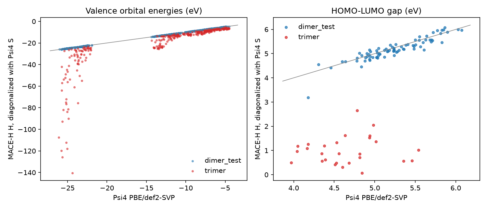

# MACE-H on water clusters: learning the Kohn-Sham Hamiltonian from Psi4

[MACE-H](https://github.com/maurergroup/MACE-H) ([arXiv:2508.15108](https://arxiv.org/abs/2508.15108))
uses MACE's many-body messages to predict the Kohn-Sham Hamiltonian matrix in an
atomic-orbital basis, one block per atom pair, instead of an energy.
Diagonalizing the predicted H against the overlap S gives orbital energies,
gaps, and band structures without an SCF. MACE-H reads the DeepH-E3 data layout,
and its own converters cover OpenMX, ABACUS, and FHI-aims. None of those runs on
this laptop, so [`hamiltonian.py`](../../src/samson_mlip_visualizer/hamiltonian.py)
adds a Psi4 → DeepH converter, and this example trains on it.

**Result (2026-09-30, 400 epochs):** on water dimers from an MD run it never
saw, the predicted H gives HOMO–LUMO gaps within 0.14 eV (mean abs.) and
valence orbital energies within 62 meV. On water trimers, which it was never
trained on, it fails: gaps are off by 3.7 eV and some levels by tens of eV.
128 training dimers teach the dimer, not local chemistry that transfers.

## Pipeline

| step | script | env | output (`D:\MLIP_Work_Folder\maceh_water`) |
|---|---|---|---|
| 1. frames | `make_frames.py` | `defects` (mace-torch) | MACE-MP-0 Langevin MD at 400 K: 208 H-bonded dimers (4 runs), 27 trimers |
| 2. labels | `label.py` | `envs\maceh` | Psi4 PBE/def2-SVP KS matrix + overlap per frame, ~1 s each → `processed\{dimer_train,dimer_test,trimer}` |
| 3. train | `train.py` | `envs\maceh` | MACE-H default network (3 blocks, ν = 3, l_max 4), 8 Å cutoff → `train\<date>_water_dimer` |
| 4. evaluate | `evaluate.py [--device cpu]` | `envs\maceh` | predicted H, diagonalized with the Psi4 S → `results.json`, `images/maceh_water.png` |

Run steps 2–4 with `PYTHONPATH=../../src`. The test sets are dimer MD run 3,
held out as a whole (80 frames), and the trimers, a composition never trained
on. Trimers are predicted in MACE-H's inference mode, with the graph built from
`overlaps.h5` alone, which is how a new structure without an SCF would be
handled.

## What was checked

- **The orbital order is correct.** Psi4 orders pure shells m = 0, +1, −1, …;
  DeepH uses OpenMX order (p: x y z; d: z², x²−y², xy, xz, yz). After the
  permutation, the H and S blocks of a rotated water molecule match the
  rotated blocks of the original to 1e-8 eV. Two independent checks show this:
  MACE-H's own `Rotate` code, and a Wigner-D fit in
  `tests/test_hamiltonian.py`. The fit covers the O d shell.
- **The DeepH round trip is exact.** Eigenvalues of the assembled
  `hamiltonians.h5` against `overlaps.h5` reproduce Psi4's orbital energies to
  3e-12 eV.

## Results

Best checkpoint of 400 epochs (epoch 394, validation MSE 0.0074 eV²; learning
rate decayed from 2e-3 to 2.5e-4). The epoch-30 checkpoint is shown for
comparison.

| MAE | train dimers | test dimers | trimers | test dimers, epoch 30 |
|---|---|---|---|---|
| H elements (meV) | 12.5 | 23.6 | 278 | 129 |
| on-site / off-site blocks (meV) | 13.8 / 12.2 | 30.9 / 21.6 | 220 / 288 | 169 / 118 |
| valence orbital energies (meV) | 24 | 62 | 7 459 | 531 |
| O 1s levels (meV) | 189 | 753 | 25 391 | 7 158 |
| HOMO / LUMO (meV) | 17 / 107 | 61 / 154 | 1 700 / 5 354 | 662 / 2 329 |
| HOMO–LUMO gap (meV) | 107 | 140 | 3 654 | 1 769 |
| reference gaps (eV) | 4.45–6.43 | 4.18–6.07 | 3.97–5.54 | |

- **Held-out dimers.** The predicted gaps follow Psi4 across a 2 eV range (one
  outlier, 4.2 vs 3.2 eV). The occupied levels are more accurate than the LUMO
  (61 against 154 meV), and the O 1s core is the worst (0.75 eV) because its
  diagonal near −510 eV is the largest number in the loss.
- **Why the eigenvalues need meV accuracy.** def2-SVP on hydrogen-bonded
  clusters has near-linearly-dependent functions, so S has small eigenvalues,
  and diagonalizing against S amplifies errors in H. At epoch 30, a 0.13 eV
  element error still gave 1.8 eV gap errors. At 24 meV the errors are 0.14 eV.
- **Trimers.** A trimer has environments no dimer has: two H-bond partners per
  water and non-bonded water pairs. The blocks there are off by 0.2–0.3 eV,
  and the amplification turns that into collapsed gaps and spurious deep
  levels. Transfer to larger clusters needs trimers (or bulk-water snapshots)
  in training, not only more dimers.

## Next steps

- Add trimers and larger clusters to training, and test on tetramers.
- Weight the loss per block, or subtract the isolated-molecule on-site blocks,
  so the O 1s diagonal does not dominate.
- Try a less diffuse basis (the ill-conditioned S sets how accurate H must be).

## Environment notes

MACE-H needs e3nn 0.5, but mace-torch 0.3.16 pins 0.4.4. `envs\maceh` is
therefore a venv with `--system-site-packages` on top of `defects`: it reuses
that env's CUDA torch 2.11 and has its own e3nn 0.5.1, torch_geometric, pathos,
tensorboard, and wandb. No `torch_scatter` wheel exists for torch 2.11, so a
small shim that uses `index_add` sits in the venv's site-packages (an earlier
`scatter_reduce` version crashed with a CUDA illegal instruction). Two MACE-H
settings have to be passed explicitly: `[basic] inference = False` in the
train config, and no `verbose=` in the scheduler parameters (torch ≥ 2.7).

## Running it

The 400 epochs took about 6 h of running time spread over two days
(28–70 s per epoch). They were interrupted by the laptop sleeping and by two CUDA
faults while the GPU was shared: `CUBLAS_STATUS_EXECUTION_FAILED` and, with an
earlier torch_scatter shim, an illegal instruction. `train.py --resume
RUN/model.pkl` continues from the last epoch with the optimizer and LR schedule
restored, on `--device cpu` if needed (about 60 s per epoch on 32 threads). On
this laptop MACE-H evaluation hung on CUDA after those faults, so use
`evaluate.py --device cpu` (4 minutes for all 235 structures).
