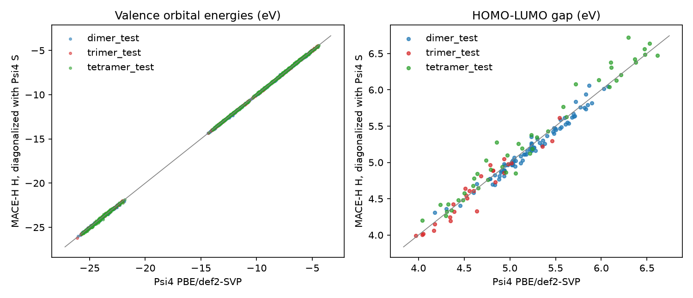
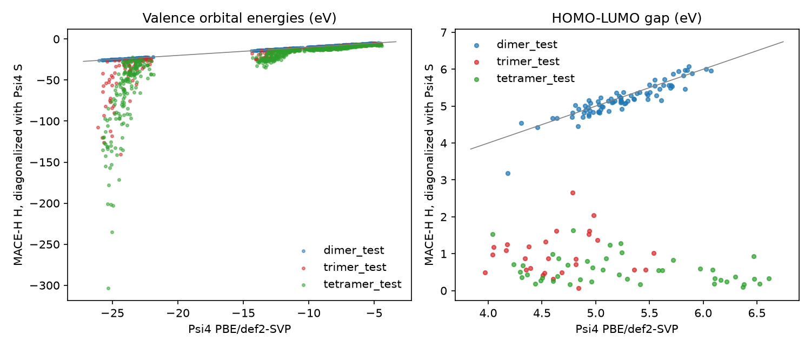

# MACE-H on water clusters: learning the Kohn-Sham Hamiltonian from Psi4

[MACE-H](https://github.com/maurergroup/MACE-H) ([arXiv:2508.15108](https://arxiv.org/abs/2508.15108))
uses MACE's many-body messages to predict the Kohn-Sham Hamiltonian matrix in an
atomic-orbital basis, one block per atom pair, instead of an energy.
Diagonalizing the predicted H against the overlap S gives orbital energies,
gaps, and band structures without an SCF. MACE-H reads the DeepH-E3 data layout,
and its own converters cover OpenMX, ABACUS, and FHI-aims. None of those runs on
this laptop, so [`hamiltonian.py`](../../src/samson_mlip_visualizer/hamiltonian.py)
adds a Psi4 → DeepH converter, and this example trains on it.

**Result:** trained on water dimers and trimers, the predicted H gives
HOMO–LUMO gaps within 0.12 eV (mean abs.) on water **tetramers it never saw**,
and valence orbital energies within 52 meV. Trained on dimers alone (round 1),
the same network failed on anything larger: gap errors of 3.7–4.7 eV.

## Pipeline

| step | script | env | output (`D:\MLIP_Work_Folder\maceh_water`) |
|---|---|---|---|
| 1. frames | `make_frames.py` | `defects` (mace-torch) | MACE-MP-0 Langevin MD at 400 K, hydrogen-bonded frames only |
| 2. labels | `label.py` | `envs\maceh` | Psi4 PBE/def2-SVP KS matrix + overlap per frame (1–4 s each) → `processed\{train,test}\<set>` |
| 3. train | `train.py [--sets dimer] [--init RUN]` | `envs\maceh` | MACE-H default network (3 blocks, ν = 3, l_max 4), 8 Å cutoff → `train\<date>_water_<sets>` |
| 4. evaluate | `evaluate.py --device cpu --model RUN --tag NAME` | `envs\maceh` | predicted H, diagonalized with the Psi4 S → `results_<tag>.json`, `images/maceh_water_<tag>.png` |

Run steps 2–4 with `PYTHONPATH=../../src`.

| set | structures | MD runs | used for |
|---|---|---|---|
| dimer train | 128 | 3 | training (both rounds) |
| trimer train | 166 | 4 | training (round 2) |
| dimer test | 80 | 1, held out whole | test |
| trimer test | 27 | 2, other seeds | test |
| tetramer test | 44 | 2 | test, never trained on, predicted in MACE-H's inference mode (graph from `overlaps.h5` alone, as for a structure with no SCF) |

Every atom pair in every set is within 7.4 Å, inside the 8 Å cutoff.

## What was checked

- **The orbital order is correct.** Psi4 orders pure shells m = 0, +1, −1, …;
  DeepH uses OpenMX order (p: x y z; d: z², x²−y², xy, xz, yz). After the
  permutation, the H and S blocks of a rotated water molecule match the
  rotated blocks of the original to 1e-8 eV. Two independent checks show this:
  MACE-H's own `Rotate` code, and a Wigner-D fit in
  `tests/test_hamiltonian.py`. The fit covers the O d shell.
- **The DeepH round trip is exact.** Eigenvalues of the assembled
  `hamiltonians.h5` against `overlaps.h5` reproduce Psi4's orbital energies to
  3e-12 eV.

## Results

- **Round 1** (`--sets dimer`): 400 epochs from scratch, best epoch 394
  (validation MSE 0.0074 eV²).
- **Round 2** (`--init <round 1>`): fine-tuned on dimers and trimers for 150
  epochs with a fresh optimizer (LR 1e-3), best epoch 124 (validation MSE
  0.0020 eV² on a dimer + trimer split). This took 2 h on the free GPU at
  about 27 s per epoch.

Mean absolute errors on the test sets (meV):

| | dimers, round 1 | dimers, round 2 | trimers, round 1 | trimers, round 2 | tetramers, round 1 | tetramers, round 2 |
|---|---|---|---|---|---|---|
| H elements | 23.6 | 14.4 | 278 | 14.4 | 303 | 17.5 |
| on-site / off-site blocks | 31 / 22 | 16 / 14 | 220 / 288 | 18 / 14 | 266 / 307 | 24 / 17 |
| valence orbital energies | 62 | 28 | 7 459 | 32 | 13 775 | 52 |
| O 1s levels | 753 | 333 | 25 391 | 496 | 36 227 | 714 |
| HOMO / LUMO | 61 / 154 | 24 / 56 | 1 700 / 5 354 | 36 / 72 | 1 778 / 6 488 | 52 / 122 |
| HOMO–LUMO gap | 140 | 60 | 3 654 | 85 | 4 714 | 116 |

Reference gaps are 4.2–6.1 eV (dimers), 4.0–5.5 eV (trimers), and 4.0–6.6 eV
(tetramers).

- **Trimers in training fix the transfer.** Round 1 never saw a water with two
  hydrogen-bond partners or a pair of waters that are not bonded to each other.
  Its blocks there were off by 0.2–0.3 eV. After 166 trimers, the trimer and
  tetramer blocks are as accurate as the dimer blocks (14–18 meV). A tetramer
  has no environment a trimer lacks at this cutoff: each water has at most two
  partners in a ring. So 4-ring transfer is expected, but larger or 3D clusters
  should still be tested before relying on it.
- **Adding trimers also improved the dimers** (gap errors 140 → 60 meV).
  Partly that is 150 more epochs; partly the trimer environments constrain the
  same blocks.
- **Why the eigenvalues need meV accuracy.** def2-SVP on hydrogen-bonded
  clusters has near-linearly-dependent functions, so S has small eigenvalues,
  and diagonalizing against S amplifies errors in H. In round 1, 0.3 eV element
  errors became gap errors of several eV and spurious deep levels. At 15–20 meV
  the gap errors are 0.06–0.12 eV.
- **The O 1s core is still the worst level** (0.3–0.7 eV). Its diagonal near
  −510 eV is the largest number in the MSE loss.

## Next steps

- Test on larger 3D clusters (hexamer cage and prism) or bulk-water snapshots.
- Weight the loss per block, or subtract the isolated-molecule on-site blocks,
  so the O 1s diagonal does not dominate.
- Try a less diffuse basis (the ill-conditioned S sets how accurate H must be).

## Environment notes

MACE-H needs e3nn 0.5, but mace-torch 0.3.16 pins 0.4.4. `envs\maceh` is
therefore a venv with `--system-site-packages` on top of `defects`: it reuses
that env's CUDA torch 2.11 and has its own e3nn 0.5.1, torch_geometric, pathos,
tensorboard, and wandb. No `torch_scatter` wheel exists for torch 2.11, so a
small shim that uses `index_add` sits in the venv's site-packages (an earlier
`scatter_reduce` version crashed with a CUDA illegal instruction). Two MACE-H
settings have to be passed explicitly: `[basic] inference = False` in the
train config, and no `verbose=` in the scheduler parameters (torch ≥ 2.7).

## Running it

Round 1 took about 6 h of running time spread over two days (28–70 s per epoch).
It was interrupted by the laptop sleeping and by two CUDA faults while the GPU
was shared: `CUBLAS_STATUS_EXECUTION_FAILED` and, with an earlier torch_scatter
shim, an illegal instruction. `train.py --resume RUN/model.pkl` continues from
the last epoch with the optimizer and LR schedule restored, on `--device cpu`
if needed (about 60 s per epoch on 32 threads). `--init RUN` instead starts a
new training from RUN's weights (epoch 0, fresh optimizer, no best loss to
beat), which is how round 2 was run. MACE-H evaluation hung on CUDA on this
laptop after those faults, so use `evaluate.py --device cpu` (about 5 minutes
for all 445 structures).
