# SN2 in SAMSON: F⁻ + CH₃Cl → CH₃F + Cl⁻

A worked example of the SAMSON bridge on an ionic reaction, run end to end by
an agent through the MCP tools (`samson_import_file`, `samson_start_job`,
`samson_job_status`, `samson_view`), then checked against DFT and the
literature. The numbers come from runs on 2026-09-26 on a laptop (Intel
i9-14900HX, RTX 5070 Laptop GPU).

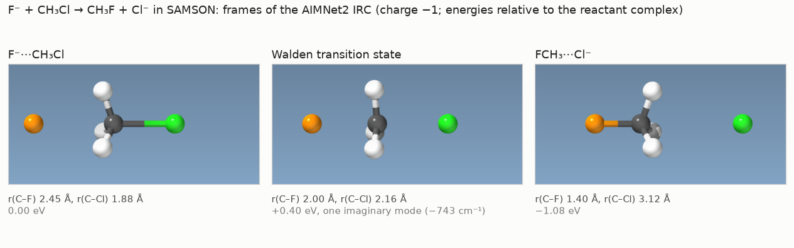

*Frames of the AIMNet2 IRC in SAMSON (F orange, Cl green). The CH₃ umbrella
turns inside out as F⁻ comes in from the back and Cl⁻ leaves: the Walden
inversion. Energies are relative to the reactant complex.*

## Conclusions

For gas-phase F⁻ + CH₃Cl, the best available reference (Czakó's CCSD(T)
basis-set-limit focal-point study) puts the Walden barrier only 3.4 kcal/mol
above the ion–dipole complex. The methods split sharply on this. The two
range-separated hybrids, ωB97M-V and ωB97X-D, reproduce every stationary point
to within about 1 kcal/mol. PBE and GFN2-xTB have no barrier at all, so neither
is a usable reference or fine-tuning target here, unlike for HCN. Among the
MLIPs, the stock foundation model MACE-MP-0 fails qualitatively. It has no
charge input, no reactant complex, and energy errors of up to 1 eV along the
path. AIMNet2 is the only off-the-shelf model that gets the chemistry right: it
finds the correct transition state, with geometry and energy relative to the
reactants close to CCSD(T), and an IRC that connects the right complexes. But
it binds the complexes 5–6 kcal/mol too strongly, so its barrier from the
complex is 9.3 kcal/mol, nearly three times too high, and its TS mode is too
stiff (−743 cm⁻¹ against about −450).

Fine-tuning MACE-MP-0 on 93 ωB97X-D calculations along AIMNet2's path fixed
this for about 20 minutes on a laptop. On frames it was not trained on, the
model reproduces ωB97X-D within a few meV (barrier 3.31 against
3.28 kcal/mol), its geometries match CCSD(T) within 0.05 Å, and its TS
frequency agrees with ωB97X-D's. The limits are just as clear. Those test
frames lie within about 0.02 Å of the training data. A step off the path (the
C–F scan) the error grows to about 1 kcal/mol, and the committee spread
underestimates it by about 2.5×. The model is also a specialist: it cannot
describe separated ions, and it made C–Cl in neutral CH₃Cl three times worse
than the foundation model, because it learned that bond as the complex
stretches it. In short, AIMNet2 is the tool for exploring an ionic reaction
like this out of the box, and cheap targeted fine-tuning turns a foundation
model into an accurate model *of this reaction path*, not a better general
model. It works only because the reference level was checked against the
literature first; fine-tuning to PBE would have produced a confident model of a
reaction with no barrier.

Fine-tuning AIMNet2 itself on the same 93 labels (5 minutes on the laptop CPU)
gives the same accuracy on the path (barrier 3.24 kcal/mol, TS and reactant
complex within 0.02 Å of CCSD(T), about 1 meV on its own IRC) with far less forgetting: its
neutral CH₃F, CH₃Cl and CH₂F₂ bonds stay within 0.01 Å of ωB97X-D. Keeping the
charge input also exposes what training on the complexes alone cannot fix:
relative to the separated F⁻ + CH₃Cl, the complexes are still 3–5 kcal/mol too
deep and the reaction 6 kcal/mol too exothermic, so a model meant for the whole
reaction needs the free fragments in its data too.

## Why this reaction needs a charge-aware model

The system is an anion, [CH₃FCl]⁻. MACE-MP-0 has no charge input, so it
evaluates the same six atoms as a neutral (radical) system. The **AIMNet2**
backend (ωB97M-D3 training data, explicit charge and long-range Coulomb) takes
`charge: -1`. It runs in its own environment in a worker process, like Psi4.

## What was run, through the MCP tools

1. Import a collinear TS guess (C–F 2.00 Å, C–Cl 2.15 Å, planar CH₃).
2. `samson_start_job` `ts` with `backend: aimnet2`, `charge: -1`,
   `method: prfo`, `exact_hessian`, `check_frequencies`, `check_irc` (37 s):
   - P-RFO converged in 3 steps;
   - one imaginary mode, −743 cm⁻¹;
   - IRC to two different minima: F⁻···CH₃Cl (0.40 eV below the TS) and
     FCH₃···Cl⁻ (1.50 eV below).
3. `samson_start_job` `irc` with `trajectory` for the benchmarks (560 frames;
   about half are the end relaxations crawling over the flat Cl⁻ departure).

The same run with **GFN2-xTB** (charge −1) is a useful cautionary tale: P-RFO
converges to a saddle with one imaginary mode (−169 cm⁻¹) that is *not* the
Walden TS. F⁻ is H-bonded to one hydrogen with C–Cl intact, and only the IRC
check shows it (one side drops 1.33 eV, the other does not move). A C–F scan
then finds no barrier at all on the GFN2 surface.

## Are the numbers right?

Stationary points relative to F⁻ + CH₃Cl, kcal/mol, classical (no zero-point
energy). The calculations are single points at the AIMNet2 geometries
(`stationary_points.py`, `reference_energies.py`, `compare.py`); the
literature values are at their own optimized geometries.

| Method | F⁻···CH₃Cl | Walden TS | FCH₃···Cl⁻ | CH₃F + Cl⁻ | Barrier from F⁻···CH₃Cl |
|---|---|---|---|---|---|
| **CCSD(T)/CBS focal point** (Szabó & Czakó 2015) | −15.6 | −12.2 | −41.6 | −31.9 | **3.4** |
| W1′ (Parthiban et al. 2001) | −15.4 | −12.5 | −42.2 | −32.6 | 2.9 |
| ωB97M-V/def2-TZVPPD | −15.5 | −12.9 | −41.9 | −32.3 | 2.6 |
| ωB97X-D/def2-TZVPD | −15.0 | −12.0 | −42.1 | −32.9 | 3.0 |
| CCSD(T)/aug-cc-pVDZ | −16.5 | −15.0 | −42.3 | −32.4 | 1.6 |
| **AIMNet2** | −21.7 | −12.4 | −46.6 | −38.7 | **9.3** |
| PBE/def2-TZVPD | −16.4 | −17.0 | −37.2 | −29.2 | −0.6 |
| GFN2-xTB | −15.9 | −20.0 | −45.0 | −36.6 | −4.1 |

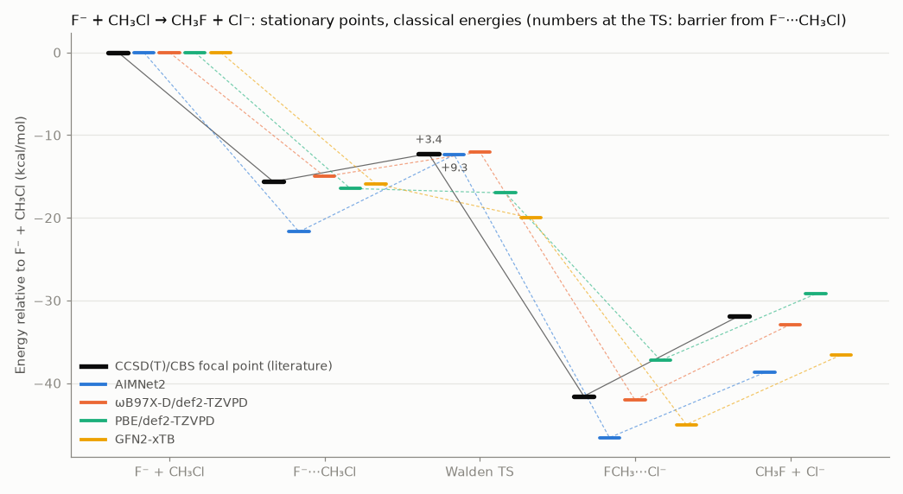

- **AIMNet2 finds the right transition state.** Its TS geometry (C–F 2.00 Å,
  C–Cl 2.17 Å) matches the CCSD(T) one (2.025 / 2.112 Å), and its TS energy
  relative to the reactants is within 0.2 kcal/mol. But it binds the
  ion–dipole complexes 5–6 kcal/mol too strongly and makes the reaction
  7 kcal/mol too exothermic, so its barrier from the complex is **9.3
  kcal/mol instead of 3.4** (0.40 vs 0.15 eV).
- **The hybrid functionals are right.** ωB97M-V and ωB97X-D reproduce the
  focal-point values within 1 kcal/mol at every point, even at AIMNet2's
  geometries. That also validates those geometries.
- **PBE and xTB have no barrier.** PBE puts the Walden TS 0.6 kcal/mol *below*
  the complex, xTB 4 kcal/mol below. GGA functionals underestimate SN2
  barriers by about 7 kcal/mol on average (PBE: −6.97 kcal/mol mean signed
  error over NHTBH38's 16 SN2 barriers). **PBE is the wrong reference for this
  reaction**, and a model fine-tuned on PBE would learn a barrierless surface.
- CCSD(T)/aug-cc-pVDZ is only a laptop spot check: the basis is too small for
  anions (TS 2.8 kcal/mol too low).

## Along the path

`run_benchmarks.ps1` evaluates each method on 31 frames of the AIMNet2 IRC
(`samson-mlip-benchmark`).

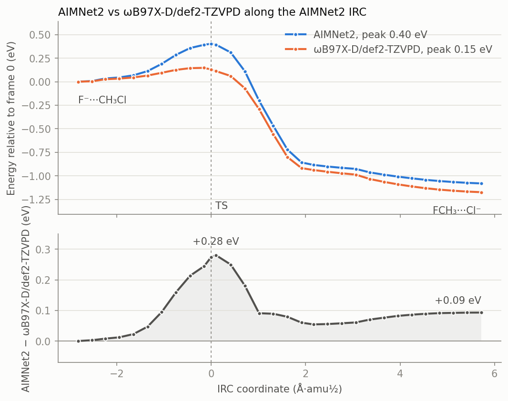

*Against ωB97X-D (the validated level), with both profiles measured from the
reactant complex: AIMNet2 rises 0.28 eV too high by the TS and stays about
0.1 eV high on the product side. ωB97X-D's own barrier along this path,
0.147 eV = 3.39 kcal/mol, equals the focal-point value.*

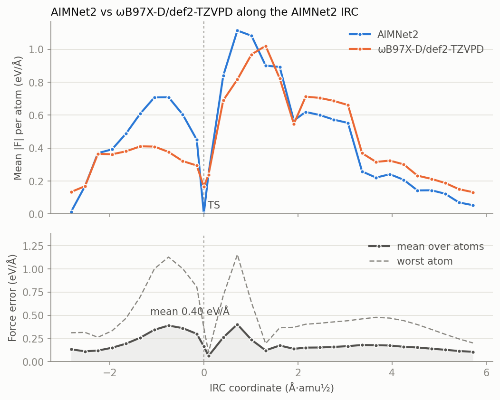

The PBE comparisons, for the record (same frames, PBE/def2-TZVPD):

| | 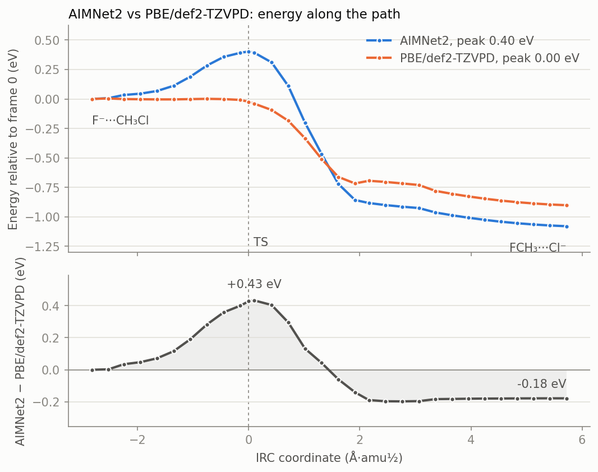 | 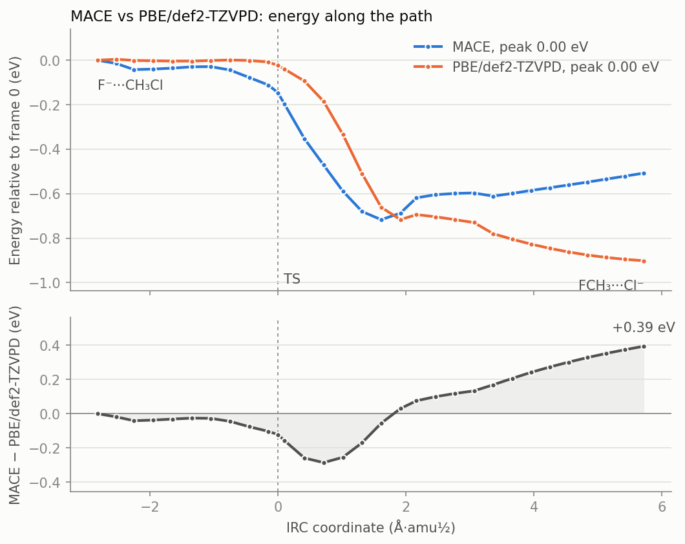 | 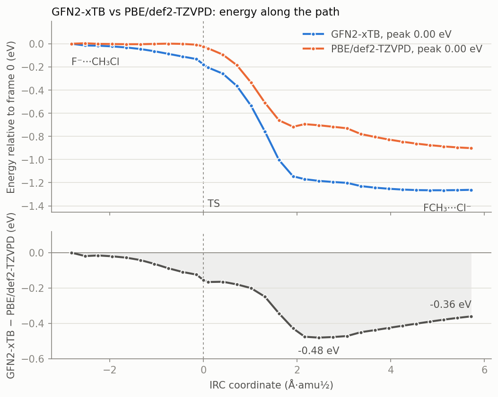 |
|---|---|---|---|
| | AIMNet2 | MACE-MP-0 small | GFN2-xTB |

PBE's profile is flat up to the TS (peak 0.004 eV above the complex).
MACE-MP-0 has no barrier either, and its energy *rises* as Cl⁻ leaves: without a
charge input it cannot represent a free chloride anion.

## Fine-tuning

`finetune_sn2.py` fine-tunes **MACE-MP-0 small to ωB97X-D/def2-TZVPD**, the
level that matches the literature within 1 kcal/mol and has analytic
gradients. It follows the HCN recipe ([`docs/fine_tuning.md`](../../docs/fine_tuning.md)),
with two changes:

- **The seed path is AIMNet2's IRC, not the foundation model's.** MACE-MP-0 has
  no barrier here, so it has no transition state to start from; AIMNet2's
  geometries match the CCSD(T) ones.
- **Labels at charge −1.** MACE has no charge input, but every configuration is
  the same anion, so the charge is implicit in the data. The price: the tuned
  model is a specialist that **cannot evaluate separated ions** (a bare F⁻ or
  Cl⁻) or any other charge, and its model card says so.

Data: 31 IRC frames spread by arc length (30 requested, plus the TS) and two
rattled copies of each (σ 0.04 Å), 93 configurations. Training: three plain fine-tunes (seeds 1–3,
120 epochs, all foundation elements kept), in parallel on the laptop GPU.
Then the committee's own P-RFO (exact Hessian), frequencies, and IRC, and
ωB97X-D on 15 frames of that IRC that were not trained on.

| | Fine-tuned MACE (3 models) | AIMNet2 | Target: ωB97X-D | CCSD(T) literature |
|---|---|---|---|---|
| Barrier from F⁻···CH₃Cl | **3.31 kcal/mol** (0.144 eV) | 9.3 | 3.0–3.4 | 3.39 |
| FCH₃···Cl⁻ − F⁻···CH₃Cl | −27.1 kcal/mol | −24.9 | −27.1 | −26.0 |
| TS r(C–F) / r(C–Cl) | **2.043 / 2.119 Å** | 2.00 / 2.17 | — | 2.025 / 2.112 |
| F⁻···CH₃Cl r(C–F) / r(C–Cl) | **2.516 / 1.851 Å** | 2.45 / 1.88 | — | 2.498 / 1.843 |
| FCH₃···Cl⁻ r(C–F) / r(C–Cl) | **1.409 / 3.229 Å** | 1.40 / 3.12 | — | 1.413 / 3.180 |
| TS imaginary mode | −445 cm⁻¹ | −743 cm⁻¹ | −450 cm⁻¹ (at the tuned TS) | not verified |
| Largest error on its own IRC, 15 frames | 2 meV; forces 0.012 eV/Å mean, 0.053 worst atom | 0.28 eV | — | — |

The ωB97X-D and AIMNet2 complex-to-complex energies are single points at AIMNet2's
geometries; the ωB97X-D frequencies are at the tuned model's TS, where
ωB97X-D's largest force is 0.025 eV/Å (`ts_frequency_check.py`).

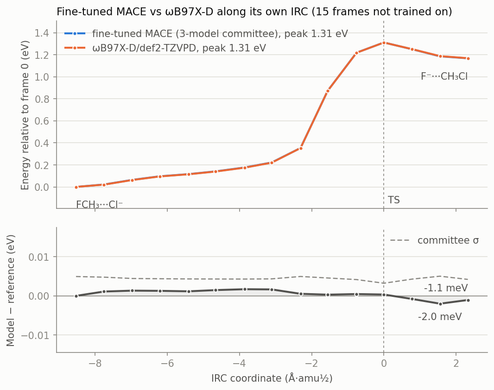

*The committee's own IRC, frame 0 at the product complex. The error stays
within ±2 meV and inside the committee spread (dashed).*

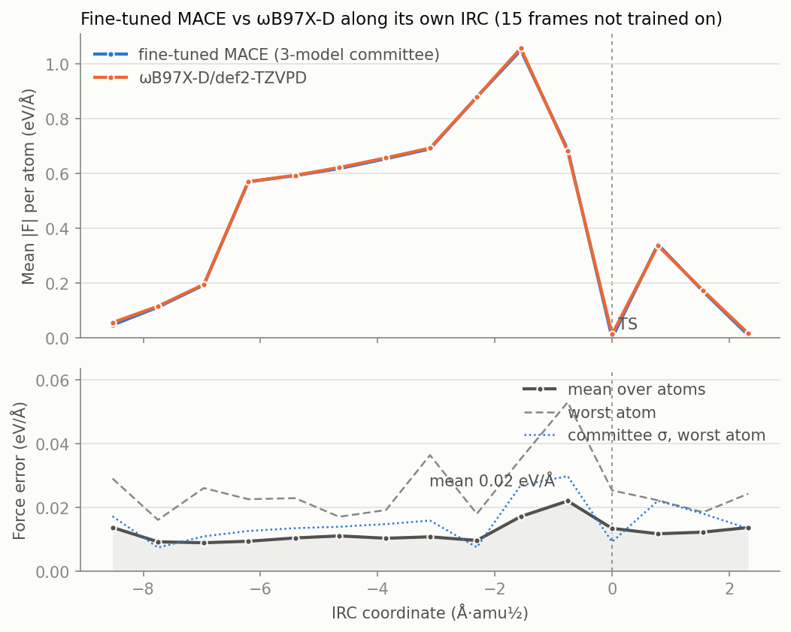

*The same frames, forces: 0.012 eV/Å mean error, 0.053 eV/Å for the worst
atom.*

Cost: **about 20 minutes** on the laptop. ωB97X-D labels 465 s (5 s per
six-atom gradient), training 579 s for the three models in parallel, committee
TS search and IRC 116 s, validation 42 s.

What this does and does not show:

- The **15 test frames are close to the training data** (median 0.011 Å, at
  most 0.019 Å aligned RMSD to the nearest training structure): the tuned IRC
  runs almost on top of AIMNet2's. They show the model reproduces its training
  region, as for HCN, not that it generalizes off the path.
- The target is ωB97X-D. Relative to the focal-point benchmark the tuned model
  inherits ωB97X-D's errors: the barrier is right, the complex-to-complex energy
  about 1 kcal/mol too exothermic.
- The models are 32 MB each (all 89 foundation elements kept), with model
  cards recording the reference level and scope. On the machine they were
  built on they are only in the mirror folder on the work drive,
  `D:\MLIP_Work_Folder\cache\mace\finetuned\SN2-F-CH3Cl_wB97XD-def2TZVPD_from-MACE-MP-0-small\`
  (`install_models` also puts a copy in `~/.cache/mace/finetuned`, removed here
  to keep large files off the system drive). Select the three `_seed?.model`
  files in the panel's model field to use them as a committee.
- A charge-aware alternative would be to fine-tune AIMNet2 itself
  (`aimnet train --load`), which keeps the charge input and the ion limits; it
  needs aimnet's HDF5 data format and care with the model's built-in D3 term,
  and was not tried.

### Held-out and off-path tests

As for HCN, "held out" is measured: each test frame's aligned RMSD to the
nearest of the 93 training structures (`finetune.distances_to`). Energies are
relative to each set's first frame; ωB97X-D/def2-TZVPD is the reference, each
frame computed once (`sn2_common.CachedReference`).

| Test set | Frames | RMSD to nearest training structure | Max \|ΔE\| | Energy RMSE | Force RMSE | Worst-atom force error |
|---|---|---|---|---|---|---|
| The AIMNet2 IRC: the training frames themselves, for scale | 31 | 0 | 3 meV | 2 meV | 0.007 eV/Å | 0.041 eV/Å |
| The committee's own IRC | 31 | median 0.012 Å, max 0.019 Å | 2 meV | 1 meV | 0.009 eV/Å | 0.063 eV/Å |
| r(C–F) scan off the IRC, 2.8 → 1.4 Å | 15 | median 0.041 Å, max 0.122 Å | **44 meV** | 19 meV | 0.034 eV/Å | **0.24 eV/Å** |

The IRC frames are new structures but lie on top of the training path, so they
show that the model reproduces its training region. The **scan**
(`offpath_scan.py`: 15 constrained relaxations with the committee, from its
reactant complex) is the real test away from the path, and the error grows
with the distance from the data, as it did for HCN (0.012 eV on the IRC,
0.079 eV on the scan there):

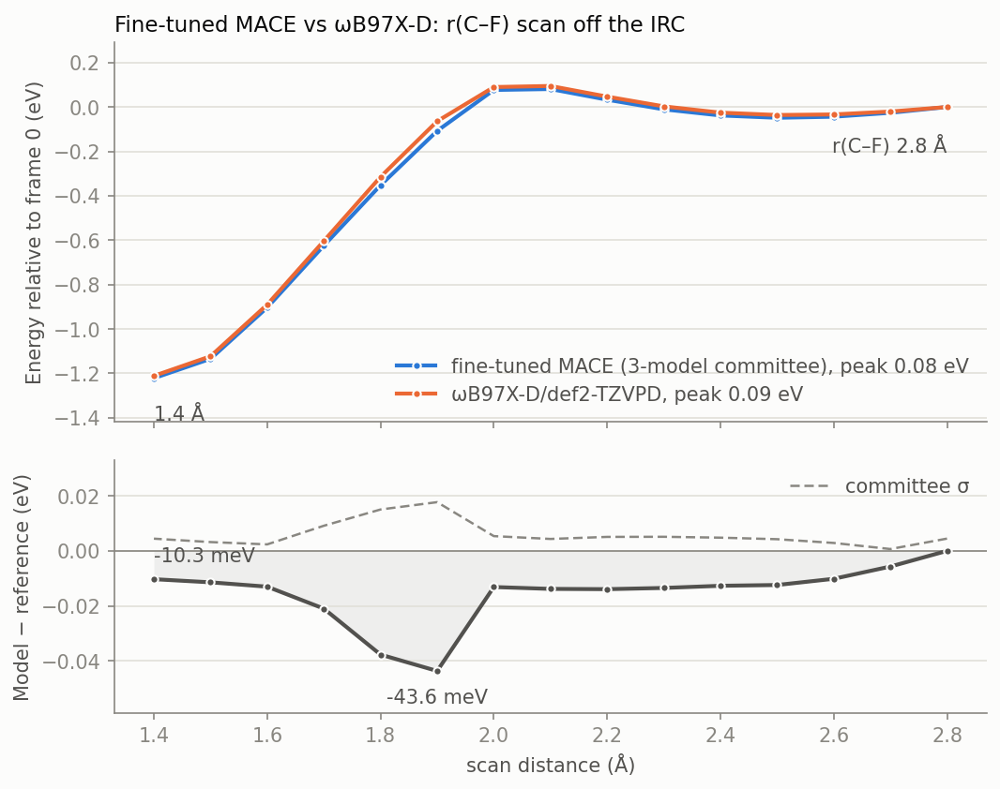

- No geometry jumps: r(C–F) describes this reaction, unlike r(N–H) for HCN.
- The error is −10 to −14 meV relative to the first point for most of the scan,
  and −44 meV (1.0 kcal/mol) at r(C–F) = 1.9 Å. That is where Cl⁻ leaves fastest
  (C–Cl 2.32 → 2.67 Å between 2.0 and 1.9 Å) and the frame farthest from the
  training data (0.122 Å). The first point (2.8 Å) is itself 0.12 Å from the
  data, so part of the −13 meV plateau is probably its own error.
- The committee spread rises there too (5 → 18 meV). Unlike HCN's committee, it
  moves with the error, but it still underestimates it by a factor of about
  2.5, and the correlation between |error| and RMSD is only 0.38.

So: about 0.002 eV on the path, up to about 0.04 eV (1 kcal/mol) a tenth of
an ångström off it.

### Foundation vs fine-tuned vs AIMNet2 on the same frames

`same_frame_benchmarks.py`: all three models on the same 31 frames of each IRC
against ωB97X-D. Barriers are from the reactant complex along the frames,
kcal/mol (ωB97X-D's own value in brackets); energy errors in eV, force errors
in eV/Å.

| Path | Model | Barrier (ωB97X-D) | Max \|ΔE\| | Energy RMSE | Force MAE / RMSE | Worst atom |
|---|---|---|---|---|---|---|
| AIMNet2 IRC (training frames) | MACE-MP-0 small | 0.00 (3.39) | 0.665 | 0.370 | 0.350 / 0.568 | 2.07 |
| | fine-tuned MACE | 3.45 (3.39) | 0.003 | 0.002 | 0.004 / 0.007 | 0.041 |
| | AIMNet2 | 9.30 (3.39) | 0.281 | 0.127 | 0.070 / 0.164 | 1.16 |
| Committee's IRC (not trained on) | MACE-MP-0 small | 0.05 (3.28) | 1.010 | 0.586 | 0.343 / 0.564 | 2.04 |
| | fine-tuned MACE | 3.31 (3.28) | 0.002 | 0.001 | 0.005 / 0.009 | 0.063 |
| | AIMNet2 | 9.05 (3.28) | 0.187 | 0.070 | 0.073 / 0.165 | 1.09 |

On the committee's IRC, fine-tuning brought the force RMSE down by a factor of
about 65 and the energy RMSE by about 480. On the AIMNet2 path those numbers are in-sample;
the committee's IRC is the fair row.

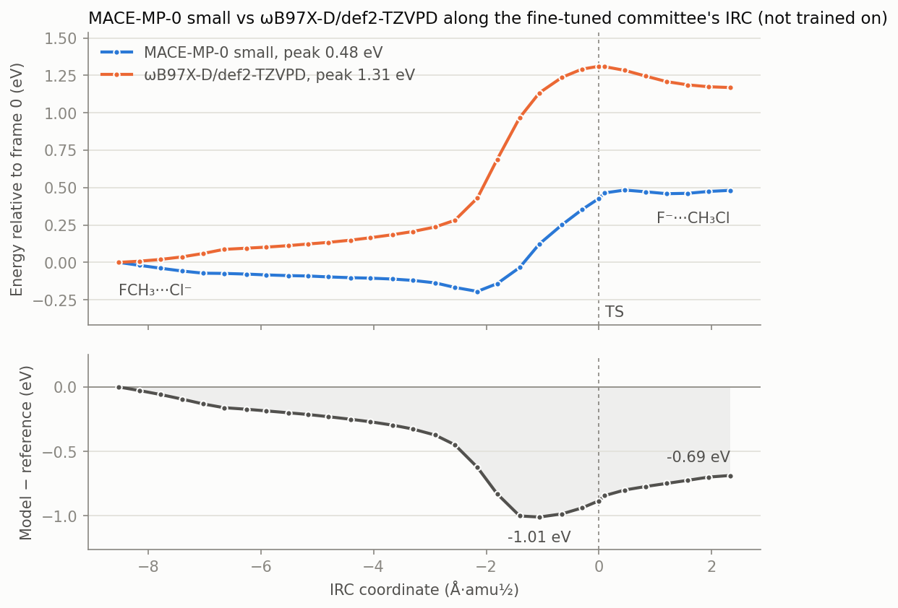

*The foundation model on the committee's IRC: no barrier, and 1 eV off on the
product side.*

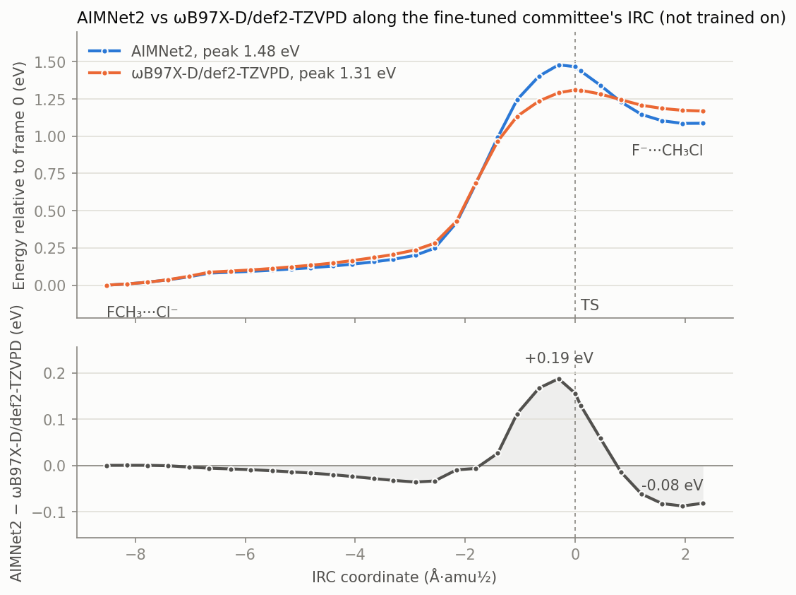

*AIMNet2 on the same frames: the right shape, but it rises about 0.19 eV too
high by the TS (barrier 9.05 against 3.28 kcal/mol).*

**Stock MACE-MP-0 small has no SN2 profile of its own** (`stock_mace_stationary.py`):

- Relaxing AIMNet2's F⁻···CH₃Cl complex with it runs all the way to the
  product: **it has no F⁻···CH₃Cl minimum.** Its product complex is also off
  (C–F 1.50 Å, C–Cl 2.58 Å; CCSD(T): 1.41, 3.18 Å).
- P-RFO from the AIMNet2 TS does converge to a first-order saddle (C–F 1.97 Å,
  C–Cl 1.97 Å, −254 cm⁻¹). But its IRC's reverse end is a shoulder only
  0.02 kcal/mol below it (C–F 2.02 Å, C–Cl 1.92 Å), not a complex. The forward
  end is its product complex, 10.1 kcal/mol lower (literature: 26 kcal/mol
  below the reactant complex).

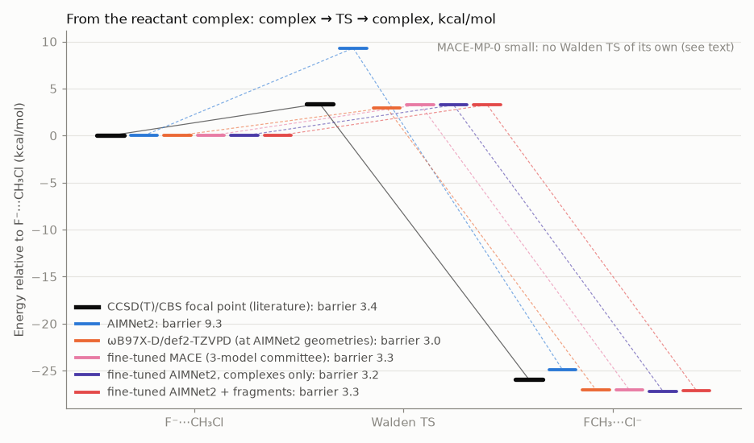

*Each model at its own stationary points, from the reactant complex. ωB97X-D
at AIMNet2's geometries. Stock MACE-MP-0 is left out: it has no Walden TS
between two complexes.*

### Forgetting

Neutral molecules the tuned model never saw, relaxed with each model
(`forgetting.py`; bond lengths in Å, geometries only: the model saw only the
anion, and MACE has no charge input):

| Molecule | Bond | MACE-MP-0 small | Fine-tuned MACE | ωB97X-D/def2-TZVPD |
|---|---|---|---|---|
| CH₃F | C–F | 1.434 (+0.054) | **1.407** (+0.027) | 1.380 |
| CH₃F | C–H | 1.098 | **1.089** | 1.091 |
| CH₃Cl | C–Cl | **1.795** (+0.014) | 1.840 (+0.059) | 1.781 |
| CH₃Cl | C–H | 1.096 | **1.084** | 1.086 |
| CH₂F₂ | C–F | **1.382** (+0.030) | 1.393 (+0.041) | 1.352 |
| CH₂F₂ | C–H | 1.101 | **1.089** | 1.077 |

- **C–Cl got worse: three times the foundation model's error.** The tuned model
  gives isolated CH₃Cl a C–Cl bond of 1.84 Å, the length it saw in F⁻···CH₃Cl
  (1.85 Å), where the approaching F⁻ stretches it. It learned the bond in its
  environment, not the bond.
- C–F in CH₃F moved halfway toward ωB97X-D (the product complex has 1.41 Å);
  C–F in CH₂F₂, a molecule with two fluorines it never saw, got slightly worse.
- C–H bonds improved throughout, except CH₂F₂.
- As for HCN, the tuned model is a specialist for this path. Multihead
  fine-tuning with foundation replay is the standard remedy and was not tried.

(The ωB97X-D CH₃Cl relaxation ended at 300 BFGS steps without reaching
0.005 eV/Å, with its bonds unchanged to 0.001 Å; DFT forces are too noisy for
that threshold, so the others used 0.01 eV/Å.)

### Fine-tuning AIMNet2

AIMNet2 was the best starting point (right TS, 0.28 eV off along the path, and
a charge input), so `finetune_aimnet2.py` fine-tunes it on the **same 93
ωB97X-D labels**: all weights, energies and forces, through
`AIMNet2Calculator(train=True)`, so the network, the embedded Coulomb term and
the D3 dispersion are trained exactly as they run at inference. 84 structures
train and 9 (three IRC frames with their rattled copies) decide when to stop.
Adam, lr 5·10⁻⁵, 800 full-batch epochs: **5 minutes on the laptop CPU**, one
model. The result is saved in the registry file's format, so the backend loads
it as `aimnet_model`.

`aimnet train --load` was not used: the registry `.pt` is a wrapper
(`state_dict` next to the Coulomb and D3 settings), and `aimnet train` loads
weights with `strict=False`, so handing it that file silently trains from
random weights.

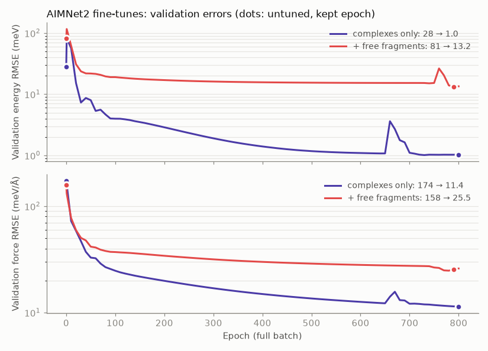

*Validation errors: energy 28 → 1.0 meV, forces 174 → 11 meV/Å. The first Adam
step overshoots, and there is one transient spike near epoch 660; the best
epoch was the last, so longer training would still gain a little.*

`evaluate_aimnet2_tuned.py` repeats the MACE checks (ωB97X-D from the shared
cache; only its own IRC needed new DFT, 31 gradients):

| | Fine-tuned AIMNet2 | Fine-tuned MACE (3 models) | ωB97X-D | CCSD(T) literature |
|---|---|---|---|---|
| Barrier from F⁻···CH₃Cl, own stationary points | **3.24 kcal/mol** | 3.31 | 3.0–3.4 | 3.39 |
| FCH₃···Cl⁻ − F⁻···CH₃Cl | −27.2 kcal/mol | −27.1 | −27.1 | −26.0 |
| TS r(C–F) / r(C–Cl) | 2.046 / 2.122 Å | 2.043 / 2.119 | — | 2.025 / 2.112 |
| F⁻···CH₃Cl r(C–F) / r(C–Cl) | **2.497 / 1.852 Å** | 2.516 / 1.851 | — | 2.498 / 1.843 |
| TS imaginary mode | −446 cm⁻¹ | −445 | −450 | — |
| Its own IRC (31 frames, not trained on): max \|ΔE\| / force RMSE / worst atom | 0.9 meV / 0.007 / 0.043 eV/Å | 2 meV / 0.009 / 0.063 | — | — |
| The MACE committee's IRC, same frames | 1.4 meV / 0.008 / 0.055 eV/Å | 2 meV / 0.009 / 0.063 | — | — |
| The r(C–F) scan frames, off the path | 47 meV / 0.044 / 0.26 eV/Å | 44 meV / 0.034 / 0.24 | — | — |
| Training | 5 min CPU, one model | 10 min GPU, three models | — | — |

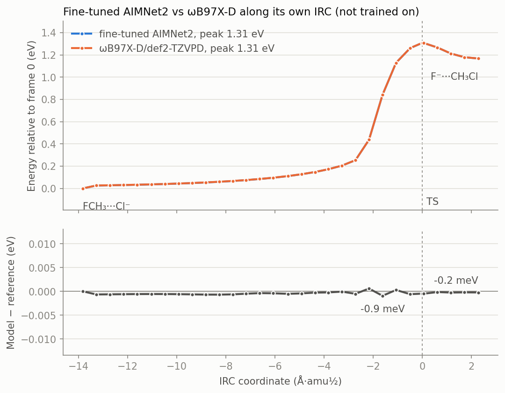

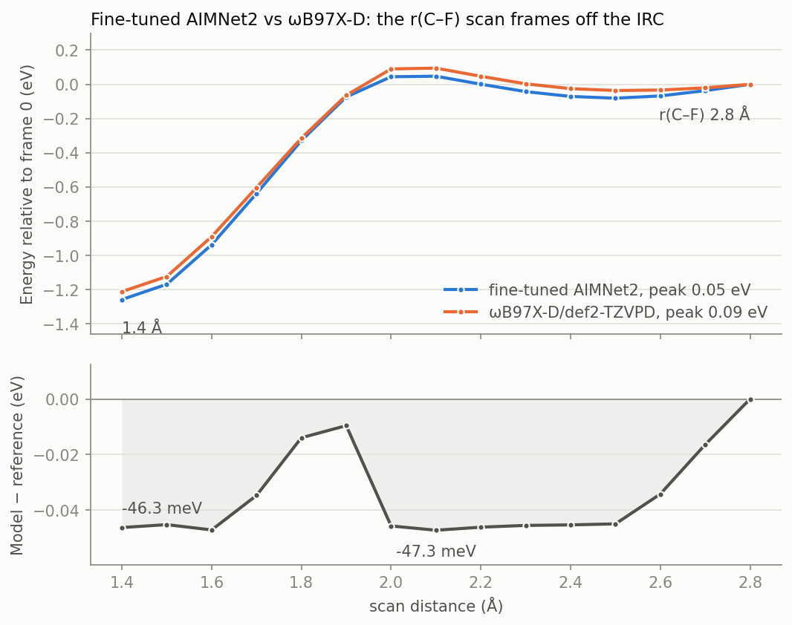

On the path the two fine-tunes are equivalent, the AIMNet2 one slightly
better; off the path (the same 15 scan frames) both reach about 1 kcal/mol,
MACE slightly better. The differences are within what one training run to the
next would change.

**Forgetting: much less than MACE.** Neutral molecules, bond lengths in Å:

| Molecule | Bond | AIMNet2 | Fine-tuned AIMNet2 | Fine-tuned MACE | ωB97X-D |
|---|---|---|---|---|---|
| CH₃F | C–F | 1.384 | 1.390 | 1.407 | 1.380 |
| CH₃Cl | C–Cl | 1.793 | **1.779** | 1.840 | 1.781 |
| CH₂F₂ | C–F | 1.357 | 1.359 | 1.393 | 1.352 |

The tuned AIMNet2 stays within 0.01 Å of ωB97X-D and even improves C–Cl, where
the tuned MACE stretched it by 0.06 Å. A molecular foundation model starts from
chemistry like this; MACE-MP-0 starts from crystals.

**But the separated fragments were not fixed.** Because it keeps the charge
input, the tuned AIMNet2 can be measured against the separated F⁻ + CH₃Cl, at
its own geometries (kcal/mol):

| | F⁻···CH₃Cl | Walden TS | FCH₃···Cl⁻ | CH₃F + Cl⁻ |
|---|---|---|---|---|
| CCSD(T)/CBS focal point | −15.6 | −12.2 | −41.6 | −31.9 |
| AIMNet2 | −21.7 | −12.4 | −46.6 | −38.7 |
| Fine-tuned AIMNet2 | −19.1 | **−15.8** | −46.2 | −38.0 |

The training data are all [CH₃FCl]⁻ complexes, so the fine-tune fixed the
energies *within* the complex (the barrier, the complex-to-complex energy) but
not the energy of the complex *relative to the free fragments*: the complexes
are still 3.5–4.6 kcal/mol too deep, and the TS, right before by a cancellation of
errors, is now 3.6 kcal/mol too low. The reaction energy (CH₃F + Cl⁻) is still
6 kcal/mol too exothermic. Fixing that needs the fragments and the long-range
approach in the data: isolated F⁻, Cl⁻, CH₃Cl, CH₃F, and complexes pulled apart
to a few ångström. Those are a handful of cheap ωB97X-D calculations, not tried
here.

## Reproduce

Environments: SAMSON's Python (the package, mace-torch), an aimnet
environment (`D:\MLIP_Work_Folder\envs\mlip`: `pip install aimnet`), Psi4 in
its own environment (`qm`). Outputs go to `D:\MLIP_Work_Folder\sn2_F_CH3Cl`.

1. In SAMSON, with the bridge running: import a TS guess and start the `ts`
   and `irc` jobs as above (the IRC with
   `trajectory: <work>\aimnet2_irc.extxyz`).
2. `run_benchmarks.ps1` (PBE comparisons; `--replot` redraws figures from the
   CSVs without recomputing).
3. `python stationary_points.py` (aimnet environment), then
   `python reference_energies.py` (Psi4 environment), then `python compare.py`
   and `python energy_levels.py`.
4. `python finetune_sn2.py` (SAMSON's Python), then, also with SAMSON's Python:
   `ts_frequency_check.py`, `same_frame_benchmarks.py` (foundation, tuned and
   AIMNet2 on the same frames), `offpath_scan.py` (the r(C–F) scan),
   `stock_mace_stationary.py`, and `forgetting.py`. They share
   `sn2_common.py` and one ωB97X-D cache (`<work>\wb97xd_cache.json`, seeded
   from the training labels), so each structure is computed once; every script
   skips what is already done. The ωB97X-D work for all of them is about 10
   minutes on the laptop (5 s per six-atom gradient).
5. AIMNet2 fine-tune: `python finetune_aimnet2.py` (aimnet environment, CPU),
   `python plot_aimnet2_training.py`, then `python evaluate_aimnet2_tuned.py`
   (SAMSON's Python; reuses the cache and `forgetting.py`), and
   `python energy_levels.py` again to add it to both diagrams.
6. `python snapshot_figure.py` for the figure at the top, from SAMSON viewport
   captures of the three frames (`captureViewportToFile`, 1600×1200; each frame
   imported as XYZ so SAMSON draws the bonds that exist in it).

### Laptop notes

- **Psi4 has no analytic gradient for ωB97M-V** (its VV10 term): forces take 25
  SCFs per six-atom frame, about 10 hours for a 30-frame benchmark. Energies
  are fine. ωB97X-D has analytic gradients (about 4 s per frame here) and is
  within 1 kcal/mol of the literature, so it is the level for forces and labels.
- **Keep Psi4's memory below 2 GiB on Windows** (conda-forge Psi4 1.11): with a
  larger setting the coupled-cluster codes fail with a spurious "not enough
  memory", even for 100 basis functions.
- `-D3BJ` functionals need the `s-dftd3` program, which the `qm` environment
  lacks; `wb97m-v` has its dispersion built in.

## References

- Szabó, Czakó, *Nat. Commun.* **6**, 5972 (2015), DOI 10.1038/ncomms6972; and
  Szabó, Császár, Czakó, *Chem. Sci.* **4**, 4362 (2013), DOI 10.1039/c3sc52157e:
  all-electron CCSD(T)/CBS focal-point energies and CCSD(T)/aug-cc-pCVQZ
  geometries.
- Parthiban, de Oliveira, Martin, *J. Phys. Chem. A* **105**, 895 (2001),
  DOI 10.1021/jp0031000: W1′ energies and DFT barriers for this reaction.
- Zhao, González-García, Truhlar, *J. Phys. Chem. A* **109**, 2012 (2005):
  NHTBH38 (SN2 barriers) and the mean errors of GGA and hybrid functionals.
