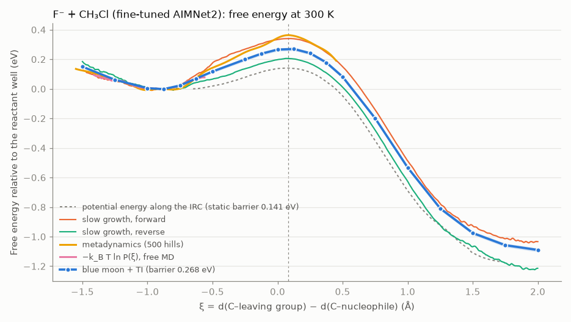
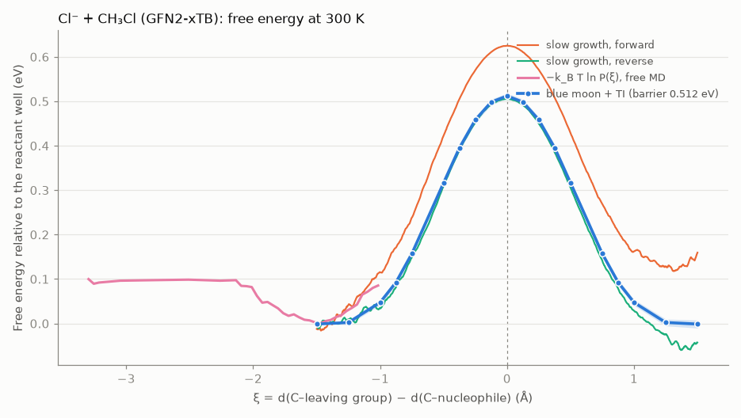
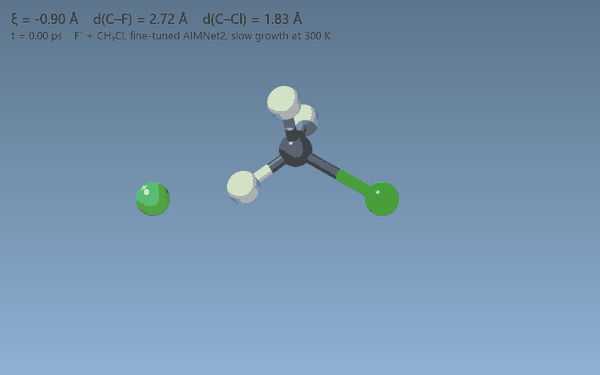

# SN2 free energies: constrained MD, blue moon, and metadynamics

This example redoes part 3 of the VASP molecular-dynamics tutorial,
[free-energy methods for Cl⁻ + CH₃Cl](https://vasp.at/tutorials/latest/md/part3/),
with the tools in this repository. The main system is F⁻ + CH₃Cl → CH₃F + Cl⁻,
driven by the AIMNet2 model fine-tuned on ωB97X-D in [`../sn2_f_ch3cl`](../sn2_f_ch3cl).
The tutorial's own identity reaction, Cl⁻ + CH₃Cl, is run with GFN2-xTB for
comparison. All numbers come from runs on 2026-09-27 on a laptop (Intel
i9-14900HX), using one CPU thread per simulation.



*F⁻ + CH₃Cl, fine-tuned AIMNet2, 300 K. Every method is zeroed at the reactant
well. The blue band is the propagated statistical error of the thermodynamic
integration. The dashed vertical line marks ξ*, where the blue-moon mean force
crosses zero. The grey dashes show the potential energy along the model's IRC.*

## Conclusions

- **The free-energy barrier is about twice the static one.**
  - For F⁻ + CH₃Cl, blue-moon thermodynamic integration gives
    ΔA‡ = 0.268 ± 0.01 eV (6.2 kcal/mol) at 300 K.
  - The potential-energy barrier from the ion–dipole complex is 0.141 eV
    (3.25 kcal/mol, the fine-tuned value that matches CCSD(T)).
  - Almost all of the difference is entropy. In the reactant well, F⁻ roams
    over a wide range of ξ (−1.7 to −0.5 Å in 20 ps of free MD), and the free
    minimum sits at ξ = −0.91 Å, not at the static complex (−0.65 Å). At the
    TS, the three heavy atoms are locked in a line.
- **The independent estimates agree on the picture; only blue moon pins the
  number.**
  - Two well-tempered metadynamics runs give 0.33 and 0.37 eV, still drifting
    after 50 ps. That is 0.05–0.1 eV above the blue-moon value.
  - The reactant well of −k_BT ln P(ξ) from free MD lies on top of the
    blue-moon profile.
  - The rate formula gives k = 3.5 × 10⁸ s⁻¹ from the complex and a
    phenomenological barrier of 0.253 eV (5.8 kcal/mol).
- **Slow growth, as the tutorial warns, is not converged** at the tutorial's
  speed (1 mÅ per 2 fs step).
  - Forward it overshoots (0.351 eV); reverse it undershoots (0.215 eV).
  - The two branches differ by up to 0.25 eV.
  - They bracket the blue-moon profile but are no substitute for it.
- **Cl⁻ + CH₃Cl with GFN2-xTB reproduces the tutorial's workflow and its internal
  consistency.**
  - The generalized velocity at the TS matches the tutorial to three digits:
    7.85 against 7.84 × 10¹² Å/s.
  - The phenomenological barrier equals the free-energy difference, as in the
    tutorial.
  - The barrier itself comes out higher: 0.51 eV against the tutorial's
    0.41 eV. That difference comes from the potential, not the method.
- **The numbers are only as good as the model away from its training path.**
  - The fine-tuned AIMNet2 was checked to about 1 kcal/mol a small step off
    the IRC.
  - At 300 K the MD samples much further from it than that, above all the
    roaming F⁻ in the reactant well.
  - That off-path error is not measured here. The
    [active-learning loop](../sn2_f_ch3cl/README.md#active-learning-with-the-library-loop) run
    on these MD frames would be the way to check it.
  - The dynamics is classical (no zero-point energy or tunnelling), as in the
    tutorial.

## Method

The reaction coordinate is the tutorial's: ξ = d(C–X_leaving) − d(C–X_nucleophile).
It is negative in the reactant complex, near zero at the Walden TS, and positive
on the product side. Everything is in
[`samson_mlip_visualizer.free_energy`](../../src/samson_mlip_visualizer/free_energy.py),
which is ASE-based and works with any calculator:

| Tutorial (VASP)                                   | Here                                                                                                                  |
| ------------------------------------------------- | --------------------------------------------------------------------------------------------------------------------- |
| `ICONST` … `R` combination of distances           | `DistanceCombination([(0, 4, 1.0), (0, 5, -1.0)])`, with ξ, ∇ξ, Z and the blue-moon G term                            |
| SHAKE in the Andersen NVT MD (`MDALGO = 1`)       | `constrained_md`: velocity Verlet with SHAKE and RATTLE, Andersen thermostat, constraint multiplier λ recorded each step |
| slow growth, `INCREM`                             | `constrained_md(increment=…)` and `slow_growth_profile`: ∫λ dξ along the moving target                                |
| blue moon, `REPORT` output                        | `blue_moon_gradient`: dA/dξ = ⟨Z^-½(λ + k_BT·G)⟩ / ⟨Z^-½⟩, with block-averaged errors; `integrate_gradient`            |
| free MD, P(ξ)                                     | ASE `Andersen` and `probability_density`                                                                              |
| ⟨\|ξ̇*\|⟩ = √(2k_BT/π) / ⟨Z^-½⟩ at ξ*             | `generalized_velocity`                                                                                                |
| k = ½⟨\|ξ̇*\|⟩ P(ξ_ref) e^(−ΔA/k_BT), ΔA‡          | `rate_constant`                                                                                                       |
| (not in the tutorial)                             | `MetadynamicsCalculator` (well-tempered Gaussian bias on ξ, harmonic walls) and `metadynamics`, `fes_from_hills`       |

The sign convention matters when comparing with the tutorial. The constraint
force is +λ∇ξ, and dA/dξ is the average of λ plus the Z and G corrections. The
unit tests check this, the G term, and the whole estimator against a
three-atom model whose A(ξ) is known exactly by quadrature
([`tests/test_free_energy.py`](../../tests/test_free_energy.py)).

Settings as in the tutorial:
- 300 K, 2 fs step, hydrogen given tritium mass (3.0);
- Andersen collision probability 0.05 per step.

For F⁻ + CH₃Cl the runs were:

| Run                    | What                                                                                                                  |
| ---------------------- | --------------------------------------------------------------------------------------------------------------------- |
| blue moon              | 20 windows from ξ = −1.5 to +2.0 Å (0.25 Å apart, 0.125 Å through the well and barrier), 3000 steps each, first 500 dropped |
| slow growth            | 500 steps held at the start, then ξ moved over 3.5 Å at 1 mÅ per step, forward and reverse                            |
| free MD                | 10 000 steps from the complex, with a wall keeping F⁻ within 5 Å of carbon                                            |
| constrained run at ξ*  | 3000 steps, for ⟨\|ξ̇*\|⟩                                                                                             |
| metadynamics           | well-tempered (bias factor 10), 20 meV × 0.08 Å hills every 50 steps, 25 000 steps (50 ps), walls at ξ = −1.6 and +0.5 Å |

Windows start from the fine-tuned model's IRC frame nearest their target. The
last stretch is made chemically: the nucleophile or the leaving group is pulled
along its C–X axis. Projecting straight onto ξ along the mass-weighted gradient
instead pulls carbon away from its hydrogens; one early window started that
way reached 1800 K.

The static curve is the fine-tuned model's potential energy along its own IRC.

## Results: F⁻ + CH₃Cl (fine-tuned AIMNet2, 300 K)

| Quantity                                   | Value                                                      |
| ------------------------------------------ | ---------------------------------------------------------- |
| reactant free-energy minimum ξ_min          | −0.91 Å (blue moon), −0.89 Å (peak of P(ξ))                |
| ξ* (top of the barrier)                     | +0.08 Å                                                    |
| **ΔA‡, blue moon + TI**                     | **0.268 eV (6.19 kcal/mol)**, ± 0.01 eV                    |
| ΔA‡, well-tempered metadynamics             | 0.37 eV (0.21–0.37 over the run; a second run 0.33 eV)      |
| ΔA‡, slow growth forward / reverse          | 0.351 / 0.215 eV (hysteresis up to 0.25 eV)                |
| ΔE‡, static, from the complex               | 0.141 eV (3.25 kcal/mol)                                   |
| ΔA, well → ξ = 2.0 Å (products)             | −1.09 ± 0.01 eV                                            |
| P(ξ_ref), ξ_ref = −0.89 Å                   | 2.91 Å⁻¹                                                   |
| ⟨\|ξ̇*\|⟩                                    | 8.09 × 10¹² Å/s (tutorial, Cl system: 7.84 × 10¹²)         |
| rate constant k                             | 3.5 × 10⁸ s⁻¹                                              |
| phenomenological ΔA‡                        | 0.253 eV (5.83 kcal/mol)                                   |

The metadynamics run needed one correction. With the upper wall at ξ = +1.0 Å,
the walker crossed the barrier once, after 12 ps, and never came back: the
product side is 1 eV downhill, and 50 ps of 20 meV hills could not fill it. Its
barrier (0.31 eV) therefore rested on a single crossing. With the wall at
+0.5 Å, just past ξ*, it went from the well to beyond the TS and back 30 times.

The barrier read from the accumulated bias still moves:
- 0.21 eV after 100 hills;
- 0.29 eV after 200;
- 0.32 eV after 300;
- 0.33 eV after 400;
- 0.37 eV after 500.

The final hills are 3 meV high. An earlier run with the same settings ended at
0.33 eV. That run used ASE's Langevin default `fixcm=True`, which ASE warns
skews NVT sampling for small systems; the library now uses `fixcm=False`.

Both runs end 0.05–0.1 eV above the blue-moon value, and both are still
rising. The likely cause is the same one that hurts slow growth: the angle
at which F⁻ approaches relaxes slowly compared with the hill deposition, so
the bias partly fills a side-on approach instead of the backside barrier.
(A slow-growth run through the SAMSON bridge showed this directly. With one
seed, F⁻ was pulled in about 50° off the backside line, and the barrier came
out at 0.83 eV. Two other seeds gave 0.30 and 0.32 eV.)

Metadynamics is the cheapest route to the whole profile, but on one
coordinate it does not pin this barrier down. The blue-moon integration is
the number to quote: 20 independent, equilibrated windows with per-window
error bars. Metadynamics on ξ together with the F–C–Cl angle would be the
fix, and it would be a two-dimensional extension of the bias.

## Comparison: Cl⁻ + CH₃Cl (GFN2-xTB), the tutorial's system



*Cl⁻ + CH₃Cl, GFN2-xTB, 300 K. The blue-moon windows cover ξ ≤ 0 and are
mirrored, since A(ξ) = A(−ξ) for an identity reaction.*

Runs:
- slow growth both ways, over ξ = −1.5 … +1.5 Å;
- 10 blue-moon windows on ξ ≤ 0, 3000 steps each;
- 10 000 steps of free MD;
- a constrained run at ξ* = 0.

All settings are as for F⁻. The reverse slow growth starts from the mirror
image of the forward start, with the two chlorines swapped.

| Quantity                                | GFN2-xTB (here)                                  | VASP tutorial (MLFF)        |
| --------------------------------------- | ------------------------------------------------ | --------------------------- |
| reactant free-energy minimum             | ξ = −1.41 Å (blue moon), −1.47 Å (peak of P(ξ))  | ξ_ref = −1.5 Å              |
| **ΔA‡, blue moon + TI**                  | **0.512 eV (11.8 kcal/mol)**, ± 0.01 eV          | 0.418 eV (cited blue moon)  |
| ΔA‡, slow growth forward / reverse       | 0.64 / 0.55 eV, each from its own start (hysteresis up to 0.21 eV) | 0.406 eV (forward) |
| ΔE‡, static, from the complex (ξ = −1.17 Å) | 0.460 eV (10.6 kcal/mol)                     | —                           |
| P(ξ_ref)                                 | 2.30 Å⁻¹                                         | 1.54 Å⁻¹                    |
| ⟨\|ξ̇*\|⟩                                 | 7.85 × 10¹² Å/s                                  | 7.84 × 10¹² Å/s             |
| rate constant k                          | 2.2 × 10⁴ s⁻¹                                    | 9.2 × 10⁵ s⁻¹               |
| phenomenological ΔA‡                     | 0.504 eV (11.6 kcal/mol)                         | 0.407 eV                    |

What agrees:
- **The whole chain of methods.** The phenomenological barrier matches the
  free-energy difference, 0.504 against 0.513 eV from ξ_ref, just as the
  tutorial's 0.407 matches its 0.406. The generalized velocity agrees to three
  digits. The rate constants differ by a factor of 40, which is
  exp(−Δ(ΔA‡)/k_BT) for the 0.1 eV gap in barriers: the gap in k is the gap in
  the barrier and nothing else.
- **The reverse slow growth.** It lies on the blue-moon profile and ends within
  0.04 eV of zero, the right answer for an identity reaction.

What differs:
- **The forward slow growth** overshoots by 0.13 eV and ends 0.17 eV above its
  start.
- **The barrier** is higher than the tutorial's. The literature value the
  tutorial cites is from a PW91 (GGA) study, and PW91 puts the static barrier
  5 kcal/mol below coupled cluster, against xTB's 3 kcal/mol (see
  [the literature comparison](#comparison-with-the-literature)). So xTB's higher
  barrier is the less wrong one, and both are too low.

Entropy raises the Cl⁻ barrier much less than the F⁻ one: 0.05 eV above the
static value here, against 0.13 eV for F⁻. In free MD the chloride drifts out to
the 5 Å wall (the flat stretch of −k_BT ln P(ξ) below ξ = −2 Å). Most of that
extra room lies beyond the part of the well that sets the barrier.

## Comparison with the literature

The high-level references are static (electronic) energies; the only
finite-temperature free-energy barrier found for either reaction is Bučko's
PW91 blue-moon study of Cl⁻ + CH₃Cl, which is where the VASP tutorial's
comparison value comes from.

| Quantity | Here | Literature |
| --- | --- | --- |
| **F⁻ + CH₃Cl**, static barrier from the C₃ᵥ complex | 3.25 kcal/mol (fine-tuned AIMNet2) | 3.39 kcal/mol, CCSD(T)-based focal point [1] |
| F⁻ + CH₃Cl, entrance → exit complex | ΔA = −25.1 kcal/mol (well → ξ = 2 Å, free energy) | ΔE = −26.0 kcal/mol (electronic, complex to complex) [1] |
| F⁻ + CH₃Cl, free-energy barrier at 300 K | 6.2 kcal/mol | none found |
| **Cl⁻ + CH₃Cl**, static central barrier | 10.6 kcal/mol (GFN2-xTB) | 13.6 kcal/mol, W1′ and W2h [2]; 8.6 kcal/mol, PW91 [3] |
| Cl⁻ + CH₃Cl, blue-moon barrier on ξ = d₁ − d₂, 300 K | 11.8 kcal/mol (0.512 eV, xTB) | 10.8 kcal/mol (0.466 eV), PW91 [3] |
| thermal rise of the barrier (free − static) | +1.2 (Cl, xTB), +2.9 kcal/mol (F) | +2.2 kcal/mol, PW91, Cl [3] |
| shift of the reactant minimum in ξ at 300 K | 0.24 Å (Cl), 0.26 Å (F) | 0.2 Å (1.3 → 1.5 Å), PW91, Cl [3] |

What this says:

- **The F⁻ model is right where it can be checked.** Its static barrier and
  reaction energy match the coupled-cluster values to about 1 kcal/mol, the
  accuracy it was fitted for. Nobody seems to have published a free-energy
  barrier for F⁻ + CH₃Cl to compare the 6.2 kcal/mol against.
- **The thermal part behaves as in the one published study.** Bučko's PW91
  blue moon for Cl⁻ + CH₃Cl found the same two effects seen here: the barrier
  rises with temperature (by 2.2 kcal/mol) and the reactant minimum moves
  about 0.2 Å outward along ξ. Here the rise is 2.9 kcal/mol for F⁻ and
  1.2 kcal/mol for Cl⁻ with xTB, and the minima move 0.26 and 0.24 Å.
- **For Cl⁻ + CH₃Cl, both low-level potentials are too low.** xTB's static
  barrier is 3 kcal/mol below W1′/W2h, and PW91's is 5 kcal/mol below. Adding a
  thermal rise of about 1–2 kcal/mol to 13.6 suggests a classical free-energy
  barrier near 15 kcal/mol (0.65 eV). That is an estimate, not a computed
  number; the way to get it is the fine-tune-then-blue-moon route used for F⁻.
- **The value the tutorial cites (0.418 eV) matches Bučko's two-coordinate
  result (40 kJ/mol).** The one-coordinate value on ξ = d₁ − d₂, the coordinate
  used here and in the tutorial, is 45 kJ/mol (0.466 eV). Bučko shows the
  barrier depends by about 0.05 eV on the choice of coordinate.
- **The rate constants have no experimental counterpart.** They are canonical
  transition-state-theory rates for crossing from a thermalized complex. In
  the gas phase the complex is not thermalized and, for F⁻, the TS lies
  12 kcal/mol below the separated reactants [1]. Trajectory studies also find
  barrier recrossing and non-statistical behaviour for Cl⁻ + CH₃Cl [4] and
  F⁻ + CH₃Cl [5]. The rates are the tutorial's quantity, computed the
  tutorial's way; they are not predictions of a measured rate.

[1] I. Szabó, A. G. Császár, G. Czakó, *Chem. Sci.* **4**, 4362 (2013),
doi:10.1039/c3sc52157e.
[2] S. Parthiban, G. de Oliveira, J. M. L. Martin, *J. Phys. Chem. A* **105**,
895 (2001), doi:10.1021/jp0031000.
[3] T. Bučko, *J. Phys.: Condens. Matter* **20**, 064211 (2008),
doi:10.1088/0953-8984/20/6/064211.
[4] L. Sun, K. Song, W. L. Hase, *J. Am. Chem. Soc.* **123**, 5753 (2001),
doi:10.1021/ja004077z.
[5] H. Wang, W. L. Hase, *J. Am. Chem. Soc.* **119**, 3093 (1997),
doi:10.1021/ja962622j.

## Running it from SAMSON

The same methods are bridge jobs, `slow_growth`, `blue_moon` and
`metadynamics` (see [`docs/samson_api.md`](../../docs/samson_api.md)). Each
works on the open structure with any backend, shows the run live, and leaves
its frames as a path that can be scrubbed.

With the complex open in SAMSON, an assistant (or `samson_start_job`) runs
blue moon with:

```json
{"kind": "blue_moon", "options": {
  "backend": "aimnet2", "model": "<aimnet env python>", "aimnet_model": "<fine-tuned .pt>",
  "charge": -1, "coordinate": "0-4, 0-5:-1", "values": [-0.9, -0.6, -0.3, -0.1, 0.1, 0.3],
  "steps": 1200, "skip": 300, "hydrogen_mass": 3, "timestep_fs": 2}}
```

The job returns:
- the integrated profile with its error;
- `xi_min`, `xi_star`, and `barrier_ev`;
- the generalized velocity at the TS window.

That call took 14 minutes in SAMSON on the laptop. It found:
- ξ* = 0.080 Å, the same as the 20-window run above;
- A(ξ*) = 0.25 eV above the ξ = −0.9 Å window;
- ⟨|ξ̇*|⟩ = 8.09 × 10¹² Å/s, also the same.

The mean force is already slightly positive at ξ = −0.9 Å, so the minimum lies
just below the first window. The job then reports the barrier from the lowest
window as a lower bound and says to add windows at lower ξ.



*A slow-growth job run from SAMSON (seed 1, ξ from −0.9 to +1.2 Å in 4.2 ps,
barrier 0.30 eV), rendered frame by frame through the bridge with
[`samson_clip.py`](samson_clip.py). F⁻ comes in from the back, the CH₃
umbrella turns inside out, and Cl⁻ leaves. The molecule's overall tumbling is
removed for viewing. One carbon–halogen stick is drawn, to whichever halogen
is less stretched relative to its bond length.*

Run slow growth from SAMSON with several seeds. One seed there pulled F⁻ in
about 50° off the backside line and gave 0.83 eV; seeds 1 and 2 gave 0.30 and
0.32 eV.

## Reproducing

Use the aimnet environment's Python, which has ASE and AIMNet2; `xtb` must be
findable for the Cl system. Outputs go to `D:\MLIP_Work_Folder\sn2_free_energy`,
or to `SN2FE_WORK`.

```bash
python examples/sn2_free_energy/launch.py main
python examples/sn2_free_energy/analyze.py
python examples/sn2_free_energy/launch.py ts
python examples/sn2_free_energy/analyze.py
```

- `launch.py main` runs every task in parallel, one thread each, and skips
  tasks that are already done. `launch.py main F` or `launch.py main Cl`
  limits it to one system.
- The first `analyze.py` finds ξ*.
- `launch.py ts` runs the constrained simulation at ξ*.
- The second `analyze.py` adds the rate, then writes `results.json` and the
  figures.

The F⁻ set is about 110 000 MD steps at roughly 40 ms per step. On the laptop
it ran in about half an hour of wall time; the 50 ps metadynamics run is the
longest. xTB costs about 180 ms per step, so the Cl⁻ set takes about 35 minutes
in parallel.

| File                                    | Role                                                                                                   |
| --------------------------------------- | ------------------------------------------------------------------------------------------------------ |
| [`common.py`](common.py)                | systems, masses, coordinate, calculators, starting structures, window grid                             |
| [`run.py`](run.py)                      | one task: `slow_growth forward\|reverse`, `window XI`, `free_md`, `ts_velocity XI`, `metadynamics`      |
| [`launch.py`](launch.py)                | runs the tasks in parallel                                                                             |
| [`analyze.py`](analyze.py)              | integration, errors, hysteresis, P(ξ), rate, metadynamics free energy, figures                         |
| [`samson_clip.py`](samson_clip.py)      | renders a SAMSON path (such as a bridge `slow_growth` run) into a GIF/WebP through the bridge          |
