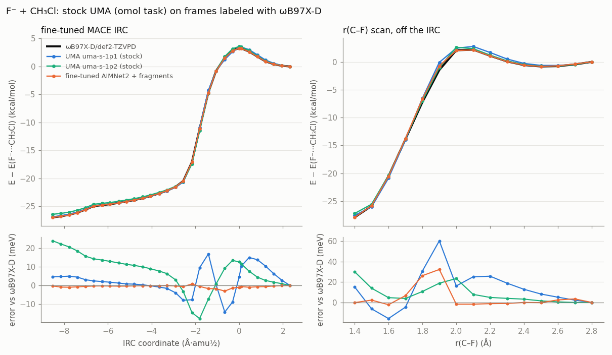

# UMA on F⁻ + CH₃Cl: a stock foundation model against CCSD(T)

Meta FAIR's UMA ("Universal Models for Atoms", fairchem) has a task head,
`omol`, trained on OMol25 (ωB97M-V/def2-TZVPD). It takes the molecular charge
and spin as inputs, like AIMNet2, but covers far more of the periodic table. This
example adds UMA as a backend and runs it, untrained, through the same checks as
the models in [`../sn2_f_ch3cl`](../sn2_f_ch3cl) (the SN2 reaction
F⁻ + CH₃Cl → CH₃F + Cl⁻, charge −1). Numbers are from runs on 2026-09-28 on the
laptop CPU (8 threads).



*Energies along the fine-tuned MACE IRC (left) and the r(C–F) scan off the IRC
(right). All the frames were labeled with ωB97X-D/def2-TZVPD earlier, so no new
DFT ran. Energies are relative to F⁻···CH₃Cl; the error against ωB97X-D is below.
The fine-tuned AIMNet2 was trained on frames within 0.02 Å of the IRC frames; UMA
saw none of them.*

## Conclusions

- **Stock UMA already matches the fine-tuned models.** Without any training on
  this reaction:
  - uma-s-1p1 gives a barrier of 3.46 kcal/mol from the ion–dipole complex, and
    uma-s-1p2 gives 3.58 kcal/mol. The CCSD(T) focal point is 3.39 kcal/mol.
  - Both put the reaction energy between the complexes within 1 kcal/mol of the
    references.
  - Both find a TS with one imaginary mode (−483 and −465 cm⁻¹; ωB97X-D −450).
  - The fine-tuned AIMNet2 and MACE needed 93 ωB97X-D calculations to get there,
    and stock AIMNet2 overestimates the barrier nearly threefold (9.3 kcal/mol).
- **uma-s-1p2 has the better geometry.** Its TS r(C–F)/r(C–Cl) of 2.035/2.115 Å
  is within 0.01 Å of CCSD(T) (2.025/2.112).
- **Against ωB97X-D, UMA's errors are larger than the fine-tunes'**: 20–40 meV
  at most on the IRC and 30–60 meV on the scan, against 3 meV for the fine-tuned AIMNet2
  on the IRC, next to its training path. Part of that is the reference: UMA learned
  ωB97M-V, not ωB97X-D, and the two functionals differ by about 0.4 kcal/mol in
  this barrier. Off the path (the scan) the fine-tuned AIMNet2 is also 32 meV
  off, so no model is at the meV level there.
- **Nothing is forgotten.** Neutral CH₃F, CH₃Cl and CH₂F₂ come out within
  0.007 Å of ωB97X-D (C–F 1.387, C–Cl 1.782 Å). By contrast, the fine-tuned MACE
  lengthened C–Cl by 0.06 Å.
- **The energies relative to the separated reactants are right too.** uma-s-1p2
  puts the complex, TS, product complex and products at −15.3, −11.8, −41.8 and
  −32.6 kcal/mol below F⁻ + CH₃Cl. The CCSD(T) values are −15.6, −12.2, −41.6 and
  −31.9, so every one is within 0.7 kcal/mol. Stock AIMNet2 overbinds the complex
  by 6 kcal/mol. A free ion is a single atom, whose energy UMA takes from its
  isolated-atom table ([Free ions](#free-ions-single-atoms)).
- **Not yet done:** the large model, uma-m-1p1. It is packaged for LONI as smoke
  test 12 (see [On LONI](#on-loni-the-large-model)).

## Results

| | UMA-s-1p1 | UMA-s-1p2 | Fine-tuned AIMNet2 + fragments | Stock AIMNet2 | Reference |
|---|---|---|---|---|---|
| Barrier from F⁻···CH₃Cl (kcal/mol) | 3.46 | 3.58 | 3.26 | 9.3 | 3.39 (CCSD(T)); 2.6 (ωB97M-V); 3.0 (ωB97X-D) |
| FCH₃···Cl⁻ − F⁻···CH₃Cl (kcal/mol) | −27.0 | −26.5 | −27.1 | −24.9 | −26.0 (CCSD(T)); −27.1 (ωB97X-D) |
| TS r(C–F) / r(C–Cl) (Å) | 2.073 / 2.096 | **2.035 / 2.115** | 2.049 / 2.121 | 2.00 / 2.17 | 2.025 / 2.112 (CCSD(T)) |
| F⁻···CH₃Cl r(C–F) / r(C–Cl) (Å) | 2.553 / 1.850 | 2.537 / 1.848 | 2.517 / 1.850 | 2.45 / 1.88 | 2.498 / 1.843 (CCSD(T)) |
| FCH₃···Cl⁻ r(C–F) / r(C–Cl) (Å) | 1.419 / 3.256 | 1.416 / 3.223 | 1.407 / 3.262 | 1.40 / 3.12 | 1.413 / 3.180 (CCSD(T)) |
| TS imaginary mode (cm⁻¹) | −483 | −465 | −448 | −743 | −450 (ωB97X-D) |
| MACE IRC, 31 frames: max \|ΔE\| / RMSE (meV) | 19 / 7 | 41 / 19 | 2.7 / 0.7 (near its training frames) | 187 / 70 | vs ωB97X-D |
| MACE IRC: force RMSE / worst atom (eV/Å) | 0.069 / 0.36 | 0.057 / 0.26 | 0.009 / 0.054 | 0.165 / 1.09 | vs ωB97X-D |
| r(C–F) scan, 15 frames: max \|ΔE\| / RMSE (meV) | 60 / 22 | 30 / 12 | 32 / 11 | — | vs ωB97X-D |
| r(C–F) scan: force RMSE / worst atom (eV/Å) | 0.055 / 0.37 | 0.033 / 0.25 | 0.035 / 0.26 | — | vs ωB97X-D |
| CH₃F C–F / CH₃Cl C–Cl, neutral (Å) | 1.387 / 1.782 | 1.387 / 1.781 | 1.380 / 1.781 | 1.384 / 1.793 | 1.380 / 1.781 (ωB97X-D) |
| Relative to F⁻ + CH₃Cl, complex / TS / product complex / products (kcal/mol) | −14.9 / −11.4 / −41.9 / −32.6 | **−15.3 / −11.8 / −41.8 / −32.6** | −15.1 / −11.8 / −42.2 / −32.9 | −21.7 / −12.4 / −46.6 / −38.7 | −15.6 / −12.2 / −41.6 / −31.9 (CCSD(T)); −15.5 / −12.9 / −41.9 / −32.3 (ωB97M-V/def2-TZVPPD) |
| Cost | none: stock; 54 ms per force call | none | 7 min CPU training + 93 DFT labels | none | — |

The UMA and fine-tuned AIMNet2 geometries are each model's own stationary
points:
- **TS:** P-RFO with the exact Hessian, from the fine-tuned AIMNet2 TS.
- **Complexes:** the ends of the model's own IRC, relaxed.

For the energies relative to F⁻ + CH₃Cl, every fragment is at its own charge,
with CH₃Cl and CH₃F relaxed with the model. The free F⁻ and Cl⁻ come from UMA's
isolated-atom table for both UMA columns (see below).

The AIMNet2 columns come from [`../sn2_f_ch3cl`](../sn2_f_ch3cl/README.md); stock
AIMNet2's same-frame numbers are its errors on the committee's IRC there. The
CCSD(T) values are Szabó & Czakó's focal-point results, and the ωB97M-V barrier
is from the same table.

## Using UMA in this repository

The UMA backend works like AIMNet2's. fairchem needs a newer numpy and torch
than SAMSON's Python, so it runs in its own environment behind a worker process:
- the "model" is that environment's `python`;
- the checkpoint is an option.

| Where | How |
|---|---|
| CLI | `samson-mlip structure.xyz <env>/python.exe --backend uma --uma-model D:\MLIP_Downloaded_Models\UMA\uma-s-1p2.pt --charge -1` (`--uma-task omol` is the default) |
| SAMSON panel | Backend **UMA**. The model file is the environment's python (found automatically if `FAIRCHEM_PYTHON` is set). Fill the **UMA checkpoint** and **UMA task** row, and the charge and multiplicity fields. |
| Bridge / MCP job | `{"backend": "uma", "model": "<env python>", "uma_model": "<checkpoint.pt>", "uma_task": "omol", "charge": -1}` with any job kind, including `blue_moon`, `slow_growth` and `metadynamics` |
| Python | `UMACalculator(python, model="uma-s-1p2.pt", charge=-1)` from `samson_mlip_visualizer.uma_backend` |

- **Tasks:** `omol` for molecules and ions (it takes the charge and
  multiplicity); `omat`, `oc20`, `odac` and `omc` for materials, which take
  periodic cells and no charge.
- **Precision:** the model runs in float32, so relax to `fmax ≥ 0.005 eV/Å`.
- **Speed:** on the laptop CPU the small model takes about 54 ms per force call
  for these six atoms, close to AIMNet2.

### Setup

1. **Access.** The facebook/UMA repository on Hugging Face is gated: accept the
   licence (done 2026-09-27).
2. **Checkpoints.** Download them with the `hf` CLI or the site's download
   button. Saving the file page gives a ~110 KB HTML file, not the weights.
   Here they are in `D:\MLIP_Downloaded_Models\UMA`:

   | File | Size |
   |---|---|
   | `uma-s-1p1.pt` | 1.1 GB |
   | `uma-s-1p2.pt` | 2.2 GB |
   | `uma-s-1p2p1.pt` | 2.2 GB |
   | `uma-m-1p1.pt` | 10.7 GB |
3. **Single atoms** need UMA's isolated-atom table (see
   [Free ions](#free-ions-single-atoms)).
4. **Environment.** fairchem-core (2.23) is installed in
   `D:\MLIP_Work_Folder\envs\mlip`, the same environment as aimnet; sella is only
   needed for the LONI script.

### Free ions (single atoms)

A free F⁻ or Cl⁻ is a single atom, with no neighbours for the network to see, so
fairchem takes its energy from a table of isolated-atom energies. These are
ωB97M-V/def2-TZVPD values from OMol25, computed with ORCA, and the same for every
UMA model.
- **uma-s-1p2** carries the table inside the checkpoint.
- **uma-s-1p1** doesn't. For it the backend looks for
  `references/iso_atom_elem_refs.yaml` (from the UMA repository) next to the
  checkpoint, or in a `references` folder there.

That file isn't needed here. [`fragment_energies.py`](fragment_energies.py) reads
the two ions from uma-s-1p2's table and checks them on the laptop with Psi4 at the
same level:

| | UMA's table | Psi4 ωB97M-V/def2-TZVPD | table − Psi4 |
|---|---|---|---|
| F⁻ | −2717.6087 eV | −2717.5992 eV | −9.4 meV |
| Cl⁻ | −12524.3131 eV | −12524.2916 eV | −21.5 meV |
| CH₃Cl at UMA's geometry, UMA − Psi4 | — | — | −1.5 (s-1p1), −2.3 meV (s-1p2) |
| CH₃F at UMA's geometry, UMA − Psi4 | — | — | −1.0 (s-1p1), −1.3 meV (s-1p2) |

- **The energy scales match.** UMA's absolute energies agree with Psi4
  ωB97M-V/def2-TZVPD to 1–2 meV on the neutral molecules.
- **The bare anions differ between the two codes** by 9 and 22 meV (0.2 and
  0.5 kcal/mol). I haven't pinned down why; it may be how ORCA and Psi4 treat the
  diffuse functions of an anion.
- **The table is used** because it is what UMA itself uses; Psi4 is the
  cross-check. With the Psi4 ions instead, uma-s-1p1's four energies would be
  −15.1, −11.6, −42.1 and −32.3 kcal/mol, about 0.2 kcal/mol different.
- **Cost:** the Psi4 check is six small DFT jobs, 18 minutes on the laptop.

## Reproducing

With SAMSON's Python, from the repository root:

```bash
python examples/uma_sn2/evaluate_uma.py D:\MLIP_Downloaded_Models\UMA\uma-s-1p1.pt
```

```bash
python examples/uma_sn2/evaluate_uma.py D:\MLIP_Downloaded_Models\UMA\uma-s-1p2.pt
```

```bash
python examples/uma_sn2/fragment_energies.py
```

```bash
python examples/uma_sn2/plot_uma.py
```

- **Output:** each evaluation writes
  `D:\MLIP_Work_Folder\sn2_F_CH3Cl\uma\<checkpoint>\evaluation.json`, plus its
  IRC and the per-path CSVs and plots.
- **Resuming:** sections that are done are skipped. For a checkpoint without
  the isolated-atom table, the fragment section waits for `fragment_energies.py`
  (it is skipped with a message until then); rerun to fill it in.
- **Time:** about 1 minute (s-1p1) and 3 minutes (s-1p2).
- **DFT:** `evaluate_uma.py` runs none, and stops if a frame lacks a cached
  ωB97X-D label. `fragment_energies.py` runs the six Psi4 jobs above, once; they
  are cached.

## On LONI: the large model

uma-m-1p1 is a 10.7 GB checkpoint. With the laptop's other work that is too
much memory, so it is packaged as HPC smoke test 12, for a `gpu2` node:

```bash
python examples/uma_sn2/make_loni_package.py
```

This writes `D:\MLIP_Work_Folder\hpc_smoke_tests\12_uma_sn2_large`. It holds a
standalone script (fairchem, ASE and sella only), the 46 labeled frames, the
starting geometries, and a SLURM array:
- **task 1: uma-s-1p1**, the control; it must reproduce the laptop;
- **task 2: uma-m-1p1.**

The script is set for QB4: account `loni_perovsk27`, `gpu2`, and conda from
`/home/lgutsev/miniforge3`. Two things are left, both in the package README:
- create the environment `/project/lgutsev/env/uma` (fairchem-core and sella);
- fill in `<UMA_DIR>`, the folder where UMA already sits on the cluster.

- **Tested:** the same script, run on the laptop CPU with uma-s-1p1, reproduces
  the evaluation above (barrier 3.464 kcal/mol, TS mode −483 cm⁻¹) in 35 s.
- **Afterwards:** copy `outputs/` back, then run this, which prints PASS or FAIL
  for the control and the uma-m-1p1 numbers against ωB97X-D and CCSD(T):

```bash
python examples/uma_sn2/check_loni_results.py
```

## Files

| File | Role |
|---|---|
| [`evaluate_uma.py`](evaluate_uma.py) | its TS, frequencies and IRC; errors on the labeled frames; fragments; neutral molecules |
| [`fragment_energies.py`](fragment_energies.py) | free F⁻ and Cl⁻ from UMA's table, checked with Psi4 ωB97M-V/def2-TZVPD |
| [`plot_uma.py`](plot_uma.py) | the figure above |
| [`make_loni_package.py`](make_loni_package.py) | writes smoke test 12 for LONI |
| [`loni/run_uma_sn2.py`](loni/run_uma_sn2.py) | the standalone cluster script (copied into the package) |
| [`check_loni_results.py`](check_loni_results.py) | reads the cluster outputs back |
| [`../../src/samson_mlip_visualizer/uma_backend.py`](../../src/samson_mlip_visualizer/uma_backend.py), [`uma_worker.py`](../../src/samson_mlip_visualizer/uma_worker.py) | the backend and its worker |
